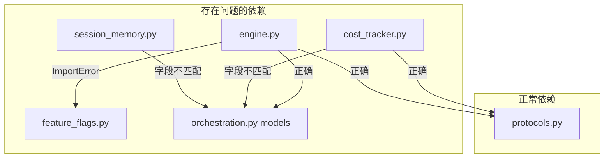
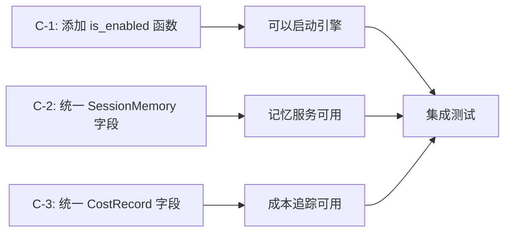
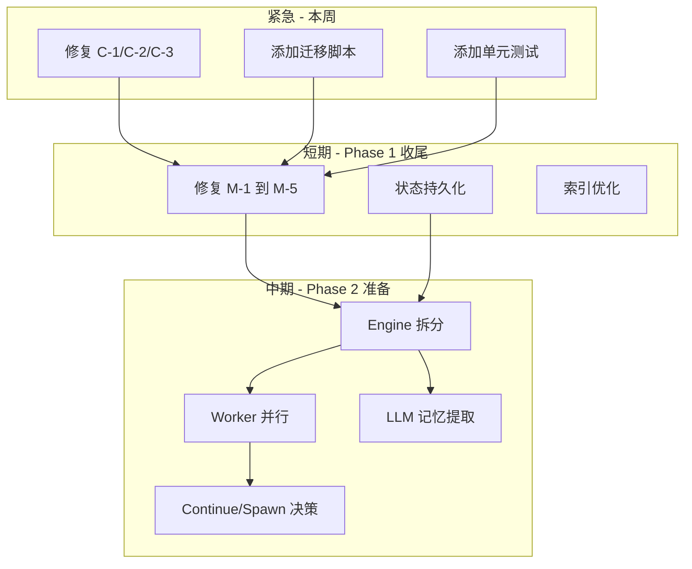
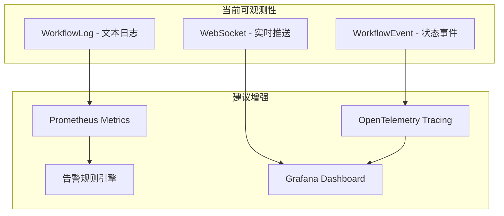

# OpenClaw v3 Phase 1 — 全面 Code Review 报告

> **审核日期**: 2026-04-02  
> **审核范围**: Phase 0 基础设施 + Phase 1 核心模块 + PRD 文档  
> **审核人**: Architect Mode  

> **文档修订**: 2026-04-03 — 与**当前仓库代码**核对后更新 [§1 总体评估](#1-总体评估)、[§2.0 修订对照](#20-修订对照-2026-04-03) 及问题表「状态」列。  
> **说明**: §3 起的逐文件正文仍保留 2026-04-02 原始表述，作为审计快照；若与 §2.0 冲突，**以 §2.0 与源码为准**。

---

## 目录

1. [总体评估](#1-总体评估)
2. [问题汇总（按严重程度）](#2-问题汇总) — 含 [§2.0 修订对照](#20-修订对照-2026-04-03)
3. [逐文件详细审核](#3-逐文件详细审核)
4. [架构合理性分析](#4-架构合理性分析)
5. [与 Claude Code 源码一致性分析](#5-与-claude-code-源码一致性分析)
6. [PRD 文档审核](#6-prd-文档审核)
7. [优化建议与改进路线图](#7-优化建议与改进路线图)

---

## 1. 总体评估

### 1.1 整体评分（2026-04-03 修订）

| 维度     | 评分（初评 → 修订说明） | 说明 |
| -------- | ------------------------ | ---- |
| 代码质量 | ⭐⭐⭐⭐ (4/5)           | 原 Critical 级别导入/模型字段问题已在后续提交中修复；仍存设计债（见 §2.0） |
| 架构设计 | ⭐⭐⭐⭐ (4/5)           | 模块划分清晰；`_active_runs` 内存态等仍为已知取舍 |
| 文档质量 | ⭐⭐⭐⭐⭐ (5/5)         | 不变 |
| 测试覆盖 | ⭐⭐⭐ (3/5)             | 契约测试为主，编排核心单测仍偏少 |
| 可维护性 | ⭐⭐⭐ (3/5)             | 不变 |

### 1.2 关键发现（2026-04-03 修订）

- **Critical（初评 3 条）**：截至当前代码，**已全部修复**（见 §2.0），不再阻塞 import / 模型持久化。
- **Major**：**M-1、M-4** 等仍为架构/逻辑风险，需结合运行场景评估；**M-2、M-5、M-3 中 `_now()`** 已缓解或修复；**M-3 中时间列仍为 String** 属模型层技术债。
- **Minor**：**m-1、m-3、m-7** 已有部分实现改进；其余仍可作为质量项跟踪。
- **Suggestion**：仍为长期优化方向，未因代码修复而消失。

### 1.3 一句话总结（2026-04-03 修订）

> **初评（2026-04-02）**：文档和架构设计优秀，但 Phase 1 曾存在模型与服务字段不一致等严重问题，阻塞集成验证。  
> **当前（以仓库为准）**：上述 **Critical 类问题已修复**；集成与生产部署仍需关注 **内存运行态、迁移、测试覆盖** 及 §2.0 中「仍有效」项。

---

## 2. 问题汇总

### 2.0 修订对照（2026-04-03）

以下对照 **当前仓库**（以 `backend/app` 下实现为准），用于衔接初评条目与现状，避免文档与代码长期脱节。

| 原编号 | 状态 | 说明 |
| ------ | ---- | ---- |
| **C-1** | **已修复** | `engine` 现使用 `is_coordinator_mode_enabled`（[`feature_flags.py`](../../backend/app/core/feature_flags.py)），不再导入不存在的 `is_enabled`。 |
| **C-2** | **已修复** | `SessionMemory` 持久化与模型字段一致（`scope` / `scope_id` / `content` 等）。 |
| **C-3** | **已修复** | `CostRecord` 使用 `workflow_instance_id`、`step_execution_id` 等与模型一致。 |
| **M-1** | **仍有效** | `_active_runs` 仍为进程内字典；多副本/重启恢复需 Redis/DB 或从 checkpoint 重建（非单行补丁）。 |
| **M-2** | **已修复** | `resume_workflow` 已按 `STATIC_DAG_V2` / `COORDINATOR_V2` / `PLAN_SUBTASK_V2` 分支继续执行；无内存态时打日志并返回。 |
| **M-3** | **部分缓解** | `_now()` 已改为 `datetime.now(timezone.utc).isoformat()`；**时间列仍为 `String`** 的结构性问题未改（见 S-6）。 |
| **M-4** | **待核实** | 重试与 `attempt_counts` 需结合当前 `engine` 重试路径做专项 review，本文档不改为「已修复」。 |
| **M-5** | **已修复** | Coordinator 开关统一为 `is_coordinator_mode_enabled()`（Settings + 兼容 `OPENCLAW_FEATURE_COORDINATOR_MODE`）。 |
| **m-1** | **已缓解** | `ToolContext` 使用 `frozenset` 加速 `is_tool_allowed`（初评为 list 查找）。 |
| **m-3** | **已缓解** | `_entries` 有上限裁剪，且未过滤的合计使用 `_grand_total_cost_usd`；按条目汇总在极长跑时可能仅覆盖近期窗口。 |
| **m-7** | **已缓解** | 主要 orchestration 表已增加 `Index`（`__table_args__`）；**已有 SQLite 文件不会自动补索引**，需迁移或重建库。 |
| **m-2、m-4、m-5、m-6、m-8** | **仍有效** | 与初评一致，未在本次修订中逐项关闭。 |

---

### 2.1 Critical（必须立即修复，阻塞发布）— 初评 2026-04-02

**状态（2026-04-03）**：下表三条均已修复，保留作历史审计记录。

| #   | 文件                                                                                  | 问题描述                                                                                                                                                                                                                                                                        | 影响                               | 状态 |
| --- | ------------------------------------------------------------------------------------- | ------------------------------------------------------------------------------------------------------------------------------------------------------------------------------------------------------------------------------------------------------------------------------- | ---------------------------------- | ---- |
| C-1 | [`engine.py`](../../backend/app/services/orchestration/engine.py)                  | ~~`from app.core.feature_flags import is_enabled` — `is_enabled` 函数在 [`feature_flags.py`](../../backend/app/core/feature_flags.py) 中**不存在**~~                                                                                                                                | ~~ImportError~~          | **已修复** |
| C-2 | [`session_memory.py`](../../backend/app/services/orchestration/session_memory.py) | ~~服务层字段与 [`SessionMemory`](../../backend/app/models/orchestration.py) 模型**完全不匹配**~~ | ~~AttributeError~~ | **已修复** |
| C-3 | [`cost_tracker.py`](../../backend/app/services/orchestration/cost_tracker.py)     | ~~`_persist_entry` 字段名与 [`CostRecord`](../../backend/app/models/orchestration.py) 不一致~~                                                     | ~~AttributeError~~ | **已修复** |

### 2.2 Major（影响生产可用性，应在发布前修复）

| #   | 文件                                                                  | 问题描述                                                                                                                    | 影响                             | 状态（2026-04-03） |
| --- | --------------------------------------------------------------------- | --------------------------------------------------------------------------------------------------------------------------- | -------------------------------- | ------------------ |
| M-1 | [`engine.py`](../../backend/app/services/orchestration/engine.py) | `_active_runs` 纯内存存储，进程重启后运行态丢失                                | 多进程/重启场景下需架构补强                   | **仍有效** |
| M-2 | [`engine.py`](../../backend/app/services/orchestration/engine.py) | `resume_workflow` 仅恢复 `STATIC_DAG_V1` …                                         | 其他 profile 无法恢复 | **已修复** |
| M-3 | [`orchestration.py`](../../backend/app/models/orchestration.py)    | ~~`_now()` 使用 `datetime.utcnow()`~~；时间字段多为 `String` 而非 `DateTime`                         | 弃用 API 已消除；String 时间仍为查询/排序债         | **部分缓解** |
| M-4 | [`engine.py`](../../backend/app/services/orchestration/engine.py) | 重试逻辑中 `attempt_counts` 与递归 attempt 可能不一致 | 重试语义需单独验证 | **待核实** |
| M-5 | [`engine.py`](../../backend/app/services/orchestration/engine.py) | ~~Coordinator 特性开关与 `FeatureFlags` 不一致~~                   | 开关行为 | **已修复** |

### 2.3 Minor（代码质量改进）

| #   | 文件                                                                                    | 问题描述                                                                                                            | 状态（2026-04-03） |
| --- | --------------------------------------------------------------------------------------- | ------------------------------------------------------------------------------------------------------------------- | ------------------ |
| m-1 | [`protocols.py`](../../backend/app/services/orchestration/protocols.py)             | `ToolContext.is_tool_allowed` 列表查找                                                                 | **已缓解**（内部 frozenset） |
| m-2 | [`context_manager.py`](../../backend/app/services/orchestration/context_manager.py) | `compact_messages` 不返回修改后消息列表                            | **仍有效** |
| m-3 | [`cost_tracker.py`](../../backend/app/services/orchestration/cost_tracker.py)       | `_entries` 内存增长                                                  | **已缓解**（上限 + 合计字段） |
| m-4 | [`engine.py`](../../backend/app/services/orchestration/engine.py)                   | `_DBCheckpointStore.save` 依赖 idempotency_key 解析 | **仍有效** |
| m-5 | [`session_memory.py`](../../backend/app/services/orchestration/session_memory.py)   | markdown 解析回 `MemoryEntry` 有损                         | **仍有效** |
| m-6 | [`feature_flags.py`](../../backend/app/core/feature_flags.py)                        | `getattr` 静默默认                                        | **仍有效** |
| m-7 | [`orchestration.py`](../../backend/app/models/orchestration.py)                         | 表缺少索引                                       | **已缓解**（模型已加 Index；旧库需迁移） |
| m-8 | [`context_manager.py`](../../backend/app/services/orchestration/context_manager.py)  | 模型窗口硬编码                                                  | **仍有效** |

### 2.4 Suggestion（架构优化建议）

| #   | 建议                                             | 说明                                                                                 |
| --- | ------------------------------------------------ | ------------------------------------------------------------------------------------ |
| S-1 | 引入 Repository 抽象层                           | Engine 直接依赖 SQLAlchemy Session，难以单元测试。建议抽取 `WorkflowRepository` 接口 |
| S-2 | 使用 Alembic 管理数据库迁移                      | PRD 中明确要求但尚未实现，当前无迁移脚本                                             |
| S-3 | 将 `_active_runs` 持久化到 Redis 或数据库        | 解决进程重启状态丢失问题                                                             |
| S-4 | ContextManager 的 compact 应返回修改后的消息列表 | 当前设计让调用者无法使用压缩结果                                                     |
| S-5 | SessionMemory 应存储结构化数据而非 markdown      | 避免 markdown→entry 的有损转换                                                       |
| S-6 | 统一时间字段类型                                 | 全部使用 `DateTime(timezone=True)` 而非 `String`                                     |

---

## 3. 逐文件详细审核

> **§3 说明（2026-04-03）**：本节为 **2026-04-02 初评原文**，保留代码片段与行号引用供对照。若与当前源码或 [§2.0](#20-修订对照-2026-04-03) 结论不一致，**以 §2.0 与仓库为准**；初评中已关闭的 Critical / 部分 Major、Minor 不再代表当前缺陷。

### 3.1 [`protocols.py`](../../backend/app/services/orchestration/protocols.py) — 核心协议定义

**评分**: ⭐⭐⭐⭐ (4/5)

**优点**:

- 枚举定义清晰，注释完整，每个类型都有文档说明
- `ToolContext` 实现了 default-deny 安全策略，符合最小权限原则
- `IdempotencyKey` 设计简洁，`__str__` 方法便于日志追踪
- Protocol 接口定义遵循 Python typing 最佳实践

**问题**:

1. **[Minor m-1]** [`is_tool_allowed`](../../backend/app/services/orchestration/protocols.py:156) 方法使用 `list.__contains__` 进行查找：

   ```python
   def is_tool_allowed(self, tool_name: str) -> bool:
       if tool_name in self.denylist:    # O(n)
           return False
       if not self.allowlist:
           return False
       return tool_name in self.allowlist  # O(n)
   ```

   **建议**: 将 `allowlist` 和 `denylist` 改为 `set[str]` 类型，或内部维护 set 副本用于查找。

2. **[Suggestion]** `OrchestrationEvent` 的 `schema_version` 默认为 `"1"`，建议改为类常量或从配置读取，便于未来版本升级。

3. **[Suggestion]** `CheckpointData.state_json` 使用 `str` 类型存储完整状态快照，对于大型工作流可能非常大。建议增加大小限制或使用压缩。

---

### 3.2 [`orchestration.py`](../../backend/app/models/orchestration.py) — 数据模型

**评分**: ⭐⭐⭐ (3/5)

**优点**:

- 14 个新表完整覆盖了 PRD 04 中的所有数据模型
- 外键关系和级联删除策略合理
- 使用了 `relationship` 定义双向关联

**问题**:

1. **[Major M-3]** [`_now()`](../../backend/app/models/orchestration.py:28) 函数：

   ```python
   def _now() -> str:
       return datetime.utcnow().isoformat()  # Python 3.12+ deprecated!
   ```

   `datetime.utcnow()` 在 Python 3.12+ 已被弃用，应使用 `datetime.now(timezone.utc)`。更重要的是，**所有时间字段都使用 `String` 类型**而非 `DateTime`，这导致：
   - 无法使用数据库原生时间函数进行查询和排序
   - 时区信息不一致（有的有 `+00:00`，有的没有）
   - 与现有 [`TimestampMixin`](../../backend/app/models/base.py:15) 的 `DateTime(timezone=True)` 类型不一致

2. **[Minor m-7]** 14 个新表均无数据库索引定义。以下列需要索引：
   - `coordinator_sessions.workflow_instance_id`
   - `worker_agents.coordinator_id`, `worker_agents.status`
   - `agent_messages.from_agent_id`, `to_agent_id`, `team_id`
   - `execution_plans.workflow_instance_id`, `status`
   - `subtasks.plan_id`, `status`, `assigned_agent_id`
   - `orchestration_checkpoints.workflow_instance_id`, `idempotency_key` (已有 unique)
   - `session_memories.scope`, `scope_id`
   - `cost_records.workflow_instance_id`, `model`, `created_at`
   - `outbox_messages.status`, `workflow_instance_id`

3. **[设计偏差]** PRD 04 中 `CoordinatorSession.plan_mode` 定义为 `Mapped[bool]`，实际实现为 `Mapped[int]` with comment `# 0/1`。同样 `WorkerAgent.continue_mode`、`SkillDefinition.enabled`、`MCPServerConfig.enabled` 都用 `int` 代替 `bool`。虽然 SQLite 不支持原生 bool，但 SQLAlchemy 的 `Boolean` 类型会自动处理这种映射，使用 `int` 降低了可读性。

4. **[缺失字段]** PRD 04 中 `SessionMemory` 定义了 `scope_id`, `content`, `content_hash`, `token_count` 等字段，但实际服务代码期望的是完全不同的字段（见 C-2）。这说明模型定义和服务实现是**独立编写的，未经集成验证**。

5. **[缺少 `__table_args__`]** 没有为任何表定义 `__table_args__` 来添加索引或约束。

---

### 3.3 [`feature_flags.py`](../../backend/app/core/feature_flags.py) — 特性开关

**评分**: ⭐⭐⭐⭐ (4/5)

**优点**:

- 所有开关默认 False（安全第一）
- 使用 `@property` 提供干净的访问接口
- `get_all_flags()` 便于 API 暴露和调试
- `@lru_cache` 单例模式合理

**问题**:

1. **[Critical C-1 关联]** 此文件**没有定义 `is_enabled` 函数**，但 [`engine.py`](../../backend/app/services/orchestration/engine.py:22) 导入了它。需要添加：

   ```python
   def is_enabled(flag_name: str) -> bool:
       """Check if a feature flag is enabled by name."""
       flags = get_feature_flags()
       return getattr(flags, flag_name, False)
   ```

   或者修改 `engine.py` 使用 `FeatureFlags` 实例方法。

2. **[Minor m-6]** `getattr(self._settings, "orchestration_v3_enabled", False)` 静默吞掉拼写错误：

   ```python
   @property
   def orchestration_v3(self) -> bool:
       return getattr(self._settings, "orchestration_v3_enabled", False)
   ```

   如果 `Settings` 类中没有 `orchestration_v3_enabled` 属性，不会报错，只会默默返回 False。建议在 `__init__` 中验证所有需要的属性是否存在。

3. **[Suggestion]** `@lru_cache(maxsize=1)` 意味着 `get_feature_flags()` 返回的是缓存的实例，如果运行时修改了环境变量，不会反映到已缓存的实例。对于需要动态刷新的场景，需要添加 `clear_cache` 机制。

---

### 3.4 [`engine.py`](../../backend/app/services/orchestration/engine.py) — 编排引擎

**评分**: ⭐⭐ (2/5)

这是问题最多的文件，包含 3 个 Critical 和 2 个 Major 问题。

**优点**:

- 整体架构设计合理：executor 注册模式、profile 分发、checkpoint 持久化
- 事件驱动设计便于 WebSocket 集成
- `WorkflowRunState` 数据类设计清晰
- 四种 profile 的分发逻辑结构清晰

**Critical 问题**:

1. **[C-1]** 第 22 行 `from app.core.feature_flags import is_enabled` — **ImportError**

   `feature_flags.py` 中没有 `is_enabled` 函数。只有 `FeatureFlags` 类和 `get_feature_flags()` 函数。

2. **[C-1 关联 / M-5]** 第 501 行 `is_enabled("COORDINATOR_MODE")`:

   ```python
   if not is_enabled("COORDINATOR_MODE"):
   ```

   即使添加了 `is_enabled` 函数，这里使用的是大写的 `"COORDINATOR_MODE"`，而 `FeatureFlags` 的属性名是小写的 `coordinator_mode`。需要统一命名规范。

**Major 问题**:

3. **[M-1]** 第 140 行 `_active_runs: dict[str, WorkflowRunState] = {}`:

   所有运行中的工作流状态存储在内存字典中。这意味着：
   - 进程重启 → 所有进行中的工作流状态丢失
   - 多实例部署 → 状态不共享
   - 内存泄漏风险 → 已完成但未正确清理的运行

   **建议**: 将状态持久化到 Redis 或数据库，`_active_runs` 仅作为本地缓存。

4. **[M-2]** 第 238 行 `resume_workflow`:

   ```python
   async def resume_workflow(self, instance_id: str) -> None:
       ...
       if state.profile == OrchestrationProfile.STATIC_DAG_V1:
           await self._execute_static_dag_v1(state)
       # 其他 profile 呢？
   ```

   只处理了 `STATIC_DAG_V1`，缺少对 `STATIC_DAG_V2`、`COORDINATOR_V2`、`PLAN_SUBTASK_V2` 的恢复逻辑。

5. **[M-4]** 第 376-385 行重试逻辑:

   ```python
   attempt = state.attempt_counts.get(step_id, 0) + 1  # 第 285 行
   state.attempt_counts[step_id] = attempt              # 第 286 行
   ...
   if attempt < state.max_retries:
       state.attempt_counts[step_id] = attempt  # ← 这里又赋值了一次，值没变
       return await self._execute_step(state, step)  # 递归调用
   ```

   问题分析：
   - 第 285 行已经 `+1` 并赋值了 `attempt`
   - 第 377 行再次赋值相同的值，是冗余操作
   - 递归调用 `_execute_step` 时，第 285 行会再次 `+1`，所以 attempt 递增是正确的
   - 但代码意图不清晰，容易引起误解

   **更严重的问题**: 递归重试没有延迟/退避策略，快速失败场景下会立即重试，可能加剧问题。

**其他问题**:

6. **[Minor m-4]** 第 781 行 `_DBCheckpointStore.save`:

   ```python
   workflow_instance_id=checkpoint.idempotency_key.split(":")[0]
       if ":" in checkpoint.idempotency_key else "",
   step_id=checkpoint.idempotency_key.split(":")[1]
       if ":" in checkpoint.idempotency_key else "",
   ```

   通过字符串分割解析 idempotency_key 来获取 workflow_instance_id 和 step_id，非常脆弱。建议直接传递这些参数。

7. **[架构问题]** Engine 同时负责：
   - 工作流生命周期管理
   - 步骤执行和重试
   - 检查点管理
   - 事件发布
   - DAG 解析
   - 数据库操作

   违反了单一职责原则。建议拆分为 `WorkflowLifecycleService`、`StepExecutionService`、`CheckpointManager` 等。

8. **[缺失]** `_execute_static_dag_v2` 注释说"并行支持 via asyncio.gather"但实际是顺序执行。对于 v2 profile，这违背了设计意图。

9. **[缺失]** `_execute_coordinator_v2` 中 Worker 是顺序创建和执行的，没有利用并行能力。Claude Code 的 coordinator 模式支持 Worker 并行执行。

---

### 3.5 [`context_manager.py`](../../backend/app/services/orchestration/context_manager.py) — 上下文管理器

**评分**: ⭐⭐⭐⭐ (4/5)

**优点**:

- 三级压缩策略（Micro/Auto/Full）设计合理，与 Claude Code 一致
- Token 预算分配逻辑清晰
- 模型上下文窗口和最大输出参数化
- 代码结构清晰，注释充分

**问题**:

1. **[Minor m-2]** `compact_messages` 方法返回 `CompactResult` 但**不返回修改后的消息列表**：

   ```python
   def compact_messages(self, messages, strategy=None, budget=None) -> CompactResult:
       ...
       if strategy == CompactStrategy.MICRO:
           return self._micro_compact(messages, budget, tokens_before)
   ```

   `CompactResult` 包含 `compacted_count` 和 `tokens_after`，但调用者无法获取压缩后的消息列表。`_micro_compact` 内部创建了 `kept_messages` 但没有通过返回值暴露。

   **建议**: 在 `CompactResult` 中添加 `compacted_messages: list[Message]` 字段。

2. **[Minor m-8]** 模型参数硬编码：

   ```python
   MODEL_CONTEXT_WINDOWS: dict[str, int] = {
       "claude-sonnet": 200000,
       "claude-opus": 200000,
       ...
   }
   ```

   新模型发布时需要修改代码。建议从配置文件或数据库加载。

3. **[精度问题]** `estimate_tokens` 使用字符数/4 的粗略估算：

   ```python
   def estimate_tokens(self, text: str) -> int:
       return max(1, int(len(text) / CHARS_PER_TOKEN * code_ratio))
   ```

   PRD 要求"估算精度与实际误差 < 10%"，但字符数/4 的估算对于中文、代码注释等场景误差可能超过 30%。建议集成 `tiktoken` 或类似库。

4. **[边界情况]** `_auto_compact` 中 `keep_last = 6` 是硬编码的：

   ```python
   keep_first = 1 if messages and messages[0].role == "system" else 0
   keep_last = 6
   ```

   如果消息总数 < 7，`messages[keep_first:len(messages) - keep_last]` 会产生意外的切片结果（空列表或负索引）。

---

### 3.6 [`cost_tracker.py`](../../backend/app/services/orchestration/cost_tracker.py) — 成本追踪器

**评分**: ⭐⭐⭐ (3/5)

**优点**:

- 模型定价表完整，包含 cache_write 和 cache_read 成本
- 预算告警三级机制（warning/critical/exceeded）设计合理
- 支持内存和数据库双模式
- `CostSummary` 聚合维度丰富

**Critical 问题**:

1. **[C-3]** 第 394-408 行 `_persist_entry`:

   ```python
   record = CostRecord(
       id=entry.id,
       session_id=entry.session_id,      # ← CostRecord 没有这个字段！
       model=entry.model,
       ...
       step_id=entry.step_id,             # ← CostRecord 没有这个字段！
       agent_id=entry.agent_id,
       metadata_json="",
   )
   ```

   `CostRecord` 模型的字段是 `workflow_instance_id` 和 `step_execution_id`，不是 `session_id` 和 `step_id`。这会导致 `AttributeError` 或 SQLAlchemy 映射错误。

**Major 问题**:

2. **[Minor m-3]** `_entries: list[CostEntry]` 无限增长：

   ```python
   self._entries: list[CostEntry] = []
   ```

   每次调用 `record_usage` 都会 append，没有清理机制。长时间运行的服务会内存溢出。

   **建议**: 添加 `max_entries` 限制或定期清理已持久化的条目。

**其他问题**:

3. **[设计偏差]** `CostEntry` dataclass 包含 `session_id` 字段，但 `CostRecord` 模型没有 `session_id` 列。这意味着 cost 数据无法按 session 聚合查询。

4. **[缺失]** `get_total_cost` 方法：

   ```python
   def get_total_cost(self, session_id=None, workflow_instance_id=None):
       if session_id:
           return self._session_costs.get(session_id, 0.0)
       if workflow_instance_id:
           return self._workflow_costs.get(workflow_instance_id, 0.0)
       return sum(e.cost_usd for e in self._entries)
   ```

   如果同时传入 `session_id` 和 `workflow_instance_id`，`workflow_instance_id` 会被忽略。应该支持组合查询或明确文档说明互斥。

---

### 3.7 [`session_memory.py`](../../backend/app/services/orchestration/session_memory.py) — 会话记忆服务

**评分**: ⭐⭐ (2/5)

**Critical 问题**:

1. **[C-2]** 模型字段完全不匹配。服务代码假设 `SessionMemoryModel` 有以下字段：

   | 服务代码使用的字段 | 模型实际字段 | 状态      |
   | ------------------ | ------------ | --------- |
   | `session_id`       | `scope_id`   | ❌ 不匹配 |
   | `memory_text`      | `content`    | ❌ 不匹配 |
   | `project_id`       | 不存在       | ❌ 缺失   |
   | `user_id`          | 不存在       | ❌ 缺失   |
   | `entry_count`      | 不存在       | ❌ 缺失   |

   影响的方法：
   - `get_memory` (line 251): `record.memory_text` → 应为 `record.content`
   - `get_project_memory` (line 263): `scope=MEMORY_SCOPE_PROJECT, project_id=project_id` → 模型没有 `project_id`
   - `get_user_memory` (line 275): `scope=MEMORY_SCOPE_USER, user_id=user_id` → 模型没有 `user_id`
   - `_get_existing_entries` (line 570): `record.memory_text` → 应为 `record.content`
   - `_persist_memory` (line 607-631): 创建/更新使用了不存在的字段

**其他问题**:

2. **[Minor m-5]** `_get_existing_entries` 将 markdown 解析回 `MemoryEntry`：

   ```python
   for line in lines:
       if line.startswith("- "):
           value = line[2:].strip()
           entries.append(MemoryEntry(
               key=f"existing_{len(entries)}",
               value=value,
               importance=0.5,  # 丢失了原始 importance
           ))
   ```

   这是一个有损转换：丢失了 `importance`、`tags`、`source`、`timestamp` 等元数据。

3. **[正则表达式质量]** `_extract_decisions` 的正则只匹配英文模式：

   ```python
   patterns = [
       r"(?:let's|lets)\s+(use|go with|choose|implement|adopt)\s+(.+?)(?:\.|$)",
       r"(?:we\s+)?(?:decided|agreed)\s+(?:to\s+)?(.+?)(?:\.|$)",
   ]
   ```

   对于中文内容完全无效。考虑到 OpenClaw 的用户场景，应该添加中文模式匹配。

4. **[设计问题]** PRD 要求"记忆提取使用 forked subagent 后台执行"，但当前实现是同步的、基于正则的简单提取，没有使用 LLM。这大幅降低了记忆提取的质量。

---

### 3.8 [`__init__.py`](../../backend/app/services/orchestration/__init__.py) — 模块导出

**评分**: ⭐⭐⭐⭐⭐ (5/5)

干净的模块导出，只导出协议层的类型定义，不导出具体实现。`__all__` 列表完整。

---

## 4. 架构合理性分析

### 4.1 模块依赖关系



### 4.2 SOLID 原则评估

| 原则             | 评估 | 说明                                                                                 |
| ---------------- | ---- | ------------------------------------------------------------------------------------ |
| **S** — 单一职责 | ⚠️   | `OrchestrationEngine` 承担了过多职责（生命周期 + 执行 + 检查点 + 事件 + DAG 解析）   |
| **O** — 开闭原则 | ✅   | 通过 `StepExecutorProtocol` 注册机制支持扩展                                         |
| **L** — 里氏替换 | ✅   | Protocol 接口定义清晰，默认实现可替换                                                |
| **I** — 接口隔离 | ✅   | `StepExecutorProtocol`、`CheckpointStoreProtocol`、`EventPublisherProtocol` 职责分离 |
| **D** — 依赖倒置 | ⚠️   | Engine 直接依赖 SQLAlchemy Session，未通过抽象层隔离                                 |

### 4.3 与 PRD 设计的偏差

| PRD 设计                                   | 实际实现                          | 偏差程度    |
| ------------------------------------------ | --------------------------------- | ----------- |
| LangGraph StateGraph 作为编排引擎          | 自定义状态机                      | 🔴 重大偏差 |
| Engine 接受 `feature_flags` 参数           | Engine 使用全局 `is_enabled` 函数 | 🟡 中等偏差 |
| `SessionMemory` 使用 forked subagent + LLM | 正则匹配 + 模板                   | 🔴 重大偏差 |
| v2 profile 支持并行执行                    | 顺序执行 + TODO 注释              | 🟡 中等偏差 |
| Coordinator 模式 Worker 并行               | Worker 顺序执行                   | 🟡 中等偏差 |
| 所有时间字段 DateTime                      | String 类型                       | 🟡 中等偏差 |

---

## 5. 与 Claude Code 源码一致性分析

### 5.1 正确借鉴的部分

| Claude Code 特性                  | OpenClaw 实现                         | 一致性          |
| --------------------------------- | ------------------------------------- | --------------- |
| Coordinator Mode 概念             | `_execute_coordinator_v2`             | 🟢 概念一致     |
| Token Budget 分配                 | `ContextManager.allocate_budget`      | 🟢 逻辑一致     |
| Auto-compact 阈值 80%             | `COMPACT_THRESHOLD_RATIO = 0.80`      | 🟢 完全一致     |
| Micro-compact 低价值消息移除      | `_micro_compact`                      | 🟢 策略一致     |
| Full compact 保留 system + last N | `_full_compact`                       | 🟢 策略一致     |
| Cost per model with cache pricing | `CostTracker.calculate_cost`          | 🟢 定价模型一致 |
| Session Memory 阈值触发           | `SessionMemoryService.should_extract` | 🟢 触发机制一致 |
| Default-deny tool permissions     | `ToolContext.is_tool_allowed`         | 🟢 安全策略一致 |
| Idempotency keys                  | `IdempotencyKey` dataclass            | 🟢 概念一致     |

### 5.2 存在偏差的部分

| Claude Code 特性                             | 期望实现                           | 实际实现               | 偏差       |
| -------------------------------------------- | ---------------------------------- | ---------------------- | ---------- |
| Coordinator Continue vs Spawn Fresh 决策矩阵 | 基于上下文重叠度自动决策           | 仅顺序执行，无决策逻辑 | 🔴         |
| Worker 并行执行                              | asyncio.gather 并行                | 顺序 for 循环          | 🔴         |
| SendMessage 双向通信                         | Worker 可主动向 Coordinator 发消息 | 无双向通信机制         | 🔴         |
| Session Memory 使用 LLM subagent 提取        | 高质量记忆提取                     | 正则匹配，质量低       | 🔴         |
| Prompt Cache 共享（Fork Subagent）           | 共享父上下文降低成本               | 未实现                 | 🟡 Phase 3 |
| Scratchpad 跨 Worker 共享                    | 共享文件目录                       | 仅模型字段，无实际机制 | 🟡         |

### 5.3 遗漏的关键特性

1. **Worker Continue 模式**: Claude Code 的核心创新之一是根据上下文重叠度决定是 Continue（复用会话）还是 Spawn Fresh（新建会话）。当前实现完全没有这个逻辑。

2. **SendMessage 协议**: Claude Code 的 Worker 通过 `SendMessageTool` 与 Coordinator 双向通信。当前实现是单向的（Coordinator → Worker），Worker 无法主动报告进度或请求帮助。

3. **Plan Mode 的 Enter/Exit 机制**: Claude Code 有明确的 `EnterPlanMode` 和 `ExitPlanMode` 工具。当前实现将 planner 作为普通步骤执行，缺少模式切换的概念。

---

## 6. PRD 文档审核

### 6.1 文档体系评估

9 个 PRD 文档形成了完整的从愿景到实施的需求链：

```
01-产品愿景 → 02-功能需求 → 03-非功能需求
                ↓
04-数据模型 → 05-系统架构 → 06-核心模块
                              ↓
           08-迁移策略 ← 07-API设计
                ↓
           09-实施计划
```

**评分**: ⭐⭐⭐⭐⭐ (5/5) — 文档质量非常高。

### 6.2 文档优点

1. 每个功能需求都有用户故事、验收标准、技术约束和 Claude Code 参考
2. Mermaid 图表丰富，架构关系清晰
3. 迁移策略考虑了回滚、兼容性、数据完整性
4. KPI 指标具体可衡量
5. 优先级划分合理（P0/P1/P2）

### 6.3 文档问题

1. **[过度设计风险]** Phase 1 一次性定义了 14 个新表、17 个特性开关、9 种 StepKind。对于一个 MVP 阶段，这个范围偏大。建议 Phase 1 只实现核心的 5-6 个表。

2. **[LangGraph 偏差]** PRD 多处提到 LangGraph 作为编排层，但实际实现是自定义状态机。如果决定不使用 LangGraph，应该更新 PRD。

3. **[缺少错误处理规范]** PRD 没有定义统一的错误码、错误处理策略和重试策略规范。

4. **[缺少 API 版本化细节]** 虽然提到 v2 API 独立路由前缀，但缺少具体的版本化策略（URL path vs header vs query parameter）。

---

## 7. 优化建议与改进路线图

### 7.1 紧急修复（阻塞所有后续工作）



**具体修复方案**:

1. **C-1 修复**: 在 [`feature_flags.py`](../../backend/app/core/feature_flags.py) 添加：

   ```python
   _FLAG_NAME_MAP = {
       "ORCHESTRATION_V3": "orchestration_v3",
       "COORDINATOR_MODE": "coordinator_mode",
       "PLAN_MODE": "plan_mode",
       # ...
   }

   def is_enabled(flag_name: str) -> bool:
       prop_name = _FLAG_NAME_MAP.get(flag_name, flag_name.lower())
       flags = get_feature_flags()
       return getattr(flags, prop_name, False)
   ```

2. **C-2 修复**: 二选一：
   - 方案 A：修改 `SessionMemory` 模型，添加 `session_id`, `memory_text`, `project_id`, `user_id`, `entry_count` 字段
   - 方案 B：修改 `SessionMemoryService`，使用模型现有的 `scope`, `scope_id`, `content` 字段

   **推荐方案 B**（修改服务层适配模型），因为模型定义更规范。

3. **C-3 修复**: 修改 `_persist_entry` 使用正确的字段名：

   ```python
   record = CostRecord(
       id=entry.id,
       workflow_instance_id=entry.workflow_instance_id,
       model=entry.model,
       step_execution_id=entry.step_id,  # 映射字段名
       agent_id=entry.agent_id,
       ...
   )
   ```

### 7.2 短期改进（Phase 1 完成前）

| 优先级 | 改进项                               | 说明                                |
| ------ | ------------------------------------ | ----------------------------------- |
| P0     | 修复所有 Critical bug                | C-1, C-2, C-3                       |
| P0     | 添加 Alembic 迁移脚本                | PRD 要求但未实现                    |
| P0     | 添加核心模块单元测试                 | Engine, ContextManager, CostTracker |
| P1     | 修复 resume_workflow 多 profile 支持 | M-2                                 |
| P1     | 添加重试退避策略                     | 指数退避 + jitter                   |
| P1     | 将 `_active_runs` 持久化             | Redis 或数据库                      |
| P2     | 统一时间字段为 DateTime              | 替换 String 类型                    |
| P2     | 添加数据库索引                       | 高频查询列                          |

### 7.3 中期优化（Phase 2 准备）

1. **拆分 OrchestrationEngine**: 将职责分离到独立的服务类
2. **实现真正的 Worker 并行**: 使用 `asyncio.gather`
3. **实现 Continue vs Spawn Fresh 决策**: 基于 Claude Code 的上下文重叠度算法
4. **升级 SessionMemory 为 LLM 提取**: 替换正则匹配
5. **添加 SendMessage 双向通信**: Worker → Coordinator 反向通道

### 7.4 改进路线图



---

## 附录 A：文件审核评分汇总

| 文件                                                                                | 评分     | Critical | Major | Minor |
| ----------------------------------------------------------------------------------- | -------- | -------- | ----- | ----- |
| [`protocols.py`](../../backend/app/services/orchestration/protocols.py)             | ⭐⭐⭐⭐ | 0        | 0     | 1     |
| [`orchestration.py`](../../backend/app/models/orchestration.py)                     | ⭐⭐⭐   | 0        | 1     | 2     |
| [`feature_flags.py`](../../backend/app/core/feature_flags.py)                       | ⭐⭐⭐⭐ | 1\*      | 0     | 1     |
| [`engine.py`](../../backend/app/services/orchestration/engine.py)                   | ⭐⭐     | 1        | 3     | 2     |
| [`context_manager.py`](../../backend/app/services/orchestration/context_manager.py) | ⭐⭐⭐⭐ | 0        | 0     | 2     |
| [`cost_tracker.py`](../../backend/app/services/orchestration/cost_tracker.py)       | ⭐⭐⭐   | 1        | 0     | 1     |
| [`session_memory.py`](../../backend/app/services/orchestration/session_memory.py)   | ⭐⭐     | 1        | 0     | 1     |

_注：feature_flags.py 的 Critical 是因为被 engine.py 引用了不存在的函数_

## 附录 B：测试覆盖建议

当前测试仅覆盖协议层契约测试。建议补充：

| 测试类别 | 覆盖目标                                      | 优先级 |
| -------- | --------------------------------------------- | ------ |
| 单元测试 | `ContextManager.compact_messages` 各策略      | P0     |
| 单元测试 | `CostTracker.calculate_cost` 各模型定价       | P0     |
| 单元测试 | `ToolContext.is_tool_allowed` 边界情况        | P0     |
| 集成测试 | `OrchestrationEngine.start_workflow` 完整流程 | P0     |
| 集成测试 | `SessionMemoryService.extract_memory` 端到端  | P1     |
| 契约测试 | 模型字段与服务层字段一致性验证                | P0     |
| 性能测试 | `ContextManager.estimate_tokens` 精度         | P2     |

---

## 8. 管理与增强优化建议

### 8.1 平台管理能力增强

#### 8.1.1 缺失的管理功能

当前后端代码缺少以下关键管理能力：

| 功能                   | 现状                                             | 建议                                                            |
| ---------------------- | ------------------------------------------------ | --------------------------------------------------------------- |
| **工作流模板版本管理** | `WorkflowTemplateVersion` 模型存在但无 API 端点  | 添加模板版本对比、回滚 API                                      |
| **批量操作**           | 无批量暂停/恢复/终止能力                         | 添加 `POST /api/v1/workflow-instances/batch` 端点               |
| **工作流克隆**         | 不支持从已有实例创建新实例                       | 添加重新运行功能，复用输入参数                                  |
| **成本预算管理**       | `CostTracker` 支持单次预算检查，但无全局预算管理 | 添加项目级/租户级预算配额和周期性重置                           |
| **审计日志**           | `WorkflowLog` 仅记录工作流日志，无操作审计       | 添加用户操作审计（谁在何时做了什么）                            |
| **健康检查**           | 无编排引擎健康检查端点                           | 添加 `/health/orchestration` 返回引擎状态、活跃运行数、队列深度 |

#### 8.1.2 可观测性增强



**建议添加的 Metrics**:

- `openclaw_workflow_duration_seconds` — 工作流执行耗时直方图
- `openclaw_step_duration_seconds` — 步骤执行耗时（按 StepKind 分维度）
- `openclaw_active_workflows gauge` — 当前活跃工作流数
- `openclaw_cost_usd_total` — 累计成本计数器（按模型分维度）
- `openclaw_token_usage_total` — Token 使用计数器
- `openclaw_checkpoint_save_duration_seconds` — 检查点保存耗时

#### 8.1.3 配置管理优化

当前 `feature_flags.py` 的开关配置分散在环境变量中，建议：

1. **集中式配置管理**: 将所有 v3 相关配置集中到一个 `OrchestrationConfig` 类中
2. **动态刷新**: 支持运行时修改特性开关，无需重启服务
3. **配置验证**: 启动时验证配置完整性和合法性
4. **配置版本化**: 记录配置变更历史

### 8.2 扩展性增强

#### 8.2.1 插件化架构

当前架构中 `StepKind` 是硬编码的枚举，添加新的步骤类型需要修改枚举定义。建议改为注册式：

```python
# 当前：硬编码枚举
class StepKind(str, Enum):
    AGENT_SESSION = "agent_session"
    TOOL_ONLY = "tool_only"
    # 添加新类型需要修改这里

# 建议：注册式
class StepKindRegistry:
    _kinds: dict[str, type[StepExecutorProtocol]] = {}

    @classmethod
    def register(cls, kind: str, executor_cls: type):
        cls._kinds[kind] = executor_cls

    @classmethod
    def get(cls, kind: str) -> type | None:
        return cls._kinds.get(kind)
```

#### 8.2.2 事件总线解耦

当前 `EventPublisherProtocol` 是简单的发布接口，建议引入事件总线：

- 支持事件过滤和路由
- 支持事件持久化和回放
- 支持多种传输层（WebSocket / SSE / Message Queue）
- 支持事件版本化

---

## 9. 前端 UI/UX 优化建议

### 9.1 当前前端代码审核

#### 9.1.1 `Instances.tsx` — 工作流实例列表

**问题**:

- 页面过于简陋，仅显示模板名、ID 和进度百分比
- 缺少状态标签（颜色编码的 badge）
- 缺少创建时间、耗时、操作按钮
- 无分页控件
- 无搜索/筛选功能
- 无空状态提示

**建议改进**:

```
┌─────────────────────────────────────────────────────┐
│ 工作流实例                          [+ 新建] [刷新]  │
│                                                     │
│ 筛选: [状态 ▼] [模板 ▼] [时间范围 ▼]  搜索: [____] │
│                                                     │
│ ┌─────────────────────────────────────────────────┐ │
│ │ 🟢 用户认证模块实现    running    45%           │ │
│ │ 模板: 功能开发流程    创建: 2分钟前             │ │
│ │ 步骤: 3/7    耗时: 2m 30s    成本: $0.15        │ │
│ │ [暂停] [查看详情 →]                              │ │
│ └─────────────────────────────────────────────────┘ │
│ ┌─────────────────────────────────────────────────┐ │
│ │ ✅ API 接口开发        completed   100%         │ │
│ │ 模板: 标准开发流程    完成: 1小时前             │ │
│ │ 步骤: 5/5    耗时: 15m    成本: $0.82           │ │
│ │ [查看报告] [重新运行] [查看详情 →]              │ │
│ └─────────────────────────────────────────────────┘ │
│                                                     │
│ 第 1 页 / 共 5 页          [← 上一页] [下一页 →]   │
└─────────────────────────────────────────────────────┘
```

#### 9.1.2 `InstanceDetail.tsx` — 实例详情

**问题**:

- DAG 边构建逻辑使用简单的顺序关系，未使用模板中实际的依赖关系
- 缺少实时更新（未使用 `useWorkflowRealtime` hook）
- 缺少成本追踪展示
- 缺少日志查看面板
- 缺少操作按钮（暂停/恢复/终止）

**建议改进**:

```
┌─────────────────────────────────────────────────────┐
│ ← 返回列表    用户认证模块实现                       │
│                                                     │
│ ┌──────┐ ┌──────┐ ┌──────┐ ┌──────┐ ┌──────┐      │
│ │状态   │ │进度   │ │耗时   │ │成本   │ │步骤   │      │
│ │running│ │45%   │ │2m30s │ │$0.15 │ │3/7   │      │
│ └──────┘ └──────┘ └──────┘ └──────┘ └──────┘      │
│                                                     │
│ [暂停] [终止]                    [查看日志] [导出]  │
│                                                     │
│ ┌──────────────── DAG 可视化 ─────────────────────┐ │
│ │  [分析] ──→ [设计] ──→ [实现] ──→ [测试]        │ │
│ │   ✅        ✅       🔄45%      ⏳               │ │
│ └─────────────────────────────────────────────────┘ │
│                                                     │
│ ┌── 步骤详情 ──────┐ ┌── 实时日志 ──────────────┐  │
│ │ ✅ 需求分析      │ │ 10:30:15 步骤实现启动     │  │
│ │ ✅ 方案设计      │ │ 10:30:18 Agent 开始编码   │  │
│ │ 🔄 代码实现 45% │ │ 10:31:05 已修改3个文件    │  │
│ │ ⏳ 单元测试      │ │ ...                       │  │
│ │ ⏳ 代码审查      │ └──────────────────────────┘  │
│ └──────────────────┘                               │
│                                                     │
│ ┌── 成本追踪 ────────────────────────────────────┐ │
│ │ 模型           Input    Output   Cost           │ │
│ │ claude-sonnet  12,500   3,200    $0.12          │ │
│ │ gpt-4o          2,000     500    $0.03          │ │
│ │ 合计: $0.15 / 预算 $1.00 (15%)                  │ │
│ └─────────────────────────────────────────────────┘ │
└─────────────────────────────────────────────────────┘
```

#### 9.1.3 `useWebSocket.ts` — WebSocket Hook

**问题**:

- `useWorkflowRealtime` 订阅了 10 种事件类型，但每种都单独调用 on/off，代码冗余
- 事件处理函数引用在每次渲染时都会变化，可能导致频繁订阅/取消订阅
- 缺少心跳检测和自动重连机制
- 缺少事件去重（网络抖动可能导致重复事件）

**建议优化**:

```typescript
// 1. 批量订阅
const WORKFLOW_EVENTS = [
  'workflow.started',
  'workflow.paused',
  'workflow.resumed',
  'workflow.completed',
  'workflow.failed',
  'step.started',
  'step.progress',
  'step.completed',
  'step.failed',
  'step.awaiting_review',
];

// 使用通配符或批量注册
subscribe(`workflow.${workflowId}.*`);

// 2. 添加心跳和重连
const RECONNECT_DELAYS = [1000, 2000, 5000, 10000, 30000];

// 3. 事件去重
const eventCache = new Map<string, number>(); // eventId → timestamp
```

#### 9.1.4 `client.ts` — API 客户端

**问题**:

- 无请求超时设置
- 无请求重试机制
- 无请求取消支持（AbortController）
- 错误处理过于简单，丢失了 HTTP 状态码结构
- 无请求/响应拦截器

**建议优化**:

```typescript
// 1. 添加超时
const controller = new AbortController();
const timeoutId = setTimeout(() => controller.abort(), 30000);

// 2. 结构化错误
class ApiError extends Error {
  constructor(
    public status: number,
    public code: string,
    message: string,
  ) {
    super(message);
  }
}

// 3. 请求重试（仅对 5xx 和网络错误）
async function withRetry<T>(fn: () => Promise<T>, maxRetries = 3): Promise<T> {
  for (let i = 0; i < maxRetries; i++) {
    try {
      return await fn();
    } catch (err) {
      if (i === maxRetries - 1) throw err;
      await new Promise(r => setTimeout(r, 1000 * Math.pow(2, i)));
    }
  }
}
```

### 9.2 v3 新增 UI 组件建议

为支持 v3 的新能力，前端需要新增以下组件：

| 组件                 | 对应功能                                 | 优先级 |
| -------------------- | ---------------------------------------- | ------ |
| **CoordinatorPanel** | 展示 Coordinator 会话和 Worker 列表/状态 | P0     |
| **CostDashboard**    | 成本追踪仪表盘（按模型/步骤/时间的图表） | P0     |
| **MemoryViewer**     | 会话记忆查看器（Markdown 渲染）          | P1     |
| **PlanEditor**       | 执行计划编辑器（拖拽排序子任务）         | P1     |
| **TeamManager**      | Agent 团队管理（添加/移除成员）          | P1     |
| **ContextMeter**     | 上下文使用仪表（token 使用率进度条）     | P2     |
| **SkillBrowser**     | 技能浏览器（搜索/筛选/预览技能）         | P2     |
| **MCPServerList**    | MCP 服务器连接管理                       | P2     |
| **FeatureFlagPanel** | 特性开关管理面板                         | P2     |

### 9.3 UX 优化建议

1. **实时反馈增强**:
   - 步骤执行时显示 Agent 的思考过程（streaming）
   - 成本实时累计动画
   - Worker 状态变化时的微动画

2. **错误体验优化**:
   - 步骤失败时显示错误详情和重试按钮
   - 工作流失败时显示失败原因和建议操作
   - 网络断开时显示离线提示和自动重连状态

3. **效率优化**:
   - 快捷键支持（R 刷新、P 暂停、Space 查看详情）
   - 批量操作（多选工作流批量暂停/终止）
   - 最近查看的工作流快速访问栏

4. **移动端适配**:
   - 当前页面使用 Tailwind 的 grid 布局但缺少响应式断点
   - 建议添加 sm: / md: / lg: 断点适配
