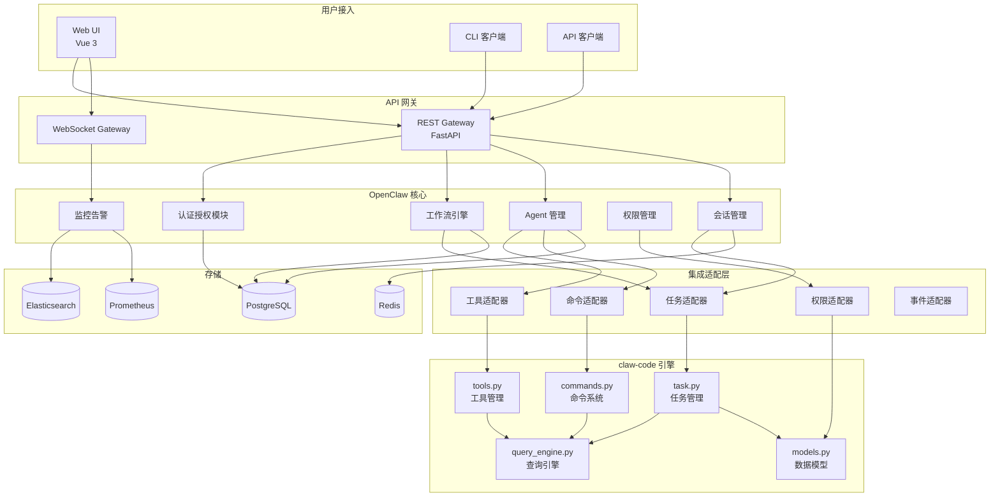
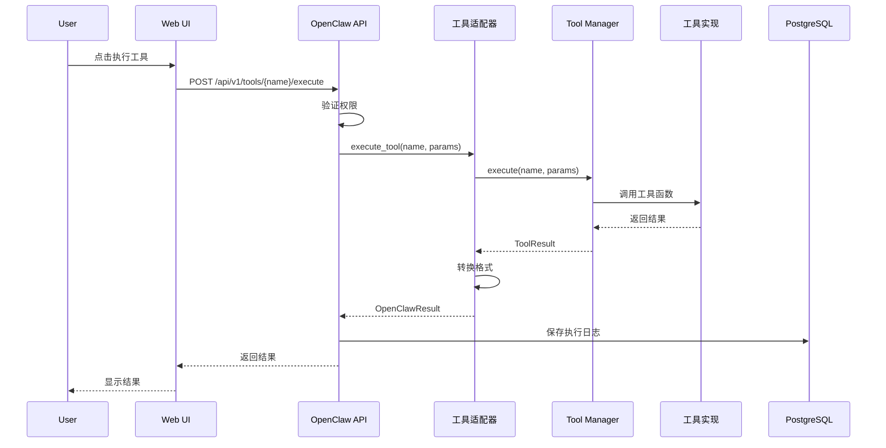
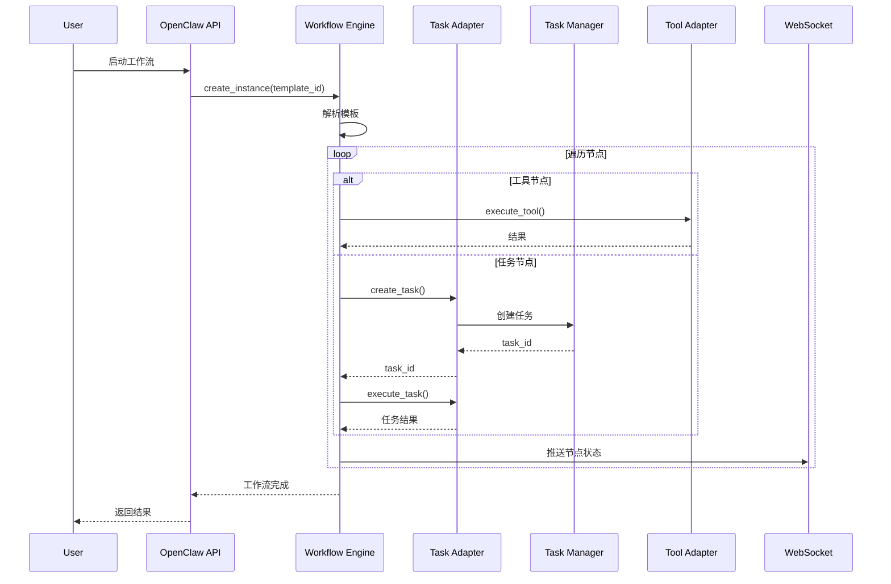
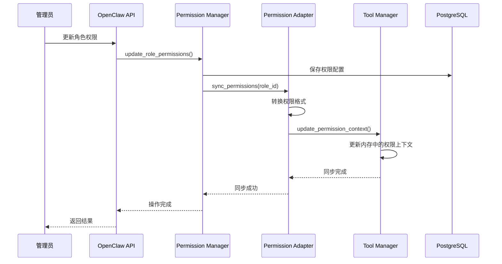

# 架构设计

> **文档版本**: 1.0.0  
> **创建日期**: 2026-04-02  
> **最后更新**: 2026-04-02  

---

## 1. 系统架构图

### 1.1 整体架构

```
┌─────────────────────────────────────────────────────────────────┐
│                          用户层                                  │
│  ┌──────────────┐  ┌──────────────┐  ┌──────────────┐          │
│  │   Web UI     │  │   CLI 客户端  │  │  API 客户端   │          │
│  │  (Vue 3)     │  │   (未来)      │  │   (第三方)    │          │
│  └──────────────┘  └──────────────┘  └──────────────┘          │
└─────────────────────────────────────────────────────────────────┘
                              │
                              ▼
┌─────────────────────────────────────────────────────────────────┐
│                        API 网关层                                │
│  ┌──────────────────────┐  ┌──────────────────────┐            │
│  │   REST API Gateway   │  │  WebSocket Gateway   │            │
│  │   (FastAPI)          │  │  (实时通信)           │            │
│  └──────────────────────┘  └──────────────────────┘            │
└─────────────────────────────────────────────────────────────────┘
                              │
                              ▼
┌─────────────────────────────────────────────────────────────────┐
│                    OpenClaw Control Plane                        │
│  ┌─────────────┐ ┌─────────────┐ ┌─────────────┐               │
│  │ 认证授权     │ │ 工作流引擎   │ │ Agent 管理  │               │
│  └─────────────┘ └─────────────┘ └─────────────┘               │
│  ┌─────────────┐ ┌─────────────┐ ┌─────────────┐               │
│  │ 会话管理     │ │ 权限管理     │ │ 监控告警    │               │
│  └─────────────┘ └─────────────┘ └─────────────┘               │
└─────────────────────────────────────────────────────────────────┘
                              │
                              ▼
┌─────────────────────────────────────────────────────────────────┐
│                      集成适配层                                  │
│  ┌──────────────────────────────────────────────────────┐      │
│  │              claw-code Adapter (Python)               │      │
│  │  ┌─────────────┐ ┌─────────────┐ ┌─────────────┐    │      │
│  │  │ 工具适配器   │ │ 命令适配器   │ │ 任务适配器   │    │      │
│  │  └─────────────┘ └─────────────┘ └─────────────┘    │      │
│  │  ┌─────────────┐ ┌─────────────┐                     │      │
│  │  │ 权限适配器   │ │ 事件适配器   │                     │      │
│  │  └─────────────┘ └─────────────┘                     │      │
│  └──────────────────────────────────────────────────────┘      │
└─────────────────────────────────────────────────────────────────┘
                              │
                              ▼
┌─────────────────────────────────────────────────────────────────┐
│                     claw-code 执行引擎                           │
│  ┌─────────────┐ ┌─────────────┐ ┌─────────────┐               │
│  │ tools.py    │ │ commands.py │ │ task.py     │               │
│  │ 工具管理     │ │ 命令系统     │ │ 任务管理     │               │
│  └─────────────┘ └─────────────┘ └─────────────┘               │
│  ┌─────────────┐ ┌─────────────┐                               │
│  │ models.py   │ │query_engine │                               │
│  │ 数据模型     │ │ 查询引擎     │                               │
│  └─────────────┘ └─────────────┘                               │
└─────────────────────────────────────────────────────────────────┘
                              │
                              ▼
┌─────────────────────────────────────────────────────────────────┐
│                        存储层                                    │
│  ┌─────────────┐ ┌─────────────┐ ┌─────────────┐               │
│  │ PostgreSQL  │ │   Redis     │ │Elasticsearch│               │
│  │ 关系数据     │ │ 缓存/会话    │ │ 日志/搜索    │               │
│  └─────────────┘ └─────────────┘ └─────────────┘               │
│  ┌─────────────┐ ┌─────────────┐                               │
│  │ Prometheus  │ │  InfluxDB   │                               │
│  │ 指标监控     │ │ 时序数据     │                               │
│  └─────────────┘ └─────────────┘                               │
└─────────────────────────────────────────────────────────────────┘
```

### 1.2 Mermaid 架构图



---

## 2. 模块设计

### 2.1 OpenClaw 核心模块

#### 2.1.1 工作流引擎 (Workflow Engine)

**职责**:
- 工作流模板解析和实例化
- 节点调度和执行
- 状态机管理
- 错误处理和重试

**关键组件**:
```python
class WorkflowEngine:
    - parse_template()      # 解析模板
    - create_instance()     # 创建实例
    - execute_node()        # 执行节点
    - handle_error()        # 错误处理
    - persist_state()       # 持久化状态
```

**节点类型**:
| 节点类型 | 描述 | 集成点 |
|----------|------|--------|
| `tool_node` | 工具调用节点 | claw-code 工具适配器 |
| `command_node` | 命令执行节点 | claw-code 命令适配器 |
| `task_node` | 子任务节点 | claw-code 任务适配器 |
| `condition_node` | 条件分支节点 | OpenClaw 内部 |
| `parallel_node` | 并行执行节点 | OpenClaw 内部 |

#### 2.1.2 Agent 管理 (Agent Manager)

**职责**:
- Agent 注册和配置
- 工具清单管理
- 命令权限配置
- Agent 生命周期管理

**关键组件**:
```python
class AgentManager:
    - register_agent()      # 注册 Agent
    - get_tool_manifest()   # 获取工具清单
    - configure_tools()     # 配置工具权限
    - execute_agent()       # 执行 Agent
    - get_status()          # 获取状态
```

#### 2.1.3 会话管理 (Session Manager)

**职责**:
- 会话创建和维护
- 上下文管理
- 会话持久化

**关键组件**:
```python
class SessionManager:
    - create_session()      # 创建会话
    - get_context()         # 获取上下文
    - update_context()      # 更新上下文
    - close_session()       # 关闭会话
```

### 2.2 集成适配层模块

#### 2.2.1 工具适配器 (Tool Adapter)

**职责**:
- 桥接 OpenClaw 和 claw-code 工具管理
- 工具元数据转换
- 工具调用代理

**接口定义**:
```python
class ToolAdapter:
    def get_tool_list() -> List[ToolMetadata]
    def get_tool_detail(name: str) -> ToolDetail
    def execute_tool(name: str, params: dict) -> ToolResult
    def filter_tools(permissions: List[str]) -> List[ToolMetadata]
```

**数据转换**:
```
OpenClaw Tool          claw-code Tool
─────────────────────────────────────────
{                      {
  "name": "tool1",       "tool_name": "tool1",
  "description": "...",  "metadata": {"desc": "..."},
  "parameters": {...},   "schema": {...},
  "permissions": [...]   "permission_context": {...}
}                      }
```

#### 2.2.2 命令适配器 (Command Adapter)

**职责**:
- 命令元数据获取
- 命令执行代理
- 命令积压管理

**接口定义**:
```python
class CommandAdapter:
    def get_command_list() -> List[CommandMetadata]
    def execute_command(name: str, args: dict) -> CommandResult
    def get_backlog() -> CommandBacklog
    def clear_backlog() -> None
```

#### 2.2.3 任务适配器 (Task Adapter)

**职责**:
- 任务创建和执行
- 任务状态同步
- 子任务管理

**接口定义**:
```python
class TaskAdapter:
    def create_task(spec: TaskSpec) -> Task
    def execute_task(task_id: str) -> TaskResult
    def get_task_status(task_id: str) -> TaskStatus
    def cancel_task(task_id: str) -> bool
    def get_subtasks(task_id: str) -> List[Task]
```

#### 2.2.4 权限适配器 (Permission Adapter)

**职责**:
- 权限上下文转换
- 权限同步
- 权限验证

**接口定义**:
```python
class PermissionAdapter:
    def sync_permissions(user_id: str) -> None
    def get_permission_context(agent_id: str) -> PermissionContext
    def validate_access(agent_id: str, resource: str) -> bool
```

#### 2.2.5 事件适配器 (Event Adapter)

**职责**:
- 事件订阅和转发
- 事件格式转换
- 事件持久化

**事件类型**:
| 事件类型 | 来源 | 目的 |
|----------|------|------|
| `tool_executed` | claw-code | OpenClaw 监控 |
| `command_completed` | claw-code | OpenClaw 工作流 |
| `task_status_changed` | claw-code | OpenClaw UI |
| `permission_updated` | OpenClaw | claw-code |

### 2.3 claw-code 核心模块

#### 2.3.1 tools.py - 工具管理

**核心类**:
```python
class ToolManager:
    - load_tools()              # 加载工具清单
    - get_metadata(name)        # 获取元数据
    - execute(name, params)     # 执行工具
    - filter_by_permission()    # 权限过滤
```

**数据结构**:
```python
@dataclass
class ToolMetadata:
    name: str
    description: str
    parameters: Dict[str, Any]
    permissions: List[str]
    version: str
```

#### 2.3.2 commands.py - 命令系统

**核心类**:
```python
class CommandManager:
    - register_command()        # 注册命令
    - get_metadata(name)        # 获取元数据
    - execute(name, args)       # 执行命令
    - manage_backlog()          # 管理积压
```

**数据结构**:
```python
@dataclass
class CommandMetadata:
    name: str
    description: str
    arguments: Dict[str, Any]
    port: int  # 命令端口
```

#### 2.3.3 task.py - 任务管理

**核心类**:
```python
class TaskManager:
    - create_task(spec)         # 创建任务
    - execute(task_id)          # 执行任务
    - get_status(task_id)       # 获取状态
    - split_subtasks(task_id)   # 拆分子任务
```

**数据结构**:
```python
@dataclass
class Task:
    id: str
    spec: TaskSpec
    status: TaskStatus
    subtasks: List[str]
    created_at: datetime
    updated_at: datetime
```

---

## 3. 数据流设计

### 3.1 工具调用数据流



### 3.2 工作流执行数据流



### 3.3 权限同步数据流



---

## 4. 通信协议

### 4.1 REST API 协议

**基础 URL**: `https://api.openclaw.example.com/api/v1`

**认证**: JWT Bearer Token

**请求格式**:
```http
POST /api/v1/tools/web_search/execute
Authorization: Bearer <token>
Content-Type: application/json

{
  "params": {
    "query": "OpenClaw",
    "count": 10
  },
  "context": {
    "session_id": "sess_123",
    "agent_id": "agent_456"
  }
}
```

**响应格式**:
```json
{
  "success": true,
  "data": {
    "tool": "web_search",
    "result": [...],
    "execution_time_ms": 1234
  },
  "metadata": {
    "request_id": "req_789",
    "timestamp": "2026-04-02T21:49:00Z"
  }
}
```

### 4.2 WebSocket 协议

**连接 URL**: `wss://api.openclaw.example.com/ws/agents/{agent_id}`

**消息格式**:

#### 客户端 → 服务端
```json
{
  "type": "subscribe",
  "channels": ["task_status", "tool_events"]
}
```

```json
{
  "type": "execute",
  "payload": {
    "action": "run_task",
    "task_id": "task_123"
  }
}
```

#### 服务端 → 客户端
```json
{
  "type": "event",
  "channel": "task_status",
  "payload": {
    "task_id": "task_123",
    "status": "running",
    "progress": 45,
    "timestamp": "2026-04-02T21:49:00Z"
  }
}
```

```json
{
  "type": "event",
  "channel": "tool_events",
  "payload": {
    "tool": "web_search",
    "event": "executed",
    "duration_ms": 1234,
    "success": true
  }
}
```

### 4.3 事件协议

**事件总线**: Redis Pub/Sub

**事件格式**:
```json
{
  "event_id": "evt_123",
  "event_type": "tool.executed",
  "source": "claw-code",
  "timestamp": "2026-04-02T21:49:00Z",
  "payload": {
    "tool_name": "web_search",
    "agent_id": "agent_456",
    "session_id": "sess_123",
    "execution_time_ms": 1234,
    "success": true
  },
  "metadata": {
    "version": "1.0",
    "correlation_id": "corr_789"
  }
}
```

---

## 5. 部署架构

### 5.1 开发环境

```
┌─────────────────────────────────────┐
│       开发机 (Docker Compose)        │
│                                     │
│  ┌──────────────┐  ┌──────────────┐│
│  │ OpenClaw API │  │ claw-code    ││
│  │   :8000      │  │   :8080      ││
│  └──────────────┘  └──────────────┘│
│  ┌──────────────┐  ┌──────────────┐│
│  │ PostgreSQL   │  │ Redis        ││
│  │   :5432      │  │   :6379      ││
│  └──────────────┘  └──────────────┘│
│  ┌──────────────┐                  │
│  │ Elasticsearch│                  │
│  │   :9200      │                  │
│  └──────────────┘                  │
└─────────────────────────────────────┘
```

### 5.2 生产环境

```
┌─────────────────────────────────────────────────────────────┐
│                        负载均衡层                            │
│                   (Nginx / AWS ALB)                         │
└─────────────────────────────────────────────────────────────┘
                           │
        ┌──────────────────┼──────────────────┐
        ▼                  ▼                  ▼
┌───────────────┐  ┌───────────────┐  ┌───────────────┐
│ OpenClaw API  │  │ OpenClaw API  │  │ OpenClaw API  │
│   Node 1      │  │   Node 2      │  │   Node 3      │
└───────────────┘  └───────────────┘  └───────────────┘
        │                  │                  │
        └──────────────────┼──────────────────┘
                           ▼
┌─────────────────────────────────────────────────────────────┐
│                     服务网格 (Istio)                         │
└─────────────────────────────────────────────────────────────┘
                           │
        ┌──────────────────┼──────────────────┐
        ▼                  ▼                  ▼
┌───────────────┐  ┌───────────────┐  ┌───────────────┐
│ claw-code     │  │ claw-code     │  │ claw-code     │
│   Sidecar 1   │  │   Sidecar 2   │  │   Sidecar 3   │
└───────────────┘  └───────────────┘  └───────────────┘
                           │
        ┌──────────────────┼──────────────────┐
        ▼                  ▼                  ▼
┌───────────────┐  ┌───────────────┐  ┌───────────────┐
│ PostgreSQL    │  │ Redis Cluster │  │ Elasticsearch │
│   (主从)      │  │   (集群)      │  │   (集群)      │
└───────────────┘  └───────────────┘  └───────────────┘
```

### 5.3 Kubernetes 部署

```yaml
# openclaw-control-plane.yaml
apiVersion: apps/v1
kind: Deployment
metadata:
  name: openclaw-api
spec:
  replicas: 3
  template:
    spec:
      containers:
      - name: openclaw-api
        image: openclaw/api:latest
        ports:
        - containerPort: 8000
      - name: claw-code-sidecar
        image: clawcode/engine:latest
        ports:
        - containerPort: 8080
        env:
        - name: CLAWCODE_MODE
          value: "sidecar"
```

---

## 6.