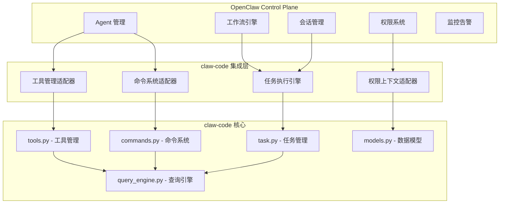
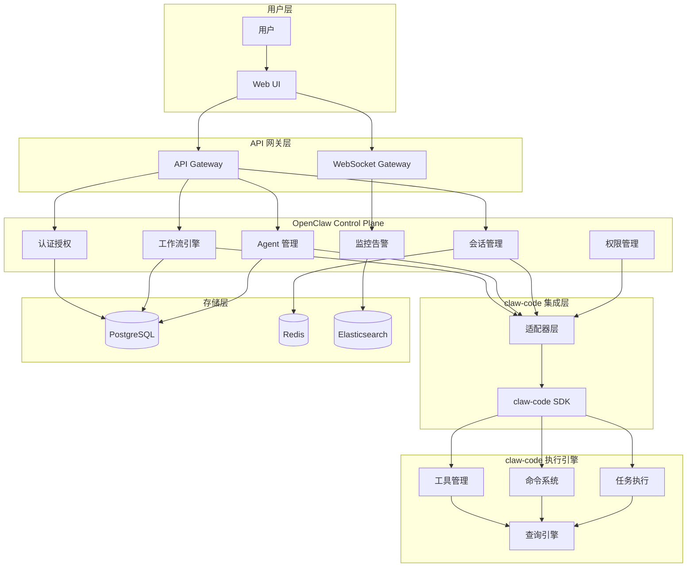
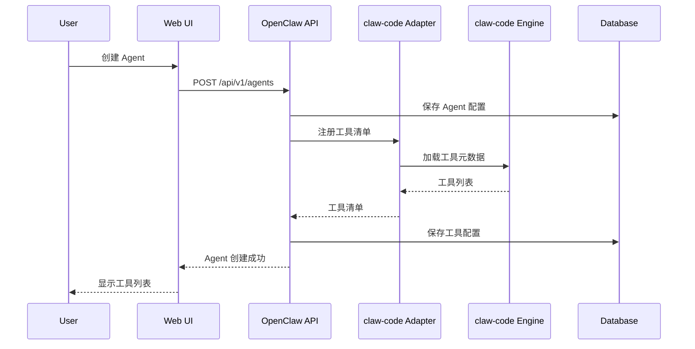

# OpenClaw Control Plane 与 claw-code 集成方案

> **文档版本**: 1.0.0  
> **创建日期**: 2026-04-02  
> **最后更新**: 2026-04-02  
> **状态**: 设计阶段

---

## 1. 概述

### 1.1 集成目标

将 **claw-code**（Claude Code 的 Python 重写版本）作为核心执行引擎集成到 **OpenClaw Control Plane** 中，实现：

- **统一管理**: 在 OpenClaw 平台上管理 claw-code 的所有功能
- **工作流编排**: 将 claw-code 能力嵌入到工作流模板中
- **可视化监控**: 提供工具、命令、任务的可视化管理界面
- **权限控制**: 细粒度的工具和命令权限管理

### 1.2 背景

**OpenClaw Control Plane** 是一个 AI Agent 编排平台，提供：
- 工作流模板管理
- Agent 生命周期管理
- 会话和任务追踪
- 看板和定时任务

**claw-code** 是 Claude Code CLI 的 Python 重写版本，核心能力包括：
- 工具清单和执行
- 命令系统
- 任务规划和执行
- 权限上下文管理

两者结合将实现 **强大的 AI Agent 编排和执行平台**。

---

## 2. 核心价值

### 2.1 对 OpenClaw 的价值

| 价值点 | 描述 |
|--------|------|
| **增强执行能力** | 获得成熟的工具管理和命令执行引擎 |
| **降低开发成本** | 复用 claw-code 的工具生态 |
| **提升可靠性** | 利用 claw-code 已验证的权限管理机制 |
| **加速迭代** | claw-code 持续演进，无需自行开发执行引擎 |

### 2.2 对 claw-code 的价值

| 价值点 | 描述 |
|--------|------|
| **可视化界面** | 提供 Web UI 管理工具和任务 |
| **工作流编排** | 支持复杂的多步骤任务编排 |
| **企业级管理** | 提供用户、权限、审计等企业级功能 |
| **监控告警** | 集成监控和告警能力 |

### 2.3 对用户的价值

| 价值点 | 描述 |
|--------|------|
| **一站式平台** | 单一平台完成 Agent 开发、部署、监控 |
| **降低门槛** | 无需编写代码即可配置复杂工作流 |
| **可视化编排** | 拖拽式工作流设计 |
| **实时反馈** | 任务执行状态实时可见 |

---

## 3. 集成范围

### 3.1 核心集成模块



### 3.2 功能映射表

| OpenClaw 模块 | claw-code 集成 | 集成方式 |
|---------------|----------------|----------|
| **Agent 管理** | 工具清单、命令系统 | API + 适配器 |
| **工作流模板** | 任务规划、命令节点 | 工作流节点类型 |
| **会话管理** | 任务执行上下文 | 共享会话存储 |
| **权限系统** | 工具权限上下文 | 权限映射和同步 |
| **监控告警** | 任务状态、工具调用日志 | 事件订阅 |

### 3.3 集成优先级

| 优先级 | 模块 | 原因 |
|--------|------|------|
| **P0** | Agent Harness 集成 | 核心功能，决定整体架构 |
| **P0** | 工具管理界面 | 用户最常用的功能 |
| **P1** | 命令系统增强 | 提升工作流编排能力 |
| **P1** | 任务编排增强 | 支持复杂任务拆分 |
| **P2** | 权限管理增强 | 企业级功能，可后续完善 |

---

## 4. 技术选型

### 4.1 集成架构模式

**选择**: 适配器模式 + 微服务通信

**原因**:
1. **解耦**: claw-code 可能被 Rust 重写，适配器隔离变化
2. **扩展性**: 易于添加新的执行引擎
3. **容错**: 一个组件失败不影响其他功能
4. **独立部署**: claw-code 可独立升级

### 4.2 通信协议

| 场景 | 协议 | 原因 |
|------|------|------|
| **同步 API** | REST + JSON | 简单、通用、易调试 |
| **实时通信** | WebSocket | 任务状态、日志实时推送 |
| **事件通知** | Webhook + Event Queue | 异步解耦 |
| **内部通信** | gRPC（可选） | 高性能、类型安全 |

### 4.3 技术栈

#### OpenClaw 扩展

```
Backend:
  - FastAPI (现有)
  - 新增: claw-code Adapter Module
  - 新增: WebSocket Gateway

Frontend:
  - Vue 3 + TypeScript (现有)
  - 新增: 工具管理页面
  - 新增: 命令配置组件
  - 新增: 任务编排可视化
```

#### claw-code 适配层

```
Python:
  - claw-code SDK (封装 API 调用)
  - 权限上下文转换器
  - 事件监听器
```

### 4.4 数据存储

| 数据类型 | 存储方案 | 原因 |
|----------|----------|------|
| **配置数据** | PostgreSQL (现有) | 关系型、事务支持 |
| **会话数据** | Redis (现有) | 快速、临时性 |
| **执行日志** | Elasticsearch | 搜索、分析 |
| **指标数据** | Prometheus + InfluxDB | 时序数据、监控 |

---

## 5. 总体架构

### 5.1 系统架构图



### 5.2 数据流概览



---

## 6. 关键设计决策

### 6.1 claw-code 部署方式

**决策**: Sidecar 模式

**理由**:
- 与 OpenClaw 紧密耦合
- 低延迟通信
- 简化部署和配置

**替代方案**:
- 独立微服务（延迟高、运维复杂）
- 嵌入式库（耦合度高、升级困难）

### 6.2 权限同步策略

**决策**: 双向同步 + 最终一致性

**理由**:
- OpenClaw 管理用户和角色
- claw-code 管理工具权限上下文
- 通过事件机制同步

### 6.3 工作流与任务映射

**决策**: 一个工作流实例 = 一个 claw-code 任务

**理由**:
- 简化状态管理
- 清晰的生命周期
- 易于追踪和调试

---

## 7. 成功标准

### 7.1 功能指标

| 指标 | 目标 | 衡量方式 |
|------|------|----------|
| 工具调用成功率 | > 99% | 监控统计 |
| API 响应时间 | < 200ms (P95) | APM 监控 |
| WebSocket 延迟 | < 100ms | 端到端测量 |
| 任务完成率 | > 95% | 任务统计 |

### 7.2 用户体验指标

| 指标 | 目标 | 衡量方式 |
|------|------|----------|
| 工具配置时间 | < 5 分钟 | 用户调研 |
| 工作流设计时间 | < 30 分钟 | 用户调研 |
| 错误恢复时间 | < 10 分钟 | 监控告警 |

---

## 8. 相关文档

- [架构设计](./architecture.md)
- [API 设计](./api-design.md)
- [实施计划](./implementation-plan.md)
- [风险评估](./risk-assessment.md)

---

## 9. 版本历史

| 版本 | 日期 | 作者 | 变更说明 |
|------|------|------|----------|
| 1.0.0 | 2026-04-02 | rd-commander | 初始版本 |
