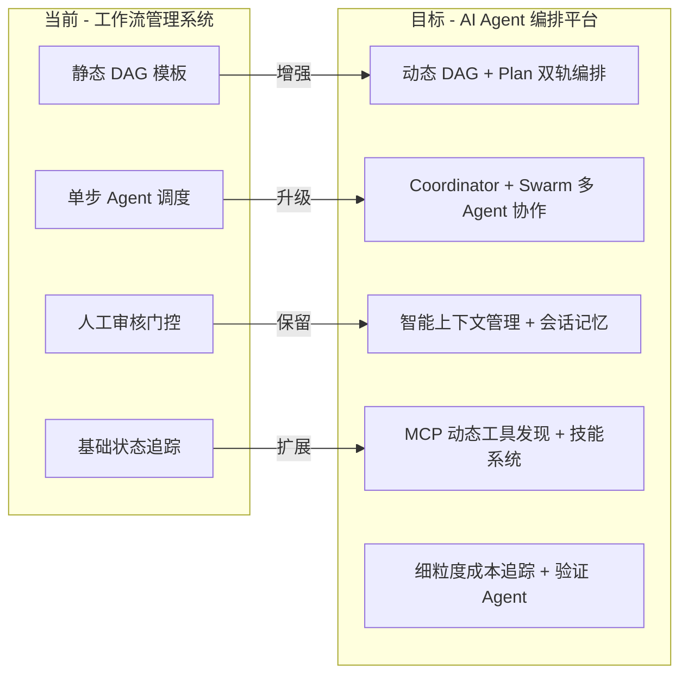
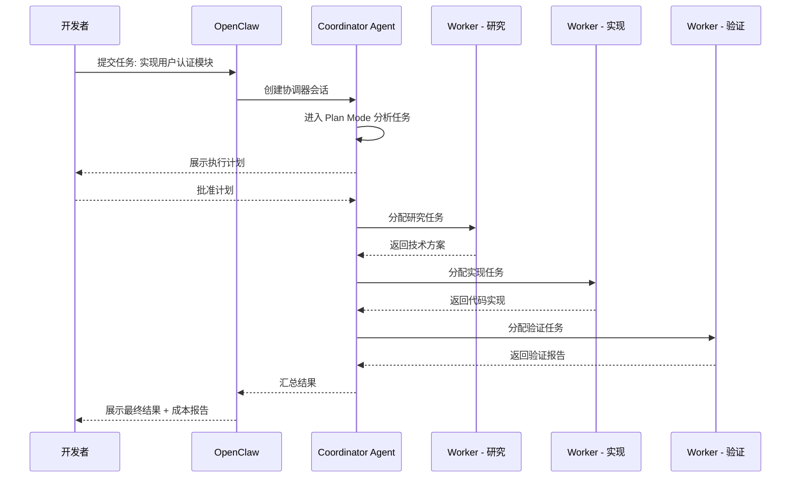

# 01 — 产品愿景与目标

## 1.1 产品定位升级

OpenClaw Control Plane 正在进行从 **"工作流管理系统"** 到 **"AI Agent 编排平台"** 的重大升级。

### 升级路径总览

| 维度           | 当前 v2                        | 目标 v3                           |
| -------------- | ------------------------------ | --------------------------------- |
| **编排模型**   | 静态 DAG 模板                  | 静态 DAG + 动态 Plan 双轨         |
| **Agent 协作** | 单步调度（`SchedulerService`） | Coordinator + Swarm + Fork 三模式 |
| **上下文管理** | 无                             | Token Budget + Auto-compact       |
| **记忆系统**   | 无                             | 会话记忆 + 项目记忆自动提取       |
| **工具集成**   | 静态 extensions API            | MCP 动态发现 + 技能注册           |
| **成本追踪**   | 基础 usage API                 | 模型级细粒度 token/cost 追踪      |
| **质量保证**   | 人工审核                       | 人工审核 + Verification Agent     |
| **扩展性**     | API 扩展                       | 技能 + 插件 + MCP 三层扩展        |
| **状态持久化** | 基础状态机                     | LangGraph Checkpointer 检查点     |

---

## 1.2 核心用户场景

### 场景 1：开发者 — 复杂功能实现

**角色**: 后端开发者  
**场景**: 需要实现一个涉及多个模块的复杂功能

**用户故事**: 作为开发者，我希望提交一个复杂任务后，系统能自动拆解、分配给多个 Agent 并行执行、独立验证，最终交付高质量结果，而不需要我手动编排每一步。

### 场景 2：运维 — 自动化运维工作流

**角色**: DevOps 工程师  
**场景**: 设置定时巡检 + 异常自动修复工作流

**用户故事**: 作为运维工程师，我希望定义一个定时触发的工作流，系统能自动巡检服务状态、发现问题后自动委派修复 Agent、修复后自动验证，全程可追踪成本和执行历史。

### 场景 3：产品经理 — 需求到交付全流程

**角色**: 产品经理  
**场景**: 提交需求文档，跟踪从分析到实现的完整流程

**用户故事**: 作为产品经理，我希望提交需求后能可视化查看 Agent 团队的执行进度、成本消耗、验证结果，并在关键节点进行人工审核。

---

## 1.3 成功指标（KPI）

### 业务指标

| 指标                    | 基线         | 目标     | 衡量方式                             |
| ----------------------- | ------------ | -------- | ------------------------------------ |
| 复杂任务自动化率        | 0%（全手动） | ≥60%     | 自动完成的步骤数 / 总步骤数          |
| 多 Agent 协作任务完成率 | N/A          | ≥85%     | 成功完成的多 Agent 任务数 / 总发起数 |
| 平均任务交付时间        | 基线待定     | 降低 40% | 从任务创建到完成的时间               |
| 用户满意度              | 基线待定     | ≥4.0/5.0 | 用户评分                             |

### 技术指标

| 指标             | 目标                     | 衡量方式                   |
| ---------------- | ------------------------ | -------------------------- |
| 编排调度延迟 P95 | < 500ms（不含 LLM 调用） | 控制面 API 响应时间        |
| 检查点恢复时间   | < 5s                     | 从检查点恢复到继续执行     |
| 上下文压缩效率   | 压缩后 ≤ 原始 30% token  | Auto-compact 前后 token 比 |
| 成本追踪精度     | 与实际 API 账单误差 < 5% | 追踪值 vs Anthropic 账单   |
| MCP 工具发现延迟 | < 2s                     | 从连接到工具列表获取       |
| 系统可用性       | ≥99.5%                   | 运行时间 / 总时间          |

### 兼容性指标

| 指标            | 目标   | 衡量方式               |
| --------------- | ------ | ---------------------- |
| v1 API 向后兼容 | 100%   | 升级后旧客户端无感知   |
| 数据迁移完整性  | 100%   | 迁移前后数据一致性校验 |
| 特性开关回滚    | < 1min | 从发现问题到回滚完成   |

---

## 1.4 核心设计原则

1. **图结构是最成熟的编排范式** — LangGraph 的 StateGraph 已成为事实标准
2. **检查点必不可少** — 所有生产级系统都需要状态持久化和恢复能力
3. **Human-in-the-loop 是刚需** — 关键决策点需要人工审批，这是安全合规的底线
4. **Token 预算管理决定成本** — Claude Code 的 Token Budget 是最精细的成本控制方案
5. **MCP 是工具集成的未来** — 标准化协议比私有 API 更有生命力
6. **记忆系统提升 Agent 连续性** — 自动记忆提取让 Agent 跨会话保持上下文
7. **协调器模式优于广播模式** — 集中式控制在生产环境更可靠
8. **渐进式迁移优于大爆炸重写** — 特性开关 + 双写 + 适配层

---

## 1.5 非目标（Non-Goals）

- **不**将任何第三方源码仓库作为依赖直接打入发布产物
- **不**在 v3 首轮一次性替换所有现有 API；采用双写/适配层与特性开关迁移
- **不**承诺与某一商业产品 100% 行为一致；以 OpenClaw 场景可验证为准
- **不**在 Phase 1 实现所有 P2 功能；按优先级分阶段交付
- **不**替换现有 FastAPI 框架；在其基础上增强
