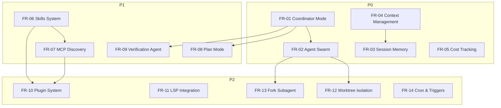

# 02 — 功能需求

## 优先级说明

| 级别   | 含义                       | 交付阶段 |
| ------ | -------------------------- | -------- |
| **P0** | 核心能力，无此则平台不可用 | Phase 1  |
| **P1** | 重要能力，显著提升平台价值 | Phase 2  |
| **P2** | 增强能力，完善生态体验     | Phase 3  |

---

## P0 — 核心能力

### FR-01: Coordinator Mode（协调器模式）

**用户故事**: 作为开发者，我希望提交一个复杂任务后，系统能自动创建协调器 Agent，将任务拆解为子任务并分配给多个 Worker Agent 并行执行，最终汇总结果。

**验收标准**:

1. 创建协调器会话后，可生成 1-N 个 Worker Agent
2. 协调器通过 SendMessage 与 Worker 双向通信
3. Worker 支持 Continue（复用已有会话）和 Spawn Fresh（新建会话）两种模式
4. 协调器可汇总所有 Worker 结果并生成最终报告
5. 任一 Worker 失败时，协调器可决定重试或降级
6. 全程可通过 WebSocket 实时查看协调器和各 Worker 状态

**技术约束**:

- 协调器本身不执行具体任务，只做任务拆解和结果汇总
- Worker 之间默认隔离，通过协调器中转通信
- 共享知识通过 `scratchpad_dir`（共享文件目录）传递
- 单个协调器最多管理 10 个 Worker

**Claude Code 参考**: `coordinator/coordinatorMode.ts` — Continue vs Spawn Fresh 决策矩阵

---

### FR-02: Agent Swarm / Team（Agent 团队系统）

**用户故事**: 作为开发者，我希望动态创建 Agent 团队，团队成员可以互相通信协作，团队由一个 Leader Agent 统一协调。

**验收标准**:

1. 可通过 API 创建/解散 Agent 团队
2. 可动态添加/移除团队成员，指定角色
3. 团队成员间可通过 SendMessage 互相通信
4. Team Leader 负责任务分配和结果汇总
5. 团队执行可绑定到工作流步骤
6. 支持 Worktree 隔离模式（每个 Worker 在独立 Git 分支工作）

**技术约束**:

- 团队生命周期与工作流实例绑定
- 消息传递异步，通过消息队列
- 团队规模上限 20 个 Agent

**Claude Code 参考**: `tools/TeamCreateTool/`, `tools/SendMessageTool/`

---

### FR-03: Session Memory（会话记忆系统）

**用户故事**: 作为开发者，我希望 Agent 在执行长任务时能自动维护会话记忆，在上下文切换或重启后能快速恢复关键信息。

**验收标准**:

1. 基于阈值自动触发记忆提取（工具调用次数 / 消息数量）
2. 后台异步执行记忆提取，不阻塞主流程
3. 输出为 Markdown 格式，可供后续会话引用
4. 支持会话级、项目级、全局级三层记忆
5. Agent 重新调度时自动加载历史记忆
6. 跨工作流实例共享项目级记忆

**技术约束**:

- 记忆提取使用 forked subagent 后台执行
- 记忆文件存储在数据库中（非文件系统）
- 记忆大小限制 100KB/会话

**Claude Code 参考**: `services/SessionMemory/sessionMemory.ts`

---

### FR-04: Context Management（上下文窗口管理）

**用户故事**: 作为系统管理员，我希望系统能自动管理 Agent 的上下文窗口，在接近限制时自动压缩历史消息，避免 token 浪费和 API 错误。

**验收标准**:

1. 支持按模型估算 token 数量
2. 当 token 使用超过阈值（默认 80%）自动触发压缩
3. 支持 Auto-compact（全量压缩）和 Micro-compact（仅压缩低价值消息）
4. 为不同工具/消息分配 token 预算
5. 压缩后保持关键上下文不丢失
6. 提供压缩前后 token 使用对比报告

**技术约束**:

- Token 估算精度需与实际误差 < 10%
- 压缩操作不能丢失用户指令和关键输出
- 支持 Claude、GPT 等多种模型的 token 计数

**Claude Code 参考**: `services/compact/`, `query/tokenBudget.ts`, `services/tokenEstimation.ts`

---

### FR-05: Cost Tracking（细粒度成本追踪）

**用户故事**: 作为项目管理者，我希望实时查看每个工作流、每个步骤、每个 Agent 的 LLM 调用成本，以便优化预算分配。

**验收标准**:

1. 按模型追踪 input/output/cache token 使用
2. 实时计算 USD 成本（基于模型定价）
3. 追踪缓存命中/未命中率
4. 追踪 API 调用耗时
5. 支持按工作流/步骤/Agent/时间维度聚合成本
6. 提供成本预算告警（超过阈值自动通知）
7. 提供成本趋势分析报表

**技术约束**:

- 成本计算在 API 调用返回后立即记录
- 精度与 Anthropic/OpenAI 账单误差 < 5%
- 历史成本数据不可篡改（追加写入）

**Claude Code 参考**: `cost-tracker.ts`

---

## P1 — 重要能力

### FR-06: Skills System（技能注册与执行系统）

**用户故事**: 作为开发者，我希望定义可复用的技能包，每个技能包含特定的工具集、提示模板和执行策略，可以在工作流步骤中直接引用。

**验收标准**:

1. 支持三种技能来源：Bundled（内置）、Custom（用户定义）、MCP Skill Builder（自动生成）
2. 技能定义包含：名称、描述、使用场景、允许工具、模型指定、参数提示
3. 工作流步骤可绑定技能（而非仅绑定 Agent）
4. 技能可跨工作流复用
5. 支持技能版本管理
6. 技能执行返回结构化 prompt blocks

**技术约束**:

- 技能注册表全局共享，按租户隔离
- 技能执行在 Agent 上下文中进行
- MCP Skill Builder 从 MCP 工具自动构建

**Claude Code 参考**: `skills/bundledSkills.ts`, `tools/SkillTool/`

---

### FR-07: MCP Dynamic Discovery（MCP 动态工具发现）

**用户故事**: 作为开发者，我希望系统能动态连接 MCP 服务器，自动发现可用工具，并将其注册到工作流步骤的工具集中。

**验收标准**:

1. 动态连接/断开 MCP 服务器
2. 自动发现 MCP 服务器提供的工具列表
3. 工具权限管理（允许/拒绝列表）
4. 支持 MCP 资源读取
5. 工具变更时自动通知相关 Agent
6. MCP 工具可直接在工作流步骤中引用

**技术约束**:

- MCP 连接支持 stdio 和 SSE 两种传输方式
- 工具发现结果缓存，TTL 可配置
- 工具执行超时可配置

**Claude Code 参考**: `services/mcp/MCPConnectionManager.tsx`, `services/mcp/client.ts`

---

### FR-08: Plan Mode（计划模式）

**用户故事**: 作为开发者，我希望在执行复杂任务前，Agent 先进入计划模式分析任务、制定执行计划，经我确认后再开始执行。

**验收标准**:

1. Agent 可进入计划模式，只做分析不做修改
2. 生成结构化执行计划（步骤列表 + 依赖关系）
3. 用户可在 UI 中查看和编辑计划
4. 计划批准后退出计划模式，开始执行
5. 执行过程中可中途修改计划
6. 计划结果作为工作流步骤的输入

**技术约束**:

- 计划模式使用独立模型调用（不消耗执行预算）
- 计划输出需经 JSON Schema 校验
- DAG 模板中可标记 `plan_required: true`

**Claude Code 参考**: `tools/EnterPlanModeTool/`, `tools/ExitPlanModeTool/`

---

### FR-09: Verification Agent（验证 Agent）

**用户故事**: 作为开发者，我希望在工作流的关键步骤后自动插入独立验证环节，由独立的验证 Agent 审查实现质量。

**验收标准**:

1. 验证 Agent 与实现 Agent 完全隔离（独立会话）
2. 可验证代码质量、测试覆盖率、边界情况
3. 输出结构化验证报告（通过/失败/警告列表）
4. 验证失败时可自动触发修复流程
5. 验证报告作为步骤产出物存储
6. 支持自定义验证规则

**技术约束**:

- 验证 Agent 不共享实现 Agent 的上下文
- 验证超时独立于步骤超时
- 验证结果不可被实现 Agent 修改

**Claude Code 参考**: `tools/AgentTool/built-in/verificationAgent.ts`

---

## P2 — 增强能力

### FR-10: Plugin System（插件系统）

**用户故事**: 作为开发者，我希望通过安装插件来扩展平台能力，插件可以提供新的技能、MCP 服务器、Hook 等。

**验收标准**:

1. 支持内置插件和市场插件
2. 插件可提供：skills、hooks、MCP servers
3. 插件启用/禁用不影响其他插件
4. 插件安装/卸载 API
5. 插件沙箱隔离执行

---

### FR-11: LSP Integration（LSP 语言服务器集成）

**用户故事**: 作为开发者，我希望 Agent 在编码时能获取 LSP 诊断信息（错误、警告），提升代码质量。

**验收标准**:

1. 管理 LSP 服务器实例（启动/停止）
2. 获取文件诊断信息
3. 被动反馈模式（后台收集诊断）
4. 支持主流语言（Python、TypeScript、Go）

---

### FR-12: Worktree Isolation（Git Worktree 隔离）

**用户故事**: 作为开发者，我希望多个 Agent 并行工作时，每个 Agent 在独立的 Git Worktree 中操作，避免工作区冲突。

**验收标准**:

1. 为 Agent 创建独立 Git Worktree
2. Agent 在隔离环境中修改代码
3. 完成后自动合并或清理
4. 冲突检测和解决机制

---

### FR-13: Fork Subagent（并行子 Agent）

**用户故事**: 作为开发者，我希望 Agent 能 fork 自身，在共享上下文的情况下并行执行子任务，降低成本。

**验收标准**:

1. 共享父 Agent 的 prompt cache
2. 适合并行研究、独立实现
3. 完成后通知父 Agent
4. 不允许偷看 fork 的中间结果
5. Fork 结果作为父 Agent 上下文注入

---

### FR-14: Cron & Remote Triggers（定时任务与远程触发）

**用户故事**: 作为运维工程师，我希望设置定时触发的工作流和通过 Webhook 触发的工作流。

**验收标准**:

1. 支持 cron 表达式定义定时任务
2. 到期自动触发工作流
3. 通过 Webhook URL 触发工作流
4. 支持 GitHub webhook、Slack 等集成
5. 触发历史和日志记录

---

## 功能依赖关系

