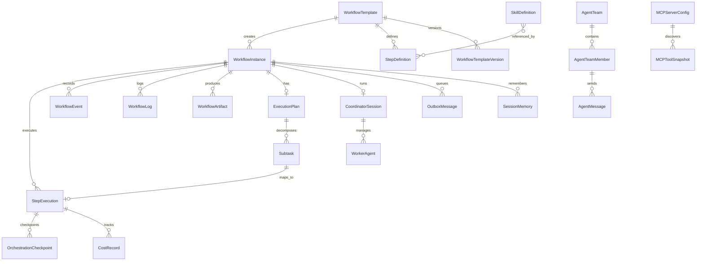

# 04 — 数据模型设计

## 4.1 模型总览

### 现有模型（保留/增强）

| 模型               | 表名                 | 变更类型                                             |
| ------------------ | -------------------- | ---------------------------------------------------- |
| `WorkflowTemplate` | `workflow_templates` | 增强：新增 `step_types` 字段                         |
| `WorkflowInstance` | `workflow_instances` | 增强：新增 `orchestration_profile`、`plan_id` 等字段 |
| `StepDefinition`   | `step_definitions`   | 增强：新增 `kind`、`config_json`、`condition` 字段   |
| `StepExecution`    | `step_executions`    | 增强：新增 `idempotency_key`、`input_hash` 等字段    |
| `ReviewRecord`     | `review_records`     | 保留不变                                             |
| `WorkflowLog`      | `workflow_logs`      | 保留不变                                             |
| `WorkflowEvent`    | `workflow_events`    | 保留不变                                             |
| `WorkflowArtifact` | `workflow_artifacts` | 保留不变                                             |
| `Agent`            | `agents`             | 增强：新增 `team_id`、`agent_type` 字段              |

### 新增模型

| 模型                      | 表名                        | 用途              |
| ------------------------- | --------------------------- | ----------------- |
| `CoordinatorSession`      | `coordinator_sessions`      | 协调器会话管理    |
| `WorkerAgent`             | `worker_agents`             | Worker Agent 实例 |
| `AgentTeam`               | `agent_teams`               | Agent 团队        |
| `AgentTeamMember`         | `agent_team_members`        | 团队成员关系      |
| `AgentMessage`            | `agent_messages`            | Agent 间消息      |
| `ExecutionPlan`           | `execution_plans`           | 动态执行计划      |
| `Subtask`                 | `subtasks`                  | 计划内子任务      |
| `OrchestrationCheckpoint` | `orchestration_checkpoints` | 编排检查点        |
| `SessionMemory`           | `session_memories`          | 会话记忆          |
| `CostRecord`              | `cost_records`              | 成本追踪记录      |
| `SkillDefinition`         | `skill_definitions`         | 技能定义          |
| `MCPServerConfig`         | `mcp_server_configs`        | MCP 服务器配置    |
| `MCPToolSnapshot`         | `mcp_tool_snapshots`        | MCP 工具快照      |
| `OutboxMessage`           | `outbox_messages`           | 命令/事件积压     |

---

## 4.2 ER 关系图



---

## 4.3 新增表结构详细定义

### CoordinatorSession（协调器会话）

```python
class CoordinatorSession(Base):
    """协调器会话表"""
    __tablename__ = "coordinator_sessions"

    id: Mapped[str]              # PK，协调器会话 ID
    workflow_instance_id: Mapped[str]   # FK → workflow_instances.id
    status: Mapped[str]          # active / completed / failed / terminated
    coordinator_agent_id: Mapped[Optional[str]]  # 协调器 Agent ID
    plan_mode: Mapped[bool]      # 是否启用了计划模式
    scratchpad_dir: Mapped[Optional[str]]  # 跨 Worker 共享知识目录
    config_json: Mapped[str]     # 协调器配置 JSON
    result_summary: Mapped[Optional[str]]  # 最终结果摘要
    created_at: Mapped[str]
    completed_at: Mapped[Optional[str]]
    error_message: Mapped[Optional[str]]
```

### WorkerAgent（Worker Agent 实例）

```python
class WorkerAgent(Base):
    """Worker Agent 实例表"""
    __tablename__ = "worker_agents"

    id: Mapped[str]              # PK
    coordinator_id: Mapped[str]  # FK → coordinator_sessions.id
    agent_id: Mapped[Optional[str]]  # FK → agents.id
    agent_type: Mapped[str]      # worker / verification / explore / plan
    status: Mapped[str]          # pending / running / completed / failed
    task_description: Mapped[Optional[str]]  # 分配的任务描述
    session_key: Mapped[Optional[str]]  # 执行会话 key
    continue_mode: Mapped[bool]  # True=Continue，False=Spawn Fresh
    context_json: Mapped[Optional[str]]  # Worker 上下文
    result_json: Mapped[Optional[str]]   # 执行结果
    created_at: Mapped[str]
    started_at: Mapped[Optional[str]]
    completed_at: Mapped[Optional[str]]
    error_message: Mapped[Optional[str]]
```

### AgentTeam（Agent 团队）

```python
class AgentTeam(Base):
    """Agent 团队表"""
    __tablename__ = "agent_teams"

    id: Mapped[str]              # PK
    name: Mapped[str]            # 团队名称
    leader_agent_id: Mapped[str] # Team Leader Agent ID
    workflow_instance_id: Mapped[Optional[str]]  # 关联的工作流实例
    status: Mapped[str]          # active / dissolved
    config_json: Mapped[str]     # 团队配置
    created_at: Mapped[str]
    dissolved_at: Mapped[Optional[str]]
```

### AgentTeamMember（团队成员）

```python
class AgentTeamMember(Base):
    """团队成员表"""
    __tablename__ = "agent_team_members"

    id: Mapped[str]              # PK
    team_id: Mapped[str]         # FK → agent_teams.id
    agent_id: Mapped[str]        # FK → agents.id
    role: Mapped[str]            # leader / worker / reviewer / observer
    status: Mapped[str]          # active / idle / offline
    joined_at: Mapped[str]
    left_at: Mapped[Optional[str]]
```

### AgentMessage（Agent 间消息）

```python
class AgentMessage(Base):
    """Agent 间消息表"""
    __tablename__ = "agent_messages"

    id: Mapped[str]              # PK
    from_agent_id: Mapped[str]   # 发送者 Agent ID
    to_agent_id: Mapped[str]     # 接收者 Agent ID
    team_id: Mapped[Optional[str]]  # FK → agent_teams.id
    coordinator_id: Mapped[Optional[str]]  # FK → coordinator_sessions.id
    message_type: Mapped[str]    # task_assign / task_result / query / notify
    content: Mapped[str]         # 消息内容
    metadata_json: Mapped[Optional[str]]  # 元数据
    status: Mapped[str]          # pending / delivered / read
    created_at: Mapped[str]
    delivered_at: Mapped[Optional[str]]
```

### ExecutionPlan（动态执行计划）

```python
class ExecutionPlan(Base):
    """动态执行计划表"""
    __tablename__ = "execution_plans"

    id: Mapped[str]              # PK
    workflow_instance_id: Mapped[str]  # FK → workflow_instances.id
    source: Mapped[str]          # planner_agent / human / template
    status: Mapped[str]          # draft / approved / executing / completed / rejected
    plan_json: Mapped[str]       # 计划内容 JSON（步骤列表 + 依赖）
    version: Mapped[int]         # 计划版本号
    approved_by: Mapped[Optional[str]]  # 审批人
    created_at: Mapped[str]
    approved_at: Mapped[Optional[str]]
    completed_at: Mapped[Optional[str]]
```

### Subtask（子任务）

```python
class Subtask(Base):
    """子任务表"""
    __tablename__ = "subtasks"

    id: Mapped[str]              # PK
    plan_id: Mapped[str]         # FK → execution_plans.id
    parent_subtask_id: Mapped[Optional[str]]  # 父子任务（支持嵌套）
    step_execution_id: Mapped[Optional[str]]  # FK → step_executions.id（映射到执行记录）
    name: Mapped[str]            # 子任务名称
    description: Mapped[Optional[str]]
    status: Mapped[str]          # pending / running / completed / failed / skipped
    depends_on: Mapped[Optional[str]]  # 依赖的子任务 ID 列表 JSON
    assigned_agent_id: Mapped[Optional[str]]  # 分配的 Agent
    input_json: Mapped[Optional[str]]   # 输入参数
    output_json: Mapped[Optional[str]]  # 输出结果
    order_index: Mapped[int]     # 排序索引
    created_at: Mapped[str]
    started_at: Mapped[Optional[str]]
    completed_at: Mapped[Optional[str]]
```

### OrchestrationCheckpoint（编排检查点）

```python
class OrchestrationCheckpoint(Base):
    """编排检查点表"""
    __tablename__ = "orchestration_checkpoints"

    id: Mapped[str]              # PK
    workflow_instance_id: Mapped[str]  # FK → workflow_instances.id
    step_execution_id: Mapped[str]  # FK → step_executions.id
    checkpoint_type: Mapped[str] # pre_execute / post_execute / on_failure
    state_json: Mapped[str]      # 完整状态快照 JSON
    input_hash: Mapped[Optional[str]]  # 输入哈希（用于 memo）
    output_hash: Mapped[Optional[str]]  # 输出哈希
    output_summary: Mapped[Optional[str]]  # 输出摘要
    attempt: Mapped[int]         # 尝试次数
    idempotency_key: Mapped[str] # 幂等键
    created_at: Mapped[str]
```

### SessionMemory（会话记忆）

```python
class SessionMemory(Base):
    """会话记忆表"""
    __tablename__ = "session_memories"

    id: Mapped[str]              # PK
    scope: Mapped[str]           # session / project / global
    scope_id: Mapped[str]        # session_id / project_id / global
    content: Mapped[str]         # Markdown 格式记忆内容
    content_hash: Mapped[str]    # 内容哈希（用于变更检测）
    token_count: Mapped[int]     # 大致 token 数
    source: Mapped[str]          # auto_extract / manual / fork_subagent
    version: Mapped[int]         # 版本号
    created_at: Mapped[str]
    updated_at: Mapped[str]
```

### CostRecord（成本追踪记录）

```python
class CostRecord(Base):
    """成本追踪记录表"""
    __tablename__ = "cost_records"

    id: Mapped[str]              # PK
    workflow_instance_id: Mapped[Optional[str]]  # FK → workflow_instances.id
    step_execution_id: Mapped[Optional[str]]  # FK → step_executions.id
    agent_id: Mapped[Optional[str]]  # Agent ID
    model: Mapped[str]           # 模型名称
    input_tokens: Mapped[int]    # 输入 token 数
    output_tokens: Mapped[int]   # 输出 token 数
    cache_creation_tokens: Mapped[int]  # 缓存创建 token
    cache_read_tokens: Mapped[int]      # 缓存读取 token
    total_tokens: Mapped[int]    # 总 token 数
    cost_usd: Mapped[float]      # USD 成本
    duration_ms: Mapped[int]     # API 调用耗时
    api_call_type: Mapped[str]   # message / tool_call / embedding
    metadata_json: Mapped[Optional[str]]  # 额外元数据
    created_at: Mapped[str]
```

### SkillDefinition（技能定义）

```python
class SkillDefinition(Base):
    """技能定义表"""
    __tablename__ = "skill_definitions"

    id: Mapped[str]              # PK
    name: Mapped[str]            # 技能名称（唯一）
    display_name: Mapped[Optional[str]]
    description: Mapped[str]     # 技能描述
    category: Mapped[str]        # bundled / custom / mcp_generated
    when_to_use: Mapped[Optional[str]]  # 使用场景说明
    allowed_tools: Mapped[Optional[str]]  # 允许的工具列表 JSON
    model: Mapped[Optional[str]]  # 指定使用的模型
    argument_hint: Mapped[Optional[str]]  # 参数提示
    prompt_template: Mapped[Optional[str]]  # prompt 模板
    config_json: Mapped[Optional[str]]  # 技能配置
    version: Mapped[str]         # 技能版本
    enabled: Mapped[bool]        # 是否启用
    tenant_id: Mapped[Optional[str]]  # 租户 ID（null=全局）
    created_at: Mapped[str]
    updated_at: Mapped[str]
```

### MCPServerConfig（MCP 服务器配置）

```python
class MCPServerConfig(Base):
    """MCP 服务器配置表"""
    __tablename__ = "mcp_server_configs"

    id: Mapped[str]              # PK
    name: Mapped[str]            # 服务器名称（唯一）
    transport_type: Mapped[str]  # stdio / sse
    connection_config: Mapped[str]  # 连接配置 JSON
    status: Mapped[str]          # connected / disconnected / error
    tool_count: Mapped[int]      # 已发现工具数
    last_discovered_at: Mapped[Optional[str]]  # 最后发现时间
    enabled: Mapped[bool]        # 是否启用
    tenant_id: Mapped[Optional[str]]  # 租户 ID
    created_at: Mapped[str]
    updated_at: Mapped[str]
```

### MCPToolSnapshot（MCP 工具快照）

```python
class MCPToolSnapshot(Base):
    """MCP 工具快照表"""
    __tablename__ = "mcp_tool_snapshots"

    id: Mapped[str]              # PK
    server_id: Mapped[str]       # FK → mcp_server_configs.id
    tool_name: Mapped[str]       # 工具名称
    description: Mapped[Optional[str]]  # 工具描述
    input_schema: Mapped[Optional[str]]  # 输入 JSON Schema
    output_schema: Mapped[Optional[str]]  # 输出 JSON Schema
    version: Mapped[str]         # 工具版本
    discovered_at: Mapped[str]
```

### OutboxMessage（Outbox 消息）

```python
class OutboxMessage(Base):
    """Outbox 消息表"""
    __tablename__ = "outbox_messages"

    id: Mapped[str]              # PK
    workflow_instance_id: Mapped[str]  # FK → workflow_instances.id
    step_execution_id: Mapped[Optional[str]]  # FK → step_executions.id
    message_type: Mapped[str]    # command / event / signal
    target: Mapped[str]          # 目标（agent_id / session_key / webhook_url）
    payload_json: Mapped[str]    # 消息内容 JSON
    status: Mapped[str]          # pending / sent / acknowledged / failed
    idempotency_key: Mapped[str] # 幂等键
    retry_count: Mapped[int]     # 重试次数
    max_retries: Mapped[int]     # 最大重试次数
    created_at: Mapped[str]
    sent_at: Mapped[Optional[str]]
    acknowledged_at: Mapped[Optional[str]]
    error_message: Mapped[Optional[str]]
```

---

## 4.4 现有模型变更

### WorkflowInstance 增强

```python
# 新增字段（additive migration）
class WorkflowInstance(Base):
    # ... 现有字段保留 ...

    # v3 新增
    orchestration_profile: Mapped[Optional[str]]  # static-dag-v1 / plan-subtask-v2
    runtime_contract_version: Mapped[Optional[str]]  # 运行时契约版本
    plan_id: Mapped[Optional[str]]  # FK → execution_plans.id（可选）
    primary_session_key: Mapped[Optional[str]]  # 主会话 key
    total_cost_usd: Mapped[Optional[float]]  # 总成本
    total_tokens: Mapped[Optional[int]]  # 总 token 数
```

### StepDefinition 增强

```python
class StepDefinition(Base):
    # ... 现有字段保留 ...

    # v3 新增
    kind: Mapped[str] = "agent_session"  # StepKind 枚举
    config_json: Mapped[Optional[str]]  # 步骤类型特定配置
    condition: Mapped[Optional[str]]  # 条件表达式（JSONLogic 子集）
    skill_id: Mapped[Optional[str]]  # FK → skill_definitions.id
    verification_enabled: Mapped[bool] = False  # 是否启用验证 Agent
    tool_context_json: Mapped[Optional[str]]  # ToolContext 配置
```

### StepExecution 增强

```python
class StepExecution(Base):
    # ... 现有字段保留 ...

    # v3 新增
    idempotency_key: Mapped[Optional[str]]  # 幂等键
    input_hash: Mapped[Optional[str]]  # 输入哈希（memo 用）
    session_key: Mapped[Optional[str]]  # 执行会话 key
    checkpoint_id: Mapped[Optional[str]]  # 最新检查点 ID
    cost_usd: Mapped[Optional[float]]  # 步骤成本
    token_count: Mapped[Optional[int]]  # 步骤 token 数
```

### Agent 增强

```python
class Agent(Base):
    # ... 现有字段保留 ...

    # v3 新增
    team_id: Mapped[Optional[str]]  # FK → agent_teams.id
    agent_type: Mapped[str] = "generic"  # generic / coordinator / worker / verification
    max_concurrent_tasks: Mapped[int] = 1  # 最大并发任务数
```

---

## 4.5 迁移原则

1. **只增列/只增表** — 所有新字段默认可空或有默认值
2. **老实例不受影响** — 新字段为 null 时使用旧逻辑
3. **特性开关控制** — `ORCHESTRATION_V3_ENABLED` 控制新路径
4. **实例级 profile** — `orchestration_profile` 保证后续版本升级时可追溯语义
5. **破坏性变更走多阶段** — 双写 → 切读 → 清理
