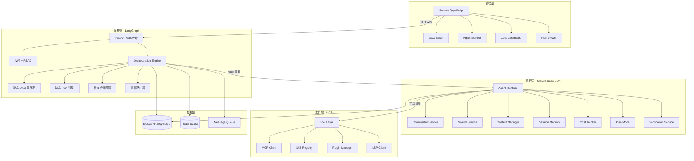

# 05 — 系统架构重构方案

## 5.1 新的三层架构



---

## 5.2 与现有 FastAPI 的集成方式

### 现有架构保留

```
FastAPI App (main.py)
├── 现有路由（保留）
│   ├── /api/health, /api/ready
│   ├── /api/projects, /api/tasks
│   ├── /api/agents, /api/channels
│   └── /api/workflow/* (现有工作流 API)
│
├── v3 新增路由（additive）
│   ├── /api/v2/orchestration/*    ← 编排引擎 API
│   ├── /api/v2/agents/coordinator/* ← 协调器 API
│   ├── /api/v2/agents/swarm/*     ← Swarm API
│   ├── /api/v2/context/*          ← 上下文管理 API
│   ├── /api/v2/memory/*           ← 记忆系统 API
│   ├── /api/v2/cost/*             ← 成本追踪 API
│   ├── /api/v2/skills/*           ← 技能系统 API
│   ├── /api/v2/mcp/*              ← MCP 管理 API
│   └── /api/v2/plans/*            ← 执行计划 API
│
└── WebSocket（增强）
    └── /ws/v2/orchestration/*     ← 编排实时事件
```

### 集成策略

1. **不替换 FastAPI** — 在现有应用上增加路由
2. **共享依赖注入** — 复用 `get_db`、`get_current_user_id` 等
3. **共享中间件** — CORS、API Key、JWT 认证
4. **共享数据层** — 同一数据库，新增表

---

## 5.3 目录结构重组方案

### 当前结构

```
backend/
├── app/
│   ├── api/              # 路由层
│   ├── core/             # 配置、认证
│   ├── models/           # 数据模型
│   ├── schemas/          # Pydantic schemas
│   └── services/         # 业务逻辑
│       └── workflow/     # 工作流服务
```

### 目标结构

```
backend/
├── app/
│   ├── api/                          # 路由层（保留 + 扩展）
│   │   ├── workflow/                 # 现有工作流 API（保留）
│   │   └── v2/                       # v3 新增 API
│   │       ├── __init__.py
│   │       ├── orchestration.py      # 编排引擎 API
│   │       ├── coordinator.py        # 协调器 API
│   │       ├── swarm.py              # Swarm API
│   │       ├── context.py            # 上下文管理 API
│   │       ├── memory.py             # 记忆系统 API
│   │       ├── cost.py               # 成本追踪 API
│   │       ├── skills.py             # 技能系统 API
│   │       ├── mcp.py                # MCP 管理 API
│   │       ├── plans.py              # 执行计划 API
│   │       └── verification.py       # 验证 Agent API
│   │
│   ├── core/                         # 核心配置（保留 + 扩展）
│   │   ├── config.py                 # 增加 v3 配置项
│   │   ├── auth.py                   # 保留
│   │   └── feature_flags.py          # 新增：特性开关
│   │
│   ├── models/                       # 数据模型（保留 + 扩展）
│   │   ├── workflow.py               # 增强：新增字段
│   │   ├── agent.py                  # 增强：新增字段
│   │   ├── orchestration.py          # 新增：编排相关模型
│   │   ├── memory.py                 # 新增：记忆模型
│   │   ├── cost.py                   # 新增：成本模型
│   │   ├── skill.py                  # 新增：技能模型
│   │   └── mcp.py                    # 新增：MCP 模型
│   │
│   ├── schemas/                      # Pydantic schemas（保留 + 扩展）
│   │   ├── workflow.py               # 增强
│   │   ├── orchestration.py          # 新增
│   │   ├── coordinator.py            # 新增
│   │   ├── swarm.py                  # 新增
│   │   ├── memory.py                 # 新增
│   │   ├── cost.py                   # 新增
│   │   ├── skill.py                  # 新增
│   │   └── mcp.py                    # 新增
│   │
│   └── services/                     # 业务逻辑（重构 + 扩展）
│       ├── workflow/                 # 现有工作流服务（保留）
│       │   ├── instance_service.py   # 增强
│       │   ├── scheduler_service.py  # 增强
│       │   └── agent_matcher_service.py  # 保留
│       │
│       ├── orchestration/            # 新增：编排引擎
│       │   ├── __init__.py
│       │   ├── engine.py             # 编排引擎核心
│       │   ├── dag_scheduler.py      # 静态 DAG 调度器
│       │   ├── plan_engine.py        # 动态 Plan 引擎
│       │   ├── checkpoint_manager.py # 检查点管理
│       │   └── event_router.py       # 事件路由
│       │
│       ├── coordinator/              # 新增：协调器服务
│       │   ├── __init__.py
│       │   ├── coordinator_service.py
│       │   └── worker_manager.py
│       │
│       ├── swarm/                    # 新增：Swarm 服务
│       │   ├── __init__.py
│       │   ├── team_service.py
│       │   └── message_service.py
│       │
│       ├── context/                  # 新增：上下文管理
│       │   ├── __init__.py
│       │   ├── context_manager.py
│       │   ├── token_budget.py
│       │   └── compact_service.py
│       │
│       ├── memory/                   # 新增：记忆系统
│       │   ├── __init__.py
│       │   └── session_memory_service.py
│       │
│       ├── cost/                     # 新增：成本追踪
│       │   ├── __init__.py
│       │   └── cost_tracker.py
│       │
│       ├── skills/                   # 新增：技能系统
│       │   ├── __init__.py
│       │   └── skill_registry.py
│       │
│       ├── mcp/                      # 新增：MCP 服务
│       │   ├── __init__.py
│       │   ├── connection_manager.py
│       │   └── tool_discovery.py
│       │
│       ├── plan/                     # 新增：计划模式
│       │   ├── __init__.py
│       │   └── plan_mode_service.py
│       │
│       └── verification/             # 新增：验证服务
│           ├── __init__.py
│           └── verification_service.py
```

---

## 5.4 新增依赖

```
# requirements.txt 新增
langgraph>=0.2.0              # 编排引擎
langchain-core>=0.3.0         # LangGraph 依赖
langchain-anthropic>=0.2.0    # Anthropic 集成
mcp>=1.0.0                    # MCP Python SDK
tiktoken>=0.7.0               # Token 估算
alembic>=1.13.0               # 数据库迁移（已有，确认版本）
```

---

## 5.5 配置扩展

```python
# backend/app/core/config.py 新增配置项

class Settings(BaseSettings):
    # ... 现有配置保留 ...

    # v3 特性开关
    orchestration_v3_enabled: bool = False
    coordinator_mode_enabled: bool = False
    swarm_mode_enabled: bool = False
    plan_mode_enabled: bool = False
    verification_agent_enabled: bool = False

    # LLM 配置
    anthropic_api_key: str | None = None
    default_model: str = "claude-sonnet-4-20250514"
    max_context_tokens: int = 200000

    # 上下文管理
    auto_compact_threshold: float = 0.8  # 80% 触发压缩
    micro_compact_threshold: float = 0.6

    # 成本追踪
    cost_budget_alert_threshold: float = 100.0  # USD
    cost_tracking_enabled: bool = True

    # MCP 配置
    mcp_connection_timeout: int = 30  # 秒
    mcp_tool_cache_ttl: int = 300  # 秒

    # 记忆系统
    memory_extraction_interval: int = 10  # 每 N 次工具调用提取一次
    memory_max_size_kb: int = 100
```
