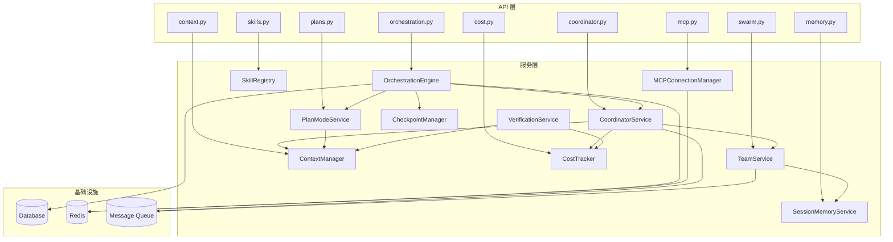
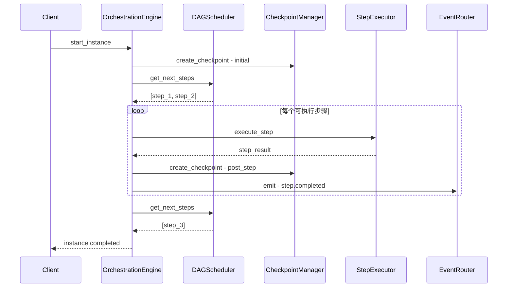

# 06 — 核心模块设计

## 6.1 模块依赖关系



---

## 6.2 编排引擎（OrchestrationEngine）

### 接口定义

```python
# backend/app/services/orchestration/engine.py

from abc import ABC, abstractmethod
from typing import Any, Optional
from enum import Enum


class StepKind(str, Enum):
    """步骤类型枚举"""
    AGENT_SESSION = "agent_session"     # 绑定 Agent 会话
    TOOL_ONLY = "tool_only"             # 仅工具调用
    COMMAND = "command"                 # 注册命令
    PLANNER = "planner"                 # 产出 ExecutionPlan
    HUMAN_GATE = "human_gate"           # 人工审核
    SUBWORKFLOW = "subworkflow"         # 嵌套子模板
    WAIT_EVENT = "wait_event"           # 等待外部事件
    COORDINATOR = "coordinator"         # 协调器模式（v3 新增）


class OrchestrationEngine:
    """
    编排引擎核心：
    - 管理工作流实例的生命周期
    - 调度步骤执行
    - 管理检查点
    - 路由事件
    """

    def __init__(self, db_session, feature_flags):
        self.db = db_session
        self.feature_flags = feature_flags
        self.checkpoint_mgr = CheckpointManager(db_session)
        self.event_router = EventRouter()

    async def start_instance(self, instance_id: str) -> None:
        """启动工作流实例"""

    async def advance_workflow(self, instance_id: str) -> None:
        """推进工作流到下一步"""

    async def get_next_steps(self, instance_id: str) -> list:
        """获取下一个可执行步骤（支持并行）"""

    async def complete_step(self, step_id: str, output: dict) -> None:
        """完成步骤并推进"""

    async def fail_step(self, step_id: str, error: str) -> None:
        """标记步骤失败，根据策略重试或终止"""

    async def pause_instance(self, instance_id: str) -> None:
        """暂停实例"""

    async def resume_instance(self, instance_id: str, checkpoint_id: str = None) -> None:
        """从检查点恢复实例"""

    async def handle_event(self, event_type: str, payload: dict) -> None:
        """处理外部事件（webhook、信号等）"""


class OrchestrationBackend(ABC):
    """编排后端抽象 — 支持未来替换为 LangGraph / Temporal"""

    @abstractmethod
    async def execute_step(self, step: dict, context: dict) -> dict:
        """执行单个步骤"""

    @abstractmethod
    async def create_checkpoint(self, instance_id: str, state: dict) -> str:
        """创建检查点"""

    @abstractmethod
    async def restore_checkpoint(self, checkpoint_id: str) -> dict:
        """恢复检查点"""
```

### 数据流



---

## 6.3 协调器服务（CoordinatorService）

```python
# backend/app/services/coordinator/coordinator_service.py

from dataclasses import dataclass
from typing import Optional


@dataclass
class CoordinatorConfig:
    """协调器配置"""
    max_workers: int = 10
    continue_threshold: float = 0.7  # 上下文重叠度阈值
    verification_enabled: bool = False
    plan_mode_enabled: bool = False
    shared_scratchpad: bool = True


class CoordinatorService:
    """
    协调器服务：
    - 接收用户任务
    - 拆解为子任务
    - 分配给 Worker Agents
    - 汇总结果、处理失败重试
    - 通过 SendMessage 与 Worker 通信
    """

    def __init__(self, db_session, context_manager, cost_tracker):
        self.db = db_session
        self.context_mgr = context_manager
        self.cost_tracker = cost_tracker
        self.worker_mgr = WorkerManager(db_session)

    async def create_session(
        self,
        workflow_instance_id: str,
        config: CoordinatorConfig = None
    ) -> str:
        """创建协调器会话，返回 session_id"""

    async def decompose_task(
        self,
        session_id: str,
        task_description: str,
        context: dict = None
    ) -> list:
        """
        使用 LLM 拆解任务为子任务列表。
        返回 [{name, description, agent_type, depends_on}, ...]
        """

    async def spawn_worker(
        self,
        session_id: str,
        task: dict,
        mode: str = "auto"  # auto / continue / spawn_fresh
    ) -> str:
        """
        生成 Worker Agent。
        mode=auto 时根据上下文重叠度自动决策 continue vs spawn_fresh。
        """

    async def send_message(
        self,
        session_id: str,
        worker_id: str,
        message: str,
        message_type: str = "instruction"
    ) -> None:
        """向 Worker 发送消息"""

    async def collect_results(self, session_id: str) -> dict:
        """汇总所有 Worker 结果"""

    async def handle_worker_failure(
        self,
        session_id: str,
        worker_id: str,
        error: str
    ) -> str:
        """处理 Worker 失败：重试 / 降级 / 终止"""
        # 返回决策：retry / degrade / terminate

    async def terminate_session(self, session_id: str) -> None:
        """终止协调器会话"""


class WorkerManager:
    """Worker Agent 生命周期管理"""

    async def create_worker(
        self,
        coordinator_id: str,
        agent_type: str,
        task: dict
    ) -> str:
        """创建 Worker"""

    async def continue_worker(
        self,
        worker_id: str,
        new_task: str
    ) -> None:
        """继续使用已有 Worker（共享上下文）"""

    async def get_worker_status(self, worker_id: str) -> dict:
        """获取 Worker 状态"""

    async def terminate_worker(self, worker_id: str) -> None:
        """终止 Worker"""
```

---

## 6.4 上下文管理器（ContextManager）

```python
# backend/app/services/context/context_manager.py

from dataclasses import dataclass
from typing import Optional


@dataclass
class TokenBudget:
    """Token 预算分配"""
    total: int                     # 总预算
    system_prompt: int             # 系统提示分配
    tools: int                     # 工具描述分配
    history: int                   # 历史消息分配
    output: int                    # 输出预留
    remaining: int                 # 剩余可用


class ContextManager:
    """
    上下文窗口管理器：
    1. Token 预算分配
    2. 自动压缩（auto-compact）
    3. 微压缩（micro-compact）
    4. Token 估算
    """

    def __init__(self, config: dict = None):
        self.compact_threshold = config.get("auto_compact_threshold", 0.8)
        self.micro_threshold = config.get("micro_compact_threshold", 0.6)

    def estimate_tokens(self, messages: list, model: str) -> int:
        """估算消息的 token 数"""

    def should_compact(self, messages: list, model: str) -> bool:
        """判断是否需要压缩"""

    def compact_messages(
        self,
        messages: list,
        strategy: str = "auto"  # auto / micro / full
    ) -> list:
        """
        压缩消息列表。
        - auto: 超过 80% 阈值触发全量压缩
        - micro: 仅压缩低价值消息（工具调用详细输出）
        - full: 全量压缩历史
        """

    def allocate_budget(
        self,
        total_budget: int,
        tools: list = None,
        system_prompt: str = None
    ) -> TokenBudget:
        """为各组件分配 token 预算"""

    def get_model_context_limit(self, model: str) -> int:
        """获取模型的上下文窗口大小"""


class CompactService:
    """消息压缩服务"""

    async def auto_compact(self, messages: list, model: str) -> list:
        """自动压缩：保留关键信息，压缩冗余"""

    async def micro_compact(self, messages: list) -> list:
        """微压缩：仅压缩工具调用的详细输出"""

    async def summarize_history(self, messages: list) -> str:
        """将历史消息摘要为关键信息"""
```

---

## 6.5 会话记忆服务（SessionMemoryService）

```python
# backend/app/services/memory/session_memory_service.py


class SessionMemoryService:
    """
    会话记忆系统：
    - 基于阈值触发记忆提取
    - 后台异步执行（forked subagent）
    - 输出 Markdown 格式
    - 支持三层记忆：session / project / global
    """

    def __init__(self, db_session, context_manager):
        self.db = db_session
        self.context_mgr = context_manager

    def should_update(self, session_id: str) -> bool:
        """检查是否需要更新记忆（基于阈值）"""

    async def extract_memory(
        self,
        session_id: str,
        messages: list,
        scope: str = "session"  # session / project / global
    ) -> str:
        """
        从对话中提取关键信息。
        使用 LLM 异步执行，不阻塞主流程。
        返回 Markdown 格式的记忆内容。
        """

    async def get_memory(self, scope: str, scope_id: str) -> str:
        """获取指定范围的记忆"""

    async def inject_memory_into_context(
        self,
        messages: list,
        scope: str,
        scope_id: str,
        budget: int
    ) -> list:
        """将记忆注入到消息上下文中（受 token 预算限制）"""

    async def merge_memories(
        self,
        source_scope: str,
        source_id: str,
        target_scope: str,
        target_id: str
    ) -> None:
        """合并记忆（如从 session 合并到 project）"""
```

---

## 6.6 成本追踪器（CostTracker）

```python
# backend/app/services/cost/cost_tracker.py

from dataclasses import dataclass


@dataclass
class ModelUsage:
    """模型使用记录"""
    model: str
    input_tokens: int = 0
    output_tokens: int = 0
    cache_creation_tokens: int = 0
    cache_read_tokens: int = 0
    duration_ms: int = 0
    web_search_requests: int = 0


@dataclass
class CostSummary:
    """成本汇总"""
    total_input_tokens: int = 0
    total_output_tokens: int = 0
    total_cache_creation_tokens: int = 0
    total_cache_read_tokens: int = 0
    total_tokens: int = 0
    total_cost_usd: float = 0.0
    total_duration_ms: int = 0
    by_model: dict = None  # {model: ModelUsage}
    by_step: dict = None   # {step_id: CostSummary}
    by_agent: dict = None  # {agent_id: CostSummary}


# 模型定价表（USD per 1M tokens）
MODEL_PRICING = {
    "claude-sonnet-4-20250514": {
        "input": 3.0,
        "output": 15.0,
        "cache_creation": 3.75,
        "cache_read": 0.30,
    },
    "claude-haiku-3-5-20241022": {
        "input": 0.80,
        "output": 4.0,
        "cache_creation": 1.0,
        "cache_read": 0.08,
    },
}


class CostTracker:
    """
    细粒度成本追踪器：
    - 按模型追踪 token 使用
    - 计算 USD 成本
    - 追踪缓存命中/未命中
    - 追踪 API 调用耗时
    """

    def __init__(self, db_session):
        self.db = db_session

    async def track_usage(
        self,
        model: str,
        usage: ModelUsage,
        workflow_instance_id: str = None,
        step_execution_id: str = None,
        agent_id: str = None
    ) -> None:
        """追踪模型使用（异步写入，不阻塞主流程）"""

    def estimate_cost(
        self,
        model: str,
        input_tokens: int,
        output_tokens: int
    ) -> float:
        """预估成本"""

    async def get_session_cost(self, session_id: str) -> CostSummary:
        """获取会话成本"""

    async def get_workflow_cost(self, workflow_id: str) -> CostSummary:
        """获取工作流成本"""

    async def get_project_cost(
        self,
        project_id: str,
        time_range: tuple = None
    ) -> CostSummary:
        """获取项目成本"""

    async def check_budget_alert(self, workflow_id: str) -> bool:
        """检查是否超过预算阈值"""
```

---

## 6.7 MCP 连接管理器（MCPConnectionManager）

```python
# backend/app/services/mcp/connection_manager.py

from dataclasses import dataclass
from typing import Any, Optional


@dataclass
class MCPServerConfig:
    """MCP 服务器配置"""
    name: str
    transport_type: str  # stdio / sse
    connection_params: dict
    enabled: bool = True


@dataclass
class ToolDefinition:
    """工具定义"""
    name: str
    description: str
    input_schema: dict
    output_schema: dict = None
    server_name: str = ""


class MCPConnectionManager:
    """
    MCP 连接管理器：
    - 动态连接/断开 MCP 服务器
    - 自动发现 MCP 工具
    - 工具权限管理
    - 资源读取
    """

    def __init__(self, db_session, cache_client=None):
        self.db = db_session
        self.cache = cache_client
        self._connections: dict[str, Any] = {}

    async def connect_server(self, config: MCPServerConfig) -> str:
        """连接 MCP 服务器，返回 server_id"""

    async def disconnect_server(self, server_name: str) -> None:
        """断开 MCP 服务器"""

    async def discover_tools(self, server_name: str) -> list[ToolDefinition]:
        """发现 MCP 服务器提供的工具"""

    async def execute_tool(
        self,
        server_name: str,
        tool_name: str,
        params: dict,
        context: dict = None  # ToolContext
    ) -> Any:
        """执行 MCP 工具（含权限校验）"""

    async def list_resources(self, server_name: str) -> list:
        """列出 MCP 资源"""

    async def read_resource(self, server_name: str, uri: str) -> str:
        """读取 MCP 资源"""

    def get_all_tools(self) -> list[ToolDefinition]:
        """获取所有已连接服务器的工具列表"""

    async def health_check(self, server_name: str) -> dict:
        """健康检查"""
```

---

## 6.8 技能注册表（SkillRegistry）

```python
# backend/app/services/skills/skill_registry.py

from dataclasses import dataclass
from typing import Optional


@dataclass
class SkillDefinition:
    """技能定义"""
    name: str
    display_name: str = ""
    description: str = ""
    category: str = "custom"  # bundled / custom / mcp_generated
    when_to_use: str = ""
    allowed_tools: list[str] = None
    model: str = None
    argument_hint: str = None
    prompt_template: str = ""
    config: dict = None
    version: str = "1.0.0"
    enabled: bool = True


class SkillRegistry:
    """
    技能注册表：
    - 注册/注销技能
    - 查询技能
    - 执行技能（返回 prompt blocks）
    - 技能版本管理
    """

    def __init__(self, db_session, mcp_manager=None):
        self.db = db_session
        self.mcp_mgr = mcp_manager
        self._skills: dict[str, SkillDefinition] = {}

    async def register_skill(self, skill: SkillDefinition) -> None:
        """注册技能"""

    async def unregister_skill(self, name: str) -> None:
        """注销技能"""

    def get_skill(self, name: str) -> Optional[SkillDefinition]:
        """获取技能"""

    def list_skills(
        self,
        category: str = None,
        enabled_only: bool = True
    ) -> list[SkillDefinition]:
        """列出可用技能"""

    async def execute_skill(
        self,
        name: str,
        args: str,
        context: dict = None
    ) -> list:
        """执行技能，返回 prompt blocks"""

    async def build_skill_from_mcp(
        self,
        server_name: str,
        tool_name: str
    ) -> SkillDefinition:
        """从 MCP 工具自动构建技能"""

    def load_bundled_skills(self) -> None:
        """加载内置技能"""
```

---

## 6.9 计划模式服务（PlanModeService）

```python
# backend/app/services/plan/plan_mode_service.py


class PlanModeService:
    """
    计划模式服务：
    1. Agent 进入计划模式，只做分析不做修改
    2. 生成结构化执行计划
    3. 用户审核计划
    4. 确认后退出计划模式，开始执行
    """

    def __init__(self, db_session, context_manager):
        self.db = db_session
        self.context_mgr = context_manager

    async def enter_plan_mode(
        self,
        workflow_instance_id: str,
        task_description: str,
        context: dict = None
    ) -> str:
        """进入计划模式，返回 plan_id"""

    async def generate_plan(
        self,
        plan_id: str,
        analysis_result: dict = None
    ) -> dict:
        """
        生成执行计划。
        返回 {steps: [...], dependencies: [...], estimated_cost: float}
        """

    async def validate_plan(self, plan_id: str) -> dict:
        """校验计划（JSON Schema + 依赖完整性 + 资源检查）"""

    async def approve_plan(self, plan_id: str, approved_by: str) -> None:
        """批准计划"""

    async def reject_plan(self, plan_id: str, reason: str) -> None:
        """拒绝计划"""

    async def modify_plan(self, plan_id: str, modifications: dict) -> None:
        """修改计划（创建新版本）"""

    async def exit_plan_mode(self, plan_id: str) -> None:
        """退出计划模式，计划进入执行"""
```

---

## 6.10 验证服务（VerificationService）

```python
# backend/app/services/verification/verification_service.py

from dataclasses import dataclass


@dataclass
class VerificationReport:
    """验证报告"""
    passed: bool
    score: float  # 0.0 - 1.0
    issues: list  # [{severity, message, location}]
    suggestions: list  # [str]
    test_coverage: float = 0.0


class VerificationService:
    """
    独立验证服务：
    - 验证 Agent 与实现 Agent 完全隔离
    - 验证代码质量、测试覆盖率、边界情况
    - 输出结构化验证报告
    """

    def __init__(self, db_session, context_manager, cost_tracker):
        self.db = db_session
        self.context_mgr = context_manager
        self.cost_tracker = cost_tracker

    async def verify_implementation(
        self,
        step_execution_id: str,
        implementation: dict,
        criteria: list = None
    ) -> VerificationReport:
        """验证实现"""

    async def verify_tests(
        self,
        step_execution_id: str,
        test_results: dict = None
    ) -> VerificationReport:
        """验证测试"""

    async def verify_plan(
        self,
        plan_id: str,
        plan_content: dict
    ) -> VerificationReport:
        """验证执行计划的合理性"""
```
