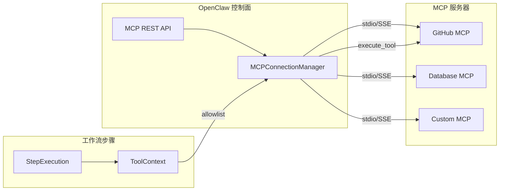

# 07 — API 设计

## 7.1 API 版本策略

| 版本 | 路径前缀   | 状态 | 说明                         |
| ---- | ---------- | ---- | ---------------------------- |
| v1   | `/api/`    | 保留 | 现有所有 API，不做破坏性变更 |
| v2   | `/api/v2/` | 新增 | v3 新增 API，additive 优先   |

**原则**:

- v1 API 保持不变，新功能在 v2 路径下添加
- v2 响应中的新字段均为可选
- 破坏性变更走新 API 主版本
- 旧版本并存至少一个 minor 周期

---

## 7.2 编排引擎 API

### 工作流实例管理（增强现有）

```
POST   /api/v2/orchestration/instances                    # 创建实例（支持新字段）
GET    /api/v2/orchestration/instances/{id}               # 获取实例（含编排状态）
POST   /api/v2/orchestration/instances/{id}/start         # 启动实例
POST   /api/v2/orchestration/instances/{id}/pause         # 暂停实例
POST   /api/v2/orchestration/instances/{id}/resume        # 从检查点恢复
POST   /api/v2/orchestration/instances/{id}/terminate     # 终止实例
GET    /api/v2/orchestration/instances/{id}/checkpoints   # 获取检查点列表
POST   /api/v2/orchestration/instances/{id}/signal        # 发送信号（人工/外部）
GET    /api/v2/orchestration/instances/{id}/timeline      # 获取时间线/审计日志
```

### 执行计划

```
POST   /api/v2/plans                                      # 创建执行计划
GET    /api/v2/plans/{id}                                 # 获取计划详情
PUT    /api/v2/plans/{id}                                 # 修改计划
POST   /api/v2/plans/{id}/approve                         # 批准计划
POST   /api/v2/plans/{id}/reject                          # 拒绝计划
GET    /api/v2/plans/{id}/subtasks                        # 获取子任务列表
GET    /api/v2/plans/{id}/subtasks/{subtask_id}           # 获取子任务详情
PUT    /api/v2/plans/{id}/subtasks/{subtask_id}           # 更新子任务
```

---

## 7.3 协调器 API

```
POST   /api/v2/coordinator/sessions                       # 创建协调器会话
GET    /api/v2/coordinator/sessions/{id}                  # 获取会话状态
DELETE /api/v2/coordinator/sessions/{id}                  # 终止会话

POST   /api/v2/coordinator/sessions/{id}/decompose        # 任务拆解
POST   /api/v2/coordinator/sessions/{id}/spawn            # 生成 Worker
GET    /api/v2/coordinator/sessions/{id}/workers          # 获取 Worker 列表
GET    /api/v2/coordinator/sessions/{id}/workers/{wid}    # 获取 Worker 状态

POST   /api/v2/coordinator/sessions/{id}/send             # 向 Worker 发送消息
GET    /api/v2/coordinator/sessions/{id}/messages         # 获取消息历史
POST   /api/v2/coordinator/sessions/{id}/collect          # 汇总结果
```

### 请求/响应示例

**创建协调器会话**:

```json
// POST /api/v2/coordinator/sessions
// Request
{
  "workflow_instance_id": "wi-xxx",
  "config": {
    "max_workers": 5,
    "plan_mode_enabled": true,
    "verification_enabled": true,
    "shared_scratchpad": true
  }
}

// Response
{
  "id": "cs-xxx",
  "status": "active",
  "coordinator_agent_id": "agent-coord-xxx",
  "config": { ... },
  "created_at": "2026-04-02T12:00:00Z"
}
```

**任务拆解**:

```json
// POST /api/v2/coordinator/sessions/cs-xxx/decompose
// Request
{
  "task_description": "实现用户认证模块，包含注册、登录、密码重置功能",
  "context": {
    "project_language": "python",
    "framework": "fastapi"
  }
}

// Response
{
  "subtasks": [
    {
      "name": "研究认证方案",
      "description": "调研 JWT vs OAuth2 vs Session 方案",
      "agent_type": "explore",
      "depends_on": []
    },
    {
      "name": "实现认证核心",
      "description": "基于研究结果实现认证核心逻辑",
      "agent_type": "worker",
      "depends_on": ["研究认证方案"]
    },
    {
      "name": "验证实现",
      "description": "验证代码质量、测试覆盖率",
      "agent_type": "verification",
      "depends_on": ["实现认证核心"]
    }
  ]
}
```

---

## 7.4 Agent Swarm API

```
POST   /api/v2/swarm/teams                                # 创建团队
GET    /api/v2/swarm/teams                                 # 列出团队
GET    /api/v2/swarm/teams/{id}                            # 获取团队详情
DELETE /api/v2/swarm/teams/{id}                            # 解散团队

POST   /api/v2/swarm/teams/{id}/members                   # 添加成员
DELETE /api/v2/swarm/teams/{id}/members/{agent_id}        # 移除成员

POST   /api/v2/swarm/messages                             # 发送消息
GET    /api/v2/swarm/teams/{id}/messages                   # 获取团队消息历史
```

---

## 7.5 上下文管理 API

```
GET    /api/v2/context/estimate                            # 估算 token 数
POST   /api/v2/context/compact                             # 手动触发压缩
GET    /api/v2/context/budget/{session_id}                 # 获取 token 预算使用情况
```

### 请求/响应示例

```json
// GET /api/v2/context/budget/session-xxx
// Response
{
  "session_id": "session-xxx",
  "model": "claude-sonnet-4-20250514",
  "total_budget": 200000,
  "allocated": {
    "system_prompt": 2000,
    "tools": 5000,
    "history": 150000,
    "output": 4096
  },
  "used": {
    "total": 168000,
    "percentage": 0.84
  },
  "should_compact": true,
  "compact_strategy": "auto"
}
```

---

## 7.6 记忆系统 API

```
GET    /api/v2/memory/{scope}/{scope_id}                  # 获取记忆
POST   /api/v2/memory/{scope}/{scope_id}/extract          # 手动触发提取
GET    /api/v2/memory/{scope}/{scope_id}/history           # 获取记忆版本历史
DELETE /api/v2/memory/{scope}/{scope_id}                   # 清除记忆
```

---

## 7.7 成本追踪 API

```
GET    /api/v2/cost/workflow/{id}                          # 获取工作流成本
GET    /api/v2/cost/step/{id}                              # 获取步骤成本
GET    /api/v2/cost/agent/{id}                             # 获取 Agent 成本
GET    /api/v2/cost/project/{id}                           # 获取项目成本
GET    /api/v2/cost/project/{id}/trend                     # 获取成本趋势
POST   /api/v2/cost/budget/alert                           # 设置预算告警
GET    /api/v2/cost/models/pricing                         # 获取模型定价表
```

### 响应示例

```json
// GET /api/v2/cost/workflow/wi-xxx
// Response
{
  "workflow_id": "wi-xxx",
  "total_cost_usd": 2.45,
  "total_tokens": 185000,
  "by_model": {
    "claude-sonnet-4-20250514": {
      "input_tokens": 50000,
      "output_tokens": 15000,
      "cache_creation_tokens": 10000,
      "cache_read_tokens": 110000,
      "cost_usd": 1.95,
      "api_calls": 12
    }
  },
  "by_step": {
    "step-1": { "cost_usd": 0.35, "tokens": 25000 },
    "step-2": { "cost_usd": 1.2, "tokens": 120000 },
    "step-3": { "cost_usd": 0.9, "tokens": 40000 }
  },
  "budget_alert": {
    "threshold": 100.0,
    "current": 2.45,
    "triggered": false
  }
}
```

---

## 7.8 技能系统 API

```
GET    /api/v2/skills                                      # 列出技能
POST   /api/v2/skills                                      # 注册技能
GET    /api/v2/skills/{name}                               # 获取技能详情
PUT    /api/v2/skills/{name}                               # 更新技能
DELETE /api/v2/skills/{name}                               # 删除技能
POST   /api/v2/skills/{name}/execute                       # 执行技能
POST   /api/v2/skills/from-mcp                             # 从 MCP 工具构建技能
```

---

## 7.9 MCP 管理 API

```
GET    /api/v2/mcp/servers                                 # 列出 MCP 服务器
POST   /api/v2/mcp/servers                                 # 连接 MCP 服务器
DELETE /api/v2/mcp/servers/{name}                          # 断开 MCP 服务器
GET    /api/v2/mcp/servers/{name}/tools                    # 获取工具列表
POST   /api/v2/mcp/servers/{name}/tools/{tool}             # 执行 MCP 工具
GET    /api/v2/mcp/servers/{name}/resources                # 获取资源列表
GET    /api/v2/mcp/servers/{name}/resources/{uri}          # 读取资源
POST   /api/v2/mcp/servers/{name}/discover                 # 触发工具重新发现
GET    /api/v2/mcp/servers/{name}/health                   # 健康检查
```

---

## 7.10 WebSocket 事件定义

### 连接

```
WS /ws/v2/orchestration/events?instance_id={id}&token={jwt}
```

### 事件类型

```jsonc
// 实例状态变更
{
  "type": "instance.status_changed",
  "payload": {
    "instance_id": "wi-xxx",
    "from_status": "running",
    "to_status": "paused",
    "actor": "user-xxx",
    "timestamp": "2026-04-02T12:00:00Z"
  },
  "schema_version": "1"
}

// 步骤状态变更
{
  "type": "step.status_changed",
  "payload": {
    "instance_id": "wi-xxx",
    "step_id": "step-1",
    "from_status": "running",
    "to_status": "completed",
    "agent_id": "agent-xxx",
    "progress": 100,
    "timestamp": "2026-04-02T12:00:00Z"
  },
  "schema_version": "1"
}

// 协调器事件
{
  "type": "coordinator.worker_spawned",
  "payload": {
    "session_id": "cs-xxx",
    "worker_id": "worker-1",
    "agent_type": "worker",
    "task": "实现认证核心",
    "timestamp": "2026-04-02T12:00:00Z"
  },
  "schema_version": "1"
}

// Agent 消息
{
  "type": "agent.message",
  "payload": {
    "from_agent_id": "agent-xxx",
    "to_agent_id": "agent-yyy",
    "message_type": "task_result",
    "content": "...",
    "timestamp": "2026-04-02T12:00:00Z"
  },
  "schema_version": "1"
}

// 成本告警
{
  "type": "cost.alert",
  "payload": {
    "workflow_id": "wi-xxx",
    "current_cost_usd": 105.0,
    "threshold_usd": 100.0,
    "timestamp": "2026-04-02T12:00:00Z"
  },
  "schema_version": "1"
}

// 计划事件
{
  "type": "plan.status_changed",
  "payload": {
    "plan_id": "plan-xxx",
    "from_status": "draft",
    "to_status": "approved",
    "approved_by": "user-xxx",
    "timestamp": "2026-04-02T12:00:00Z"
  },
  "schema_version": "1"
}

// MCP 工具发现
{
  "type": "mcp.tools_discovered",
  "payload": {
    "server_name": "github-mcp",
    "tool_count": 15,
    "new_tools": ["create_issue", "list_prs"],
    "timestamp": "2026-04-02T12:00:00Z"
  },
  "schema_version": "1"
}
```

### 事件订阅

客户端可通过连接参数过滤事件：

```
WS /ws/v2/orchestration/events?instance_id={id}&event_types=step.*,coordinator.*,cost.*
```

---

## 7.11 MCP 协议集成点



**集成流程**:

1. 管理员通过 API 配置 MCP 服务器
2. `MCPConnectionManager` 连接并发现工具
3. 工具注册到 `MCPToolSnapshot` 表
4. 工作流步骤通过 `ToolContext` 引用 MCP 工具
5. 执行时由 `MCPConnectionManager` 路由到对应服务器
