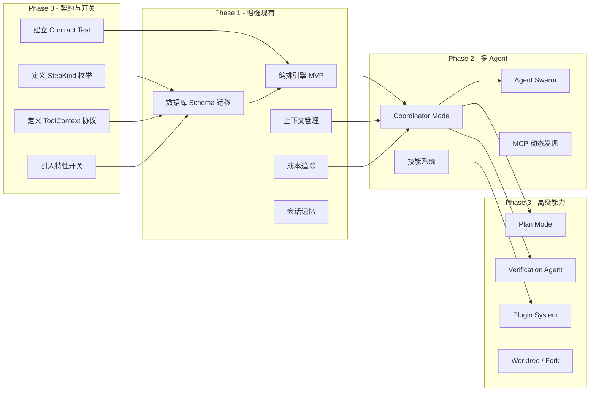
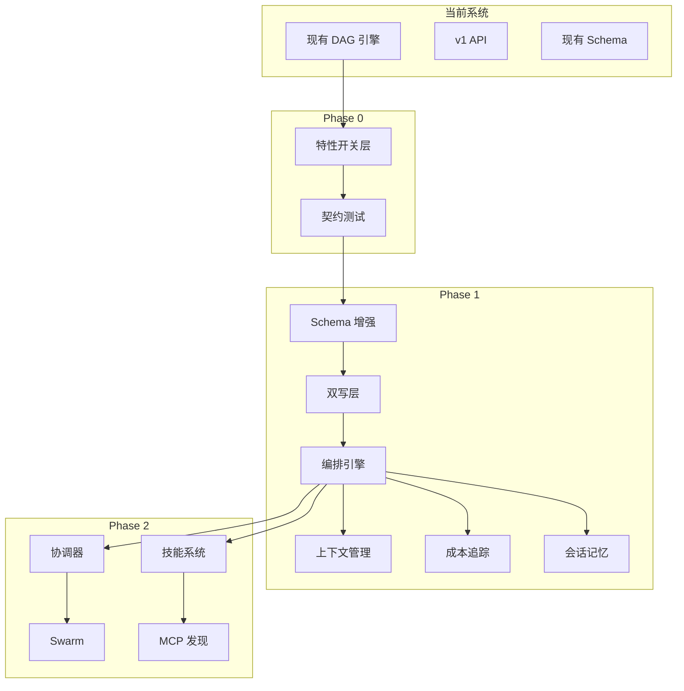

# 08 — 迁移策略

## 8.1 迁移总览



---

## 8.2 渐进式迁移路径

### 原则

1. **特性开关控制** — 每个新能力都有独立开关
2. **双写/双读** — 新旧路径并存，逐步切换
3. **可回滚** — 开关关闭即回旧路径
4. **数据只增** — 新字段默认可空，老数据不受影响

### 迁移阶段



---

## 8.3 数据库迁移方案

### 迁移策略

| 策略             | 说明                          |
| ---------------- | ----------------------------- |
| **只增列**       | 所有新字段默认可空或有默认值  |
| **只增表**       | 新增表不影响现有表            |
| **Alembic 管理** | 使用 Alembic 管理所有迁移脚本 |
| **向前兼容**     | 迁移后旧代码仍可正常运行      |

### 迁移脚本规划

```python
# migrations/versions/001_v3_additive_columns.py

def upgrade():
    # 1. WorkflowInstance 新增字段
    op.add_column('workflow_instances',
        sa.Column('orchestration_profile', sa.String(), nullable=True))
    op.add_column('workflow_instances',
        sa.Column('runtime_contract_version', sa.String(), nullable=True))
    op.add_column('workflow_instances',
        sa.Column('plan_id', sa.String(), nullable=True))
    op.add_column('workflow_instances',
        sa.Column('primary_session_key', sa.String(), nullable=True))
    op.add_column('workflow_instances',
        sa.Column('total_cost_usd', sa.Float(), nullable=True))
    op.add_column('workflow_instances',
        sa.Column('total_tokens', sa.Integer(), nullable=True))

    # 2. StepDefinition 新增字段
    op.add_column('step_definitions',
        sa.Column('kind', sa.String(), nullable=True, server_default='agent_session'))
    op.add_column('step_definitions',
        sa.Column('config_json', sa.Text(), nullable=True))
    op.add_column('step_definitions',
        sa.Column('condition', sa.Text(), nullable=True))
    op.add_column('step_definitions',
        sa.Column('skill_id', sa.String(), nullable=True))
    op.add_column('step_definitions',
        sa.Column('verification_enabled', sa.Boolean(), nullable=False, server_default='0'))
    op.add_column('step_definitions',
        sa.Column('tool_context_json', sa.Text(), nullable=True))

    # 3. StepExecution 新增字段
    op.add_column('step_executions',
        sa.Column('idempotency_key', sa.String(), nullable=True))
    op.add_column('step_executions',
        sa.Column('input_hash', sa.String(), nullable=True))
    op.add_column('step_executions',
        sa.Column('session_key', sa.String(), nullable=True))
    op.add_column('step_executions',
        sa.Column('checkpoint_id', sa.String(), nullable=True))
    op.add_column('step_executions',
        sa.Column('cost_usd', sa.Float(), nullable=True))
    op.add_column('step_executions',
        sa.Column('token_count', sa.Integer(), nullable=True))

    # 4. Agent 新增字段
    op.add_column('agents',
        sa.Column('team_id', sa.String(), nullable=True))
    op.add_column('agents',
        sa.Column('agent_type', sa.String(), nullable=False, server_default='generic'))
    op.add_column('agents',
        sa.Column('max_concurrent_tasks', sa.Integer(), nullable=False, server_default='1'))


def downgrade():
    # 移除所有新增列
    # 注意：生产环境 downgrade 需谨慎
    pass
```

```python
# migrations/versions/002_v3_new_tables.py

def upgrade():
    # 创建所有新增表
    op.create_table('coordinator_sessions', ...)
    op.create_table('worker_agents', ...)
    op.create_table('agent_teams', ...)
    op.create_table('agent_team_members', ...)
    op.create_table('agent_messages', ...)
    op.create_table('execution_plans', ...)
    op.create_table('subtasks', ...)
    op.create_table('orchestration_checkpoints', ...)
    op.create_table('session_memories', ...)
    op.create_table('cost_records', ...)
    op.create_table('skill_definitions', ...)
    op.create_table('mcp_server_configs', ...)
    op.create_table('mcp_tool_snapshots', ...)
    op.create_table('outbox_messages', ...)
```

---

## 8.4 向后兼容策略

### API 兼容

| 场景            | 策略                    |
| --------------- | ----------------------- |
| 现有 v1 API     | 不做任何变更，保持原样  |
| v1 响应新增字段 | 客户端忽略未知字段      |
| v2 API          | 独立路由前缀 `/api/v2/` |
| 破坏性变更      | 走新主版本，旧版并存    |

### 数据兼容

| 场景       | 策略                                        |
| ---------- | ------------------------------------------- |
| 老实例访问 | `orchestration_profile = null` 时使用旧逻辑 |
| 新字段查询 | 所有新字段查询都处理 null 值                |
| 模板版本   | 实例锁定创建时的模板快照                    |
| Agent 兼容 | `agent_type = null` 时默认为 `generic`      |

### 运行时兼容

```python
# backend/app/core/feature_flags.py

class FeatureFlags:
    """特性开关管理"""

    def __init__(self, settings):
        self.settings = settings

    @property
    def orchestration_v3(self) -> bool:
        return self.settings.orchestration_v3_enabled

    @property
    def coordinator_mode(self) -> bool:
        return self.settings.coordinator_mode_enabled

    @property
    def swarm_mode(self) -> bool:
        return self.settings.swarm_mode_enabled

    @property
    def plan_mode(self) -> bool:
        return self.settings.plan_mode_enabled

    @property
    def verification_agent(self) -> bool:
        return self.settings.verification_agent_enabled
```

```python
# 在服务层使用特性开关
class OrchestrationEngine:
    def __init__(self, db, feature_flags):
        self.db = db
        self.flags = feature_flags

    async def advance_workflow(self, instance_id: str):
        if not self.flags.orchestration_v3:
            # 使用旧路径
            return await self._advance_legacy(instance_id)
        # 使用新路径
        return await self._advance_v3(instance_id)
```

---

## 8.5 回滚策略

| 场景         | 回滚方式                | 预期时间 |
| ------------ | ----------------------- | -------- |
| 新功能异常   | 关闭特性开关            | < 1 分钟 |
| 数据迁移问题 | Alembic downgrade       | < 5 分钟 |
| API 不兼容   | 切换路由到 v1           | < 1 分钟 |
| 性能问题     | 关闭特性开关 + 清除缓存 | < 2 分钟 |

### 回滚检查清单

1. ✅ 特性开关已关闭
2. ✅ 旧路径功能正常
3. ✅ 数据一致性校验通过
4. ✅ 前端已切换到旧 UI
5. ✅ 监控告警已恢复

---

## 8.6 契约测试

### 控制面契约测试

```python
# tests/contract/test_api_contract.py

def test_v1_api_unchanged():
    """确保 v1 API 响应格式不变"""
    response = client.get("/api/workflow-templates")
    assert response.status_code == 200
    schema = load_contract("v1/workflow-templates.json")
    validate(response.json(), schema)


def test_v2_api_additive_only():
    """确保 v2 API 只增加字段，不删除"""
    v1_schema = load_contract("v1/workflow-instance.json")
    v2_schema = load_contract("v2/workflow-instance.json")
    # v2 必须是 v1 的超集
    assert is_superset(v2_schema, v1_schema)
```

### Gateway 契约测试

```python
# tests/contract/test_gateway_contract.py

def test_session_rpc_contract():
    """确保 Gateway RPC 契约不变"""
    request = load_fixture("gateway/session-create-request.json")
    expected = load_fixture("gateway/session-create-response.json")
    response = gateway_client.call("sessions.create", request)
    validate(response, expected["schema"])
```
