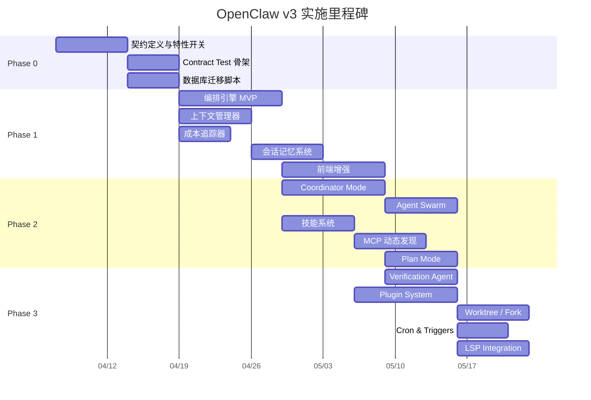

# 09 — 实施计划

## 9.1 里程碑总览



---

## 9.2 Phase 0：契约与开关

**目标**: 建立基础设施，确保后续开发有清晰的契约和开关控制。

### 任务分解

| #    | 任务                                                              | 交付物                                            | 依赖 |
| ---- | ----------------------------------------------------------------- | ------------------------------------------------- | ---- |
| P0-1 | 定义 `StepKind` 枚举和 `ToolContext` 协议                         | `backend/app/services/orchestration/protocols.py` | 无   |
| P0-2 | 定义 `orchestration_profile` 和 `runtime_contract_version` 取值集 | 文档 + 常量定义                                   | P0-1 |
| P0-3 | 实现特性开关模块                                                  | `backend/app/core/feature_flags.py`               | 无   |
| P0-4 | 编写数据库迁移脚本（additive columns + new tables）               | Alembic migration scripts                         | P0-2 |
| P0-5 | 建立 Contract Test 骨架                                           | `tests/contract/` 目录                            | P0-1 |
| P0-6 | 配置 CI 契约测试门禁                                              | CI pipeline 配置                                  | P0-5 |
| P0-7 | 新增依赖安装（langgraph, mcp, tiktoken）                          | 更新 `requirements.txt`                           | 无   |

### 里程碑验收

- [ ] `StepKind` 枚举定义完成，覆盖所有已知步骤类型
- [ ] 特性开关可通过环境变量控制
- [ ] 数据库迁移脚本在开发环境执行成功
- [ ] Contract Test 在 CI 中通过

---

## 9.3 Phase 1：核心能力 MVP

**目标**: 实现编排引擎核心、上下文管理、成本追踪、会话记忆四大 P0 能力。

### 任务分解

| #              | 任务                                                  | 交付物                                         | 依赖  |
| -------------- | ----------------------------------------------------- | ---------------------------------------------- | ----- |
| **编排引擎**   |                                                       |                                                |       |
| P1-1           | 实现 `OrchestrationEngine` 核心                       | `services/orchestration/engine.py`             | P0-1  |
| P1-2           | 实现 `DAGScheduler`（增强现有调度器）                 | `services/orchestration/dag_scheduler.py`      | P1-1  |
| P1-3           | 实现 `CheckpointManager`                              | `services/orchestration/checkpoint_manager.py` | P1-1  |
| P1-4           | 实现 `EventRouter`                                    | `services/orchestration/event_router.py`       | P1-1  |
| P1-5           | 实现步骤执行器（支持 `StepKind`）                     | `services/orchestration/step_executor.py`      | P1-2  |
| P1-6           | 编排引擎 API 端点                                     | `api/v2/orchestration.py`                      | P1-2  |
| **上下文管理** |                                                       |                                                |       |
| P1-7           | 实现 `ContextManager`（token 估算 + 预算分配）        | `services/context/context_manager.py`          | P0-1  |
| P1-8           | 实现 `CompactService`（auto-compact + micro-compact） | `services/context/compact_service.py`          | P1-7  |
| P1-9           | 上下文管理 API 端点                                   | `api/v2/context.py`                            | P1-7  |
| **成本追踪**   |                                                       |                                                |       |
| P1-10          | 实现 `CostTracker`（模型级追踪 + USD 计算）           | `services/cost/cost_tracker.py`                | P0-4  |
| P1-11          | 成本追踪 API 端点                                     | `api/v2/cost.py`                               | P1-10 |
| P1-12          | 成本预算告警机制                                      | 告警服务 + WebSocket 事件                      | P1-10 |
| **会话记忆**   |                                                       |                                                |       |
| P1-13          | 实现 `SessionMemoryService`                           | `services/memory/session_memory_service.py`    | P1-7  |
| P1-14          | 记忆系统 API 端点                                     | `api/v2/memory.py`                             | P1-13 |
| **前端增强**   |                                                       |                                                |       |
| P1-15          | 运行视图增强（检查点、状态叠加）                      | 前端组件更新                                   | P1-6  |
| P1-16          | 成本仪表盘页面                                        | 新增前端页面                                   | P1-11 |
| P1-17          | WebSocket 事件订阅增强                                | 前端 hooks 更新                                | P1-4  |

### 里程碑验收

- [ ] 编排引擎可启动/暂停/恢复工作流实例
- [ ] 检查点可在步骤完成后自动创建
- [ ] 上下文管理可在 80% 阈值自动触发压缩
- [ ] 成本追踪可按工作流/步骤/Agent 聚合
- [ ] 会话记忆可自动提取并注入上下文
- [ ] 前端可实时展示编排状态和成本

---

## 9.4 Phase 2：多 Agent 协作

**目标**: 实现 Coordinator Mode、Agent Swarm、技能系统、MCP 动态发现。

### 任务分解

| #                    | 任务                                  | 交付物                                        | 依赖        |
| -------------------- | ------------------------------------- | --------------------------------------------- | ----------- |
| **Coordinator Mode** |                                       |                                               |             |
| P2-1                 | 实现 `CoordinatorService` 核心        | `services/coordinator/coordinator_service.py` | P1-1        |
| P2-2                 | 实现 `WorkerManager`                  | `services/coordinator/worker_manager.py`      | P2-1        |
| P2-3                 | Continue vs Spawn Fresh 决策逻辑      | 决策矩阵实现                                  | P2-2        |
| P2-4                 | 协调器 API 端点                       | `api/v2/coordinator.py`                       | P2-1        |
| P2-5                 | 协调器 WebSocket 事件                 | 事件定义 + 推送                               | P2-4        |
| **Agent Swarm**      |                                       |                                               |             |
| P2-6                 | 实现 `TeamService`                    | `services/swarm/team_service.py`              | P2-1        |
| P2-7                 | 实现 `MessageService`（Agent 间通信） | `services/swarm/message_service.py`           | P2-6        |
| P2-8                 | Swarm API 端点                        | `api/v2/swarm.py`                             | P2-6        |
| **技能系统**         |                                       |                                               |             |
| P2-9                 | 实现 `SkillRegistry`                  | `services/skills/skill_registry.py`           | P1-1        |
| P2-10                | 加载 Bundled Skills                   | 内置技能定义                                  | P2-9        |
| P2-11                | 技能系统 API 端点                     | `api/v2/skills.py`                            | P2-9        |
| **MCP 动态发现**     |                                       |                                               |             |
| P2-12                | 实现 `MCPConnectionManager`           | `services/mcp/connection_manager.py`          | P0-1        |
| P2-13                | 实现 `ToolDiscovery` 服务             | `services/mcp/tool_discovery.py`              | P2-12       |
| P2-14                | MCP 管理 API 端点                     | `api/v2/mcp.py`                               | P2-12       |
| P2-15                | MCP → Skill Builder（自动构建技能）   | 集成逻辑                                      | P2-9, P2-12 |
| **Plan Mode**        |                                       |                                               |             |
| P2-16                | 实现 `PlanModeService`                | `services/plan/plan_mode_service.py`          | P2-1        |
| P2-17                | 执行计划 API 端点                     | `api/v2/plans.py`                             | P2-16       |
| **前端**             |                                       |                                               |             |
| P2-18                | 协调器监控面板                        | 前端组件                                      | P2-4        |
| P2-19                | Agent 团队管理 UI                     | 前端组件                                      | P2-8        |
| P2-20                | 技能管理页面                          | 前端组件                                      | P2-11       |
| P2-21                | MCP 服务器管理页面                    | 前端组件                                      | P2-14       |

### 里程碑验收

- [ ] 协调器可拆解任务并分配给多个 Worker
- [ ] Worker 支持 Continue 和 Spawn Fresh 两种模式
- [ ] Agent 团队可动态创建/解散/通信
- [ ] 技能可注册/执行/跨工作流复用
- [ ] MCP 服务器可动态连接并发现工具
- [ ] Plan Mode 可生成结构化执行计划

---

## 9.5 Phase 3：高级能力

**目标**: 实现 Verification Agent、Plugin System、Worktree/Fork、Cron/Triggers。

### 任务分解

| #                      | 任务                        | 交付物                                          | 依赖  |
| ---------------------- | --------------------------- | ----------------------------------------------- | ----- |
| **Verification Agent** |                             |                                                 |       |
| P3-1                   | 实现 `VerificationService`  | `services/verification/verification_service.py` | P2-1  |
| P3-2                   | 验证 Agent API 端点         | `api/v2/verification.py`                        | P3-1  |
| P3-3                   | 验证报告结构化输出          | 数据模型 + 前端展示                             | P3-1  |
| **Plugin System**      |                             |                                                 |       |
| P3-4                   | 实现 `PluginManager`        | `services/plugins/plugin_manager.py`            | P2-9  |
| P3-5                   | 插件加载/卸载/沙箱          | 插件运行时                                      | P3-4  |
| P3-6                   | 插件 API 端点               | `api/v2/plugins.py`                             | P3-4  |
| **Worktree & Fork**    |                             |                                                 |       |
| P3-7                   | 实现 `WorktreeService`      | `services/worktree/worktree_service.py`         | P2-6  |
| P3-8                   | 实现 `ForkSubagentService`  | `services/fork/fork_subagent_service.py`        | P2-1  |
| **Cron & Triggers**    |                             |                                                 |       |
| P3-9                   | 实现 `CronService`          | `services/cron/cron_service.py`                 | P1-1  |
| P3-10                  | 实现 `RemoteTriggerService` | `services/triggers/remote_trigger_service.py`   | P1-1  |
| P3-11                  | Webhook 接收端点            | API 端点                                        | P3-10 |
| **LSP Integration**    |                             |                                                 |       |
| P3-12                  | 实现 `LSPService`           | `services/lsp/lsp_service.py`                   | 无    |
| P3-13                  | LSP 诊断收集与展示          | 前端组件                                        | P3-12 |
| **前端**               |                             |                                                 |       |
| P3-14                  | 验证报告展示组件            | 前端组件                                        | P3-2  |
| P3-15                  | 插件管理页面                | 前端组件                                        | P3-6  |
| P3-16                  | Cron/Trigger 管理页面       | 前端组件                                        | P3-9  |

### 里程碑验收

- [ ] Verification Agent 可独立验证实现质量
- [ ] 插件可安装/卸载/提供技能
- [ ] Worktree 可为 Agent 提供隔离环境
- [ ] Fork Subagent 可共享 prompt cache 并行执行
- [ ] Cron 可定时触发工作流
- [ ] Webhook 可远程触发工作流

---

## 9.6 风险与缓解

| 风险                       | 概率 | 影响 | 缓解措施                                  |
| -------------------------- | ---- | ---- | ----------------------------------------- |
| 范围爆炸                   | 高   | 高   | 严格分阶段交付；每个 Phase 有独立验收标准 |
| LangGraph 学习曲线         | 中   | 中   | 先用简化版 StateGraph；团队培训           |
| Claude Code SDK 集成复杂度 | 中   | 高   | 先实现核心模块；MVP 验证后再扩展          |
| 多 Agent 并发资源竞争      | 中   | 高   | 严格的并发控制 + 资源配额                 |
| 成本超预期                 | 中   | 中   | Token Budget + 成本告警 + 预算限制        |
| 数据迁移失败               | 低   | 高   | 迁移脚本测试 + 回滚方案 + 备份策略        |
| 与 Gateway 契约不同步      | 中   | 高   | Contract Test + runtime_contract_version  |
| 团队学习曲线               | 中   | 中   | 统一术语 + 内部培训文档                   |

---

## 9.7 每阶段交付检查清单

### Phase 交付前必检

- [ ] 所有特性开关可正常开关
- [ ] 旧路径在开关关闭时正常工作
- [ ] 数据迁移脚本可正向和反向执行
- [ ] Contract Test 全部通过
- [ ] API 文档更新
- [ ] 前端构建无错误
- [ ] 性能测试通过（P95 < 500ms）
- [ ] 安全审查通过（权限默认拒绝）
- [ ] 回滚演练完成

### 发布流程

```
开发 → 单元测试 → 集成测试 → Contract Test →
特性开关（默认关闭）→ 部署到 staging → 验证 →
开启特性开关 → 灰度验证 → 全量开启
```
