# Agent 编排方案横向对比分析 v2

> 调研时间：2026-04-02 | 版本：v2.0
>
> 目标：为 OpenClaw Control Plane 集成 Claude Code 能力提供全面的编排方案选型参考

---

## 目录

1. [概述](#1-概述)
2. [框架逐一分析](#2-框架逐一分析)
3. [横向对比表格](#3-横向对比表格)
4. [架构模式深度对比](#4-架构模式深度对比)
5. [与 OpenClaw 集成适配度分析](#5-与-openclaw-集成适配度分析)
6. [结论与推荐](#6-结论与推荐)

---

## 1. 概述

### 1.1 分析范围

本文档从架构设计角度对 9 个 Agent 编排框架进行深度横向对比，覆盖三大类别：

| 类别                  | 框架                                       | 核心特征                       |
| --------------------- | ------------------------------------------ | ------------------------------ |
| **AI-Native 编排**    | Claude Code, OpenAI Agents SDK, Google ADK | 模型厂商原生方案，深度绑定 LLM |
| **多 Agent 框架**     | CrewAI, AutoGen, MetaGPT, LangGraph        | 通用多 Agent 协作，框架中立    |
| **低代码/工作流平台** | Dify, Temporal                             | 可视化编排，面向更广泛用户群   |

### 1.2 OpenClaw 现状基线

OpenClaw Control Plane 当前已具备的能力（作为对比基准）：

```
✅ DAG 工作流引擎        → 模板定义 + 实例化执行
✅ Agent 调度            → AgentMatcherService + SchedulerService
✅ 状态机                → 6 状态生命周期管理
✅ 人工审核              → ReviewGate 门控机制
✅ JWT 认证 + RBAC       → 完整权限体系
✅ WebSocket 实时推送    → 前后端双向通信
⚠️ MCP 扩展             → 基础 extensions API
⚠️ 成本追踪             → 基础 usage API
❌ 多 Agent 协作         → 仅单步调度
❌ 上下文管理            → 无 token 预算/压缩
❌ 会话记忆              → 无自动记忆提取
```

---

## 2. 框架逐一分析

### 2.1 Claude Code — Coordinator + Swarm 模式

**定位**：Anthropic 官方 CLI Agent，面向开发者的高效编码助手，内置完整的多 Agent 编排能力。

**核心架构**：

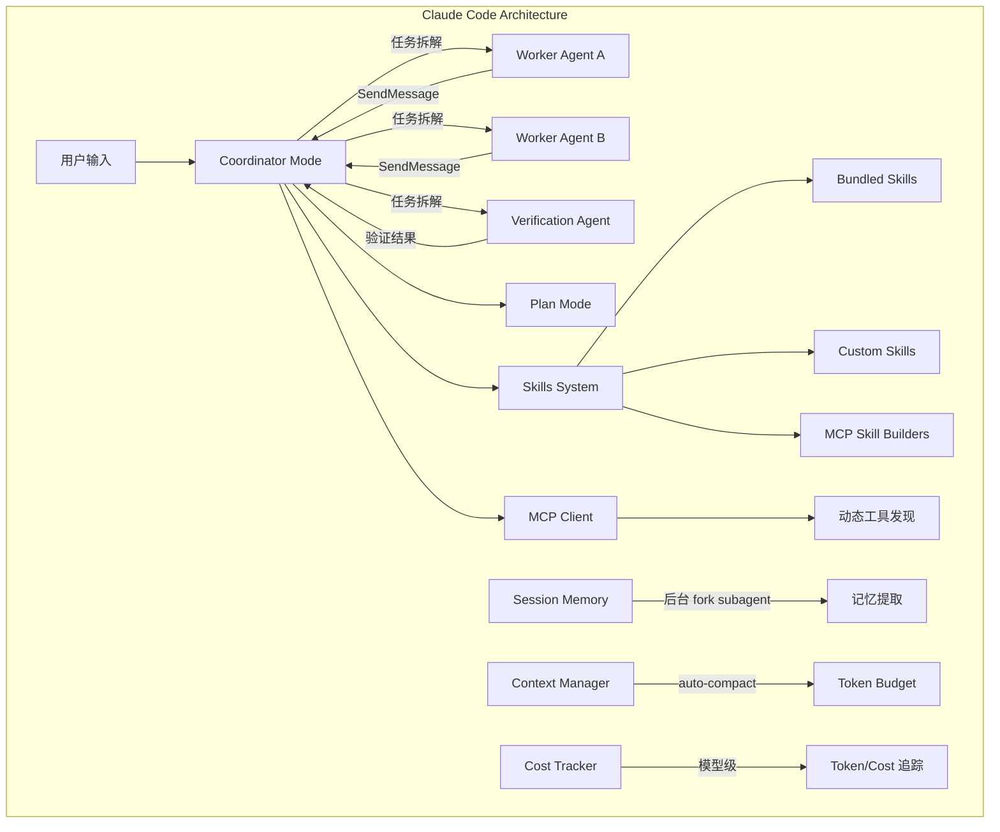

**编排模式**：集中式协调器 + 动态 Swarm

| 特性               | 说明                                              |
| ------------------ | ------------------------------------------------- |
| Coordinator Mode   | 协调器接收任务，拆解为子任务分配给 Worker         |
| Agent Swarm/Team   | TeamCreateTool 动态创建团队，SendMessageTool 通信 |
| Fork Subagent      | 共享 prompt cache 的并行子 Agent，高效利用上下文  |
| Worktree Isolation | Git worktree 隔离执行，避免工作区冲突             |
| Verification Agent | 独立验证环节，确保输出质量                        |
| Plan Mode          | EnterPlanMode/ExitPlanMode 结构化规划             |

**上下文管理**：

- Token Budget 系统：为不同工具/消息分配 token 配额
- Auto-compact：超过 80% 阈值自动压缩
- Micro-compact：仅压缩低价值消息
- Prompt Cache 共享：fork subagent 复用父上下文

**优点**：

- ✅ 最成熟的单 Agent → 多 Agent 编排方案
- ✅ 内置成本追踪（模型级细粒度）
- ✅ 会话记忆自动提取（后台异步）
- ✅ MCP 完整客户端，动态工具发现
- ✅ Skills 系统支持 bundled + custom + MCP 三种来源
- ✅ SDK API（`query()` 函数）便于集成

**缺点**：

- ❌ 深度绑定 Anthropic 模型
- ❌ CLI-first 设计，服务化集成需要额外工作
- ❌ 无可视化编排界面
- ❌ 无分布式执行能力

---

### 2.2 OpenAI Agents SDK（原 Swarm）

**定位**：OpenAI 官方多 Agent 编排框架，前身是实验性 Swarm 项目，现已升级为生产级 Agents SDK。

**核心架构**：

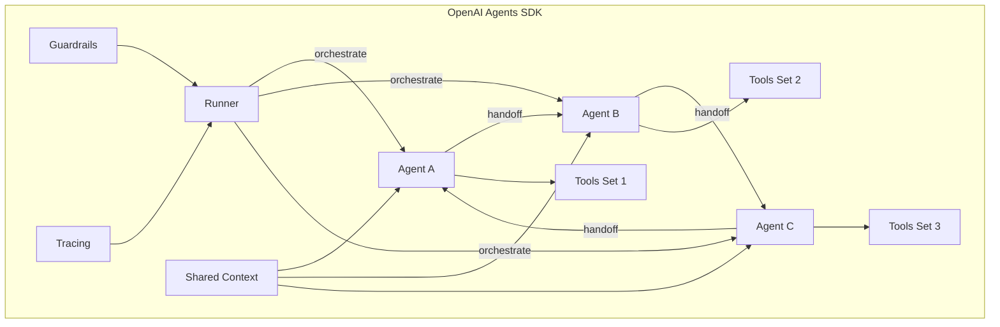

**编排模式**：去中心化 Handoff + Runner 调度

| 特性           | 说明                                     |
| -------------- | ---------------------------------------- |
| Handoff 机制   | Agent 之间通过 handoff 函数转移控制权    |
| Runner 编排    | Runner 负责执行 Agent 循环，管理工具调用 |
| Guardrails     | 输入/输出护栏，安全检查                  |
| Tracing        | 内置追踪系统，可视化 Agent 执行流        |
| Shared Context | 跨 Agent 共享上下文变量                  |

**优点**：

- ✅ 极简设计，概念清晰（Agent + Handoff + Tool）
- ✅ 内置 Guardrails 安全机制
- ✅ 原生 Tracing 支持
- ✅ 与 OpenAI 模型深度优化
- ✅ 轻量级，易于理解和集成

**缺点**：

- ❌ 深度绑定 OpenAI 模型
- ❌ 无状态持久化/检查点
- ❌ 无内置记忆系统
- ❌ 编排能力相对简单，缺乏复杂流程控制
- ❌ 无成本追踪

---

### 2.3 CrewAI

**定位**：角色驱动的多 Agent 协作框架，以"团队"隐喻降低使用门槛。

**核心架构**：

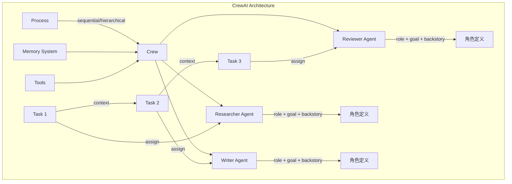

**编排模式**：声明式角色 + 流程驱动

| 特性         | 说明                                         |
| ------------ | -------------------------------------------- |
| Agent 角色   | role + goal + backstory 三元组定义 Agent     |
| Process 模式 | Sequential（顺序）/ Hierarchical（层级管理） |
| Task 链      | Task 输出自动传递给下一个 Task 作为 context  |
| Memory       | 短期 + 长期 + 实体记忆                       |
| Tool 集成    | LangChain Tool 生态                          |

**优点**：

- ✅ 角色抽象直观，降低非技术用户门槛
- ✅ 声明式定义，代码量少
- ✅ 内置记忆系统（短期/长期/实体）
- ✅ 丰富的 Tool 生态（继承 LangChain）
- ✅ 社区活跃，模板丰富

**缺点**：

- ❌ 编排灵活性有限（仅 sequential/hierarchical）
- ❌ 无状态检查点/持久化
- ❌ 复杂分支/循环流程难以表达
- ❌ Agent 间通信依赖 Task 输出传递
- ❌ 生产级可靠性存疑

---

### 2.4 Microsoft AutoGen

**定位**：对话驱动的多 Agent 框架，强调 Agent 间的自然语言协作。

**核心架构**：

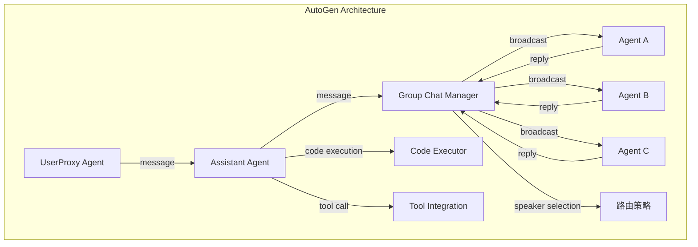

**编排模式**：对话驱动 + Group Chat 广播

| 特性              | 说明                                          |
| ----------------- | --------------------------------------------- |
| ConversableAgent  | 所有 Agent 统一接口，基于消息对话             |
| Group Chat        | 广播式多 Agent 讨论，Manager 控制发言顺序     |
| UserProxy         | 人类代理节点，支持人工介入                    |
| Code Execution    | 内置代码执行沙箱                              |
| Speaker Selection | 多种发言者选择策略（round_robin/auto/manual） |

**优点**：

- ✅ 最灵活的 Agent 间通信模型
- ✅ 对话驱动，适合探索性/创造性任务
- ✅ Group Chat 模式支持动态协作
- ✅ 内置代码执行能力
- ✅ 微软背书，企业级支持

**缺点**：

- ❌ 对话驱动导致流程不可预测
- ❌ 难以精确控制执行流程
- ❌ Token 消耗高（广播模式）
- ❌ 调试困难（非线性执行路径）
- ❌ 缺乏结构化工作流定义

---

### 2.5 LangGraph

**定位**：图状态机编排框架，LangChain 生态的核心编排引擎。

**核心架构**：

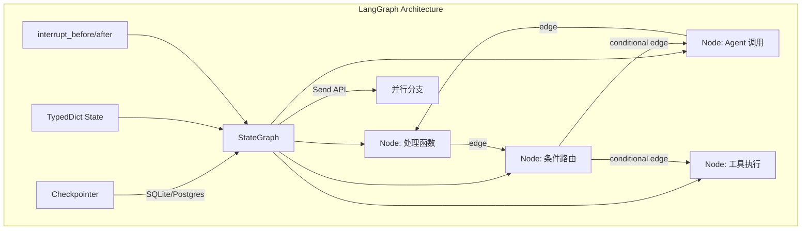

**编排模式**：显式图结构 + 状态机

| 特性                   | 说明                                     |
| ---------------------- | ---------------------------------------- |
| StateGraph             | 节点=处理函数，边=转移条件               |
| Conditional Edges      | 条件分支路由                             |
| Send API               | 动态并行分支（map-reduce 模式）          |
| Checkpointer           | 内置状态持久化（SQLite/Postgres/Memory） |
| interrupt_before/after | 精确的人工介入控制点                     |
| Subgraph               | 图嵌套，模块化组合                       |

**优点**：

- ✅ 最精细的流程控制能力
- ✅ 内置检查点，支持暂停/恢复/回放
- ✅ 状态持久化，生产级可靠性
- ✅ 条件分支 + 循环 + 并行全覆盖
- ✅ LangChain 生态集成
- ✅ Human-in-the-loop 粒度最细

**缺点**：

- ❌ 学习曲线陡峭（图论概念）
- ❌ 代码量大，定义复杂
- ❌ 调试需要可视化工具辅助
- ❌ 与 LangChain 生态耦合较深
- ❌ Agent 自主性受限（图预定义）

---

### 2.6 Dify

**定位**：开源 LLM 应用开发平台，低代码可视化编排。

**核心架构**：

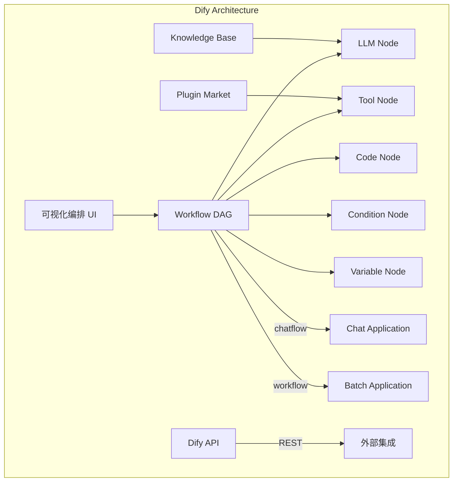

**编排模式**：可视化 DAG + 节点类型

| 特性                | 说明                          |
| ------------------- | ----------------------------- |
| 可视化编排          | 拖拽式 DAG 编辑器             |
| Chatflow / Workflow | 对话流 / 批处理两种模式       |
| 节点类型            | LLM、工具、代码、条件、变量等 |
| Knowledge Base      | 内置 RAG 知识库               |
| Plugin Market       | 插件市场，扩展工具            |
| API 发布            | 一键发布为 API                |

**优点**：

- ✅ 最低使用门槛（可视化拖拽）
- ✅ 开箱即用的完整平台
- ✅ 内置 RAG 知识库
- ✅ 一键 API 发布
- ✅ 插件市场生态
- ✅ 适合非技术用户

**缺点**：

- ❌ 多 Agent 协作能力弱
- ❌ 自定义扩展受限
- ❌ 复杂逻辑难以表达
- ❌ Agent 自主性低（节点预定义）
- ❌ 深度定制需要 fork 修改源码

---

### 2.7 MetaGPT

**定位**：模拟软件公司组织结构的多 Agent 框架，SOP 驱动。

**核心架构**：

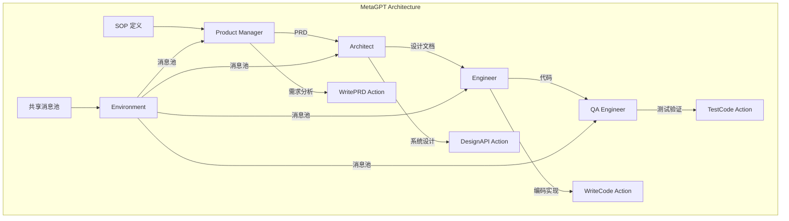

**编排模式**：SOP 流水线 + 角色模拟

| 特性        | 说明                                       |
| ----------- | ------------------------------------------ |
| 角色模拟    | ProductManager / Architect / Engineer / QA |
| SOP 驱动    | 标准操作流程定义，流水线式执行             |
| Action 抽象 | 每个 Action 是一个原子操作                 |
| 共享消息池  | Environment 级别的消息广播                 |
| 输出物      | 自动生成 PRD、设计文档、代码、测试         |

**优点**：

- ✅ 最佳的软件开发流程模拟
- ✅ 自动生成完整项目文档
- ✅ SOP 确保流程规范性
- ✅ 角色分工明确
- ✅ 适合端到端软件开发

**缺点**：

- ❌ 场景高度特化（软件开发）
- ❌ 流程僵化，难以适应非标准流程
- ❌ Agent 自主性受限
- ❌ 通用性差
- ❌ 社区规模相对较小

---

### 2.8 Google ADK（Agent Development Kit）

**定位**：Google 官方 Agent 开发框架，深度集成 Google 生态。

**核心架构**：

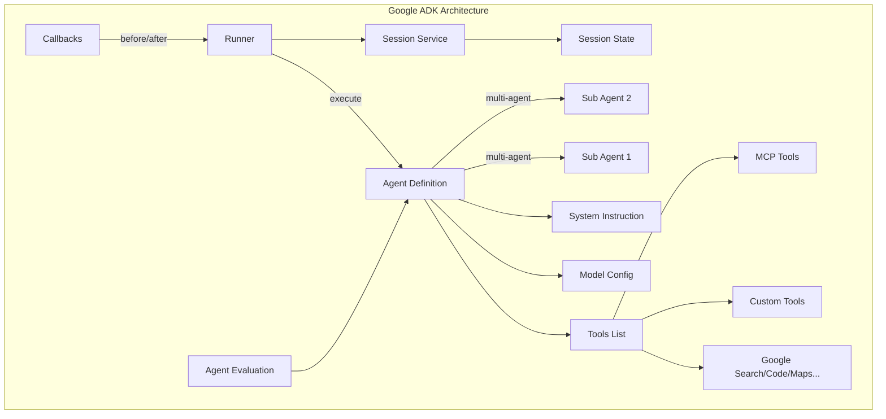

**编排模式**：声明式 Agent + Runner 执行

| 特性            | 说明                                  |
| --------------- | ------------------------------------- |
| Agent 定义      | 声明式 Agent 类 + tools + instruction |
| Runner          | 统一执行引擎，管理 Agent 循环         |
| Session Service | 内置会话状态管理                      |
| Callbacks       | before_agent / after_agent 钩子       |
| Multi-Agent     | Agent 嵌套组合                        |
| Evaluation      | 内置 Agent 评估框架                   |

**优点**：

- ✅ Google 生态深度集成（Search/Code/Maps/Gemini）
- ✅ 内置 Session 管理
- ✅ Callback 机制灵活
- ✅ 支持 MCP 工具集成
- ✅ 内置评估框架
- ✅ Python + TypeScript 双语言支持

**缺点**：

- ❌ 深度绑定 Google 生态
- ❌ 编排能力相对简单
- ❌ 社区生态不如 LangChain/CrewAI
- ❌ 文档和示例相对较少
- ❌ 生产验证案例不足

---

### 2.9 Temporal（传统工作流对比基线）

**定位**：分布式工作流编排平台，非 AI-Native 但提供最可靠的工作流保障。

**核心架构**：

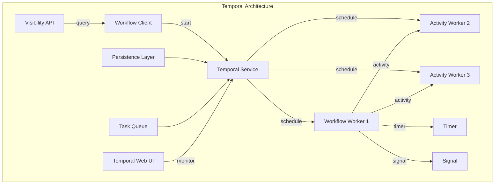

**编排模式**：代码即工作流 + 持久化执行

| 特性             | 说明                        |
| ---------------- | --------------------------- |
| Workflow as Code | 用普通代码定义工作流逻辑    |
| Activity         | 原子操作单元，支持重试/超时 |
| Saga Pattern     | 内置补偿事务支持            |
| 持久化执行       | 工作流状态自动持久化        |
| 定时器/信号      | 长时间等待 + 事件驱动       |
| 可视化 UI        | Temporal Web 监控界面       |

**优点**：

- ✅ 最强的工作流可靠性保障
- ✅ 自动状态持久化 + 故障恢复
- ✅ 分布式执行，无限扩展
- ✅ 完整的可观测性（Web UI + API）
- ✅ 多语言 SDK（Go/Java/Python/TS）
- ✅ 生产级成熟度最高

**缺点**：

- ❌ 非 AI-Native，无内置 LLM 集成
- ❌ 需要自建 Agent 能力层
- ❌ 运维复杂度高（需部署 Temporal Server）
- ❌ 学习曲线陡峭
- ❌ 对简单场景过于重量级

---

## 3. 横向对比表格

### 3.1 核心维度对比

| 维度              | Claude Code                 | OpenAI Agents SDK | CrewAI          | AutoGen         | LangGraph          |
| ----------------- | --------------------------- | ----------------- | --------------- | --------------- | ------------------ |
| **编排模式**      | 集中式 Coordinator          | 去中心化 Handoff  | 声明式角色      | 对话驱动        | 图状态机           |
| **多 Agent 协作** | Coordinator + Swarm         | Handoff 转交      | Task 链传递     | Group Chat 广播 | 图节点路由         |
| **上下文管理**    | Token Budget + Auto-compact | 共享 Context      | Task 输出传递   | 消息历史        | TypedDict State    |
| **工具集成**      | MCP + 40+ 内置工具          | Function Calling  | LangChain Tools | LangChain Tools | LangChain Tools    |
| **记忆系统**      | 自动记忆提取                | ❌ 无             | 短期/长期/实体  | ❌ 无           | Checkpointer       |
| **成本控制**      | 模型级细粒度追踪            | ❌ 无             | ❌ 无           | ❌ 无           | ❌ 无              |
| **状态持久化**    | ❌ 无                       | ❌ 无             | ❌ 无           | ⚠️ 可选         | ✅ SQLite/Postgres |
| **人工介入**      | ❌ CLI 交互                 | ❌ 无             | ⚠️ human_input  | ✅ UserProxy    | ✅ interrupt       |
| **可扩展性**      | ⚠️ 单机                     | ⚠️ 单机           | ⚠️ 单机         | ⚠️ 单机         | ⚠️ 单机            |
| **学习曲线**      | 中等                        | 低                | 低              | 中等            | 高                 |
| **模型绑定**      | Anthropic                   | OpenAI            | 无              | 无              | 无                 |

| 维度              | Dify           | MetaGPT    | Google ADK        | Temporal        |
| ----------------- | -------------- | ---------- | ----------------- | --------------- |
| **编排模式**      | 可视化 DAG     | SOP 流水线 | 声明式 Agent      | 代码即工作流    |
| **多 Agent 协作** | ❌ 弱          | 角色流水线 | Agent 嵌套        | Activity 编排   |
| **上下文管理**    | 节点变量传递   | 共享消息池 | Session State     | Workflow State  |
| **工具集成**      | 插件市场       | 有限       | Google + MCP 生态 | 自定义 Activity |
| **记忆系统**      | Knowledge Base | ❌ 无      | Session 管理      | ✅ 自动持久化   |
| **成本控制**      | ⚠️ 基础        | ❌ 无      | ❌ 无             | ❌ 无           |
| **状态持久化**    | ✅ 数据库      | ❌ 无      | ✅ Session        | ✅ 自动持久化   |
| **人工介入**      | ⚠️ 有限        | ❌ 无      | ✅ Callback       | ✅ Signal       |
| **可扩展性**      | ✅ 分布式      | ⚠️ 单机    | ⚠️ 单机           | ✅ 分布式       |
| **学习曲线**      | 低             | 中等       | 低                | 高              |
| **模型绑定**      | 多模型         | 无         | Google            | 无              |

### 3.2 编排能力矩阵

| 能力       | Claude Code | OpenAI SDK | CrewAI | AutoGen | LangGraph | Dify | MetaGPT | ADK | Temporal |
| ---------- | :---------: | :--------: | :----: | :-----: | :-------: | :--: | :-----: | :-: | :------: |
| 顺序执行   |     ✅      |     ✅     |   ✅   |   ✅    |    ✅     |  ✅  |   ✅    | ✅  |    ✅    |
| 并行执行   |     ✅      |     ❌     |   ❌   |   ✅    |    ✅     |  ✅  |   ❌    | ✅  |    ✅    |
| 条件分支   |     ✅      |     ❌     |   ⚠️   |   ✅    |    ✅     |  ✅  |   ❌    | ⚠️  |    ✅    |
| 动态路由   |     ✅      |     ✅     |   ❌   |   ✅    |    ✅     |  ❌  |   ❌    | ✅  |    ✅    |
| 循环/重试  |     ✅      |     ❌     |   ⚠️   |   ✅    |    ✅     |  ⚠️  |   ❌    | ⚠️  |    ✅    |
| 状态检查点 |     ❌      |     ❌     |   ❌   |   ❌    |    ✅     |  ⚠️  |   ❌    | ✅  |    ✅    |
| 暂停/恢复  |     ❌      |     ❌     |   ❌   |   ❌    |    ✅     |  ⚠️  |   ❌    | ✅  |    ✅    |
| 人工审批   |     ❌      |     ❌     |   ⚠️   |   ✅    |    ✅     |  ⚠️  |   ❌    | ✅  |    ✅    |
| 错误恢复   |     ⚠️      |     ❌     |   ⚠️   |   ⚠️    |    ✅     |  ⚠️  |   ❌    | ⚠️  |    ✅    |
| 分布式执行 |     ❌      |     ❌     |   ❌   |   ❌    |    ❌     |  ✅  |   ❌    | ❌  |    ✅    |
| 可视化编排 |     ❌      |     ❌     |   ❌   |   ❌    |    ⚠️     |  ✅  |   ❌    | ❌  |    ✅    |
| 代码生成   |     ✅      |     ❌     |   ❌   |   ✅    |    ❌     |  ❌  |   ✅    | ❌  |    ❌    |
| 成本追踪   |     ✅      |     ❌     |   ❌   |   ❌    |    ❌     |  ⚠️  |   ❌    | ❌  |    ❌    |

> ✅ 原生支持 | ⚠️ 部分支持/需扩展 | ❌ 不支持

### 3.3 生产就绪度评估

| 维度       | Claude Code | OpenAI SDK | CrewAI | AutoGen | LangGraph | Dify | MetaGPT | ADK | Temporal |
| ---------- | :---------: | :--------: | :----: | :-----: | :-------: | :--: | :-----: | :-: | :------: |
| 状态持久化 |      2      |     1      |   1    |    2    |     5     |  4   |    1    |  4  |    5     |
| 错误处理   |      3      |     2      |   2    |    2    |     4     |  3   |    1    |  3  |    5     |
| 可观测性   |      4      |     4      |   2    |    2    |     3     |  4   |    1    |  3  |    5     |
| 安全合规   |      3      |     4      |   2    |    2    |     3     |  3   |    1    |  3  |    5     |
| 社区生态   |      4      |     4      |   4    |    5    |     5     |  4   |    3    |  3  |    5     |
| 文档质量   |      4      |     4      |   3    |    4    |     4     |  4   |    2    |  3  |    5     |

> 评分 1-5，5 为最佳

---

## 4. 架构模式深度对比

### 4.1 编排模式分类

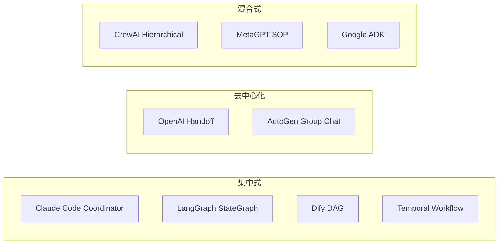

#### 集中式编排

**特征**：存在一个中央控制器决定任务分配和流转。

| 优势           | 劣势       |
| -------------- | ---------- |
| 流程可控可预测 | 单点瓶颈   |
| 易于调试和追踪 | 扩展性受限 |
| 适合结构化任务 | 灵活性不足 |

**代表**：Claude Code Coordinator、LangGraph、Dify、Temporal

#### 去中心化编排

**特征**：Agent 自主决定下一步行动，无中央控制器。

| 优势           | 劣势         |
| -------------- | ------------ |
| 高度灵活       | 流程不可预测 |
| Agent 自主性强 | 调试困难     |
| 适合探索性任务 | Token 消耗高 |

**代表**：OpenAI Agents SDK Handoff、AutoGen Group Chat

#### 混合式编排

**特征**：结合集中控制和 Agent 自主性。

| 优势           | 劣势             |
| -------------- | ---------------- |
| 兼顾控制和灵活 | 设计复杂度较高   |
| 适应多种场景   | 需要平衡控制粒度 |

**代表**：CrewAI Hierarchical、Google ADK

### 4.2 上下文管理策略对比

| 策略                  | 框架        | 特点                                    | 适用场景         |
| --------------------- | ----------- | --------------------------------------- | ---------------- |
| **Token Budget 分配** | Claude Code | 为不同模块分配 token 配额，超限自动压缩 | 长会话、复杂任务 |
| **共享 Context 变量** | OpenAI SDK  | 简单键值对跨 Agent 传递                 | 轻量级协作       |
| **Task 输出链式传递** | CrewAI      | 上游 Task 输出作为下游输入              | 顺序流水线       |
| **消息历史累积**      | AutoGen     | 完整对话历史作为上下文                  | 对话密集型       |
| **TypedDict State**   | LangGraph   | 类型化状态，节点间共享                  | 结构化工作流     |
| **Session State**     | Google ADK  | 会话级状态管理                          | 多轮交互         |
| **Workflow State**    | Temporal    | 自动持久化的工作流状态                  | 长时间运行任务   |

### 4.3 记忆系统对比

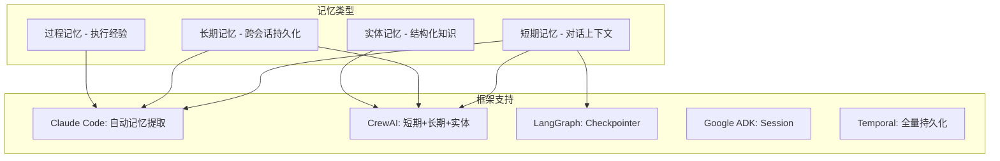

---

## 5. 与 OpenClaw 集成适配度分析

### 5.1 OpenClaw 架构特点

OpenClaw Control Plane 的核心架构特征：

```
┌─────────────────────────────────────────────────────────┐
│                    OpenClaw Control Plane                │
│                                                         │
│  ┌──────────┐    ┌──────────────┐    ┌──────────────┐  │
│  │ FastAPI   │    │ DAG Workflow │    │ State Machine│  │
│  │ Backend   │◄──►│ Engine       │◄──►│ (6 states)   │  │
│  └──────────┘    └──────────────┘    └──────────────┘  │
│       │                  │                   │          │
│  ┌──────────┐    ┌──────────────┐    ┌──────────────┐  │
│  │ React    │    │ Agent        │    │ Review Gate  │  │
│  │ Frontend │◄──►│ Scheduler    │◄──►│ (Human-in-   │  │
│  └──────────┘    └──────────────┘    │  the-loop)   │  │
│       │                              └──────────────┘  │
│  ┌──────────┐                                          │
│  │WebSocket │    ┌──────────────┐                       │
│  │ Realtime │◄──►│ JWT + RBAC   │                       │
│  └──────────┘    └──────────────┘                       │
└─────────────────────────────────────────────────────────┘
```

### 5.2 集成适配度评分

基于 OpenClaw 的技术栈和架构特点，评估各框架的集成适配度：

| 评估维度       | 权重     | Claude Code | LangGraph |  CrewAI  | AutoGen  | OpenAI SDK |   Dify   |   ADK    | Temporal |
| -------------- | -------- | :---------: | :-------: | :------: | :------: | :--------: | :------: | :------: | :------: |
| DAG 兼容性     | 20%      |      4      |     5     |    3     |    2     |     2      |    5     |    3     |    5     |
| 状态机对齐     | 15%      |      3      |     5     |    2     |    2     |     2      |    3     |    3     |    5     |
| Python/FastAPI | 15%      |      3      |     5     |    5     |    5     |     4      |    3     |    5     |    4     |
| 人工审核集成   | 15%      |      2      |     5     |    2     |    4     |     1      |    2     |    3     |    4     |
| MCP 兼容性     | 10%      |      5      |     3     |    2     |    2     |     2      |    2     |    4     |    1     |
| 可扩展性       | 10%      |      2      |     3     |    2     |    2     |     2      |    4     |    3     |    5     |
| 成本控制       | 10%      |      5      |     1     |    1     |    1     |     1      |    2     |    1     |    1     |
| 社区/文档      | 5%       |      4      |     5     |    4     |    5     |     4      |    4     |    3     |    5     |
| **加权总分**   | **100%** |  **3.35**   | **4.15**  | **2.75** | **2.55** |  **2.15**  | **3.20** | **3.05** | **4.05** |

> 评分 1-5，5 为最佳适配

### 5.3 关键集成点分析

#### 5.3.1 DAG 工作流兼容性

OpenClaw 已有 DAG 引擎，需要评估各框架是否能与之共存而非替代：

| 框架            | 与现有 DAG 的关系            | 集成难度            |
| --------------- | ---------------------------- | ------------------- |
| **Claude Code** | 作为 DAG 节点的执行引擎      | 中 — 需封装 SDK API |
| **LangGraph**   | 可替代或增强现有 DAG         | 低 — 概念一致       |
| **CrewAI**      | 作为 DAG 节点的 Agent 分配器 | 中 — 需适配层       |
| **Temporal**    | 可替代整个工作流引擎         | 高 — 架构重构       |

#### 5.3.2 状态机对齐

OpenClaw 的 6 状态生命周期：`planned → approved → dispatched → in_progress → review_pending → completed`

| 框架            | 状态管理对齐度 | 说明                                   |
| --------------- | -------------- | -------------------------------------- |
| **LangGraph**   | ✅ 完美        | 图节点可直接映射状态转移               |
| **Temporal**    | ✅ 完美        | Workflow State 天然支持                |
| **Claude Code** | ⚠️ 需适配      | Coordinator 状态需映射到 OpenClaw 状态 |
| **CrewAI**      | ⚠️ 需适配      | Task 状态需映射                        |

---

## 6. 结论与推荐

### 6.1 推荐策略：混合架构

基于以上分析，**不建议采用单一框架**，而是推荐混合架构，取各框架之长：

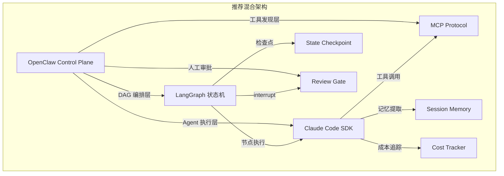

### 6.2 分层推荐

| 层次             | 推荐方案                                  | 理由                                               |
| ---------------- | ----------------------------------------- | -------------------------------------------------- |
| **工作流编排层** | LangGraph 模式                            | 与 OpenClaw DAG 理念一致，检查点/中断/恢复能力最强 |
| **Agent 执行层** | Claude Code SDK 模式                      | 成本追踪、记忆提取、上下文管理能力最强             |
| **工具集成层**   | MCP 协议                                  | 标准化工具发现，Claude Code 原生支持               |
| **状态持久化层** | OpenClaw 现有 + LangGraph Checkpointer    | 增强现有状态机，不替代                             |
| **人工审核层**   | OpenClaw ReviewGate + LangGraph interrupt | 已有机制 + 更细粒度控制                            |

### 6.3 具体实施路径

#### Phase 1：增强现有编排（短期）

1. **引入 LangGraph 状态机模式** — 增强 OpenClaw 的 DAG 引擎
   - 在现有 `SchedulerService` 基础上增加图状态管理
   - 添加检查点机制（SQLite 持久化）
   - 实现 `interrupt_before/after` 人工审批

2. **集成 Claude Code 核心模块** — 逐模块引入
   - Context Manager（Token Budget + Auto-compact）
   - Session Memory（自动记忆提取）
   - Cost Tracker（模型级成本追踪）

#### Phase 2：多 Agent 协作（中期）

3. **实现 Coordinator + Worker 模式** — 参考 Claude Code
   - `CoordinatorService` 负责任务拆解和分配
   - Worker Agent 支持继续（continue）而非重新创建
   - Verification Agent 独立验证

4. **MCP 工具发现** — 标准化工具集成
   - MCP 客户端连接管理
   - 动态工具注册到 OpenClaw skills 系统
   - MCP Skill Builders 自动生成技能

#### Phase 3：高级能力（长期）

5. **Agent Swarm / Team** — 动态团队管理
   - TeamCreate / TeamDelete API
   - Agent 间 SendMessage 通信
   - Worktree 隔离执行

6. **Plan Mode + Verification** — 结构化规划与验证
   - EnterPlanMode / ExitPlanMode
   - 独立 Verification Agent
   - 结果质量评分

### 6.4 不推荐的方案

| 方案              | 不推荐原因                                |
| ----------------- | ----------------------------------------- |
| 完全采用 Dify     | 会替代 OpenClaw 现有架构，多 Agent 能力弱 |
| 完全采用 Temporal | 非 AI-Native，需要大量自建 Agent 层       |
| 完全采用 CrewAI   | 编排灵活性不足，无状态持久化              |
| 完全采用 AutoGen  | 对话驱动模式与 DAG 工作流不匹配           |
| 完全采用 MetaGPT  | 场景过于特化（仅软件开发）                |

### 6.5 核心设计原则

从本次对比中提炼出的、适用于 OpenClaw 的设计原则：

1. **图结构是最成熟的编排范式** — LangGraph 的 StateGraph 已成为事实标准
2. **检查点必不可少** — 所有生产级系统都需要状态持久化和恢复能力
3. **Human-in-the-loop 是刚需** — 关键决策点需要人工审批，这是安全合规的底线
4. **Token 预算管理决定成本** — Claude Code 的 Token Budget 是最精细的成本控制方案
5. **MCP 是工具集成的未来** — 标准化协议比私有 API 更有生命力
6. **记忆系统提升 Agent 连续性** — 自动记忆提取让 Agent 跨会话保持上下文
7. **协调器模式优于广播模式** — 集中式控制在生产环境更可靠

---

## 附录

### A. 框架版本信息

| 框架              | 分析版本 | 语言         | 许可证      |
| ----------------- | -------- | ------------ | ----------- |
| Claude Code       | v2.1.88  | TypeScript   | proprietary |
| OpenAI Agents SDK | v0.1.x   | Python       | Apache-2.0  |
| CrewAI            | v0.80+   | Python       | Apache-2.0  |
| Microsoft AutoGen | v0.4+    | Python       | MIT         |
| LangGraph         | v0.2+    | Python/JS    | MIT         |
| Dify              | v0.15+   | Python/React | Apache-2.0  |
| MetaGPT           | v0.8+    | Python       | Apache-2.0  |
| Google ADK        | v0.1+    | Python/TS    | Apache-2.0  |
| Temporal          | v1.25+   | Go/多语言    | MIT         |

### B. 参考文档

- [Claude Code 集成方案](../design/claude-code-integration-proposal.md)
- [Agent 编排对比 v1](./agent-orchestration-comparison.md)
- [OpenClaw 架构文档](../ARCHITECTURE.md)
- [工作流 API 设计](../design/workflow-api-design.md)
